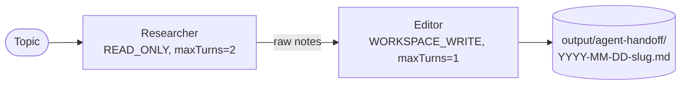

# Agent-to-Agent Task Handoff

The smallest possible agent pipeline that produces something you can actually publish: a Researcher gathers facts, an Editor turns them into a Markdown blog post, and the post is written to disk under `output/agent-handoff/`.

> **The pattern you'll use everywhere.** Almost every agent workflow starts as a handoff: gather → refine, retrieve → answer, draft → review. Once you've got `dependsOn` down, the rest of the framework is composition.

## Architecture



## Run

```bash
./agent-to-agent-task-handoff/run.sh
# or with your own topic
./run.sh agent-handoff "WebAssembly outside the browser in 2026"
./run.sh agent-handoff "what's actually new in PostgreSQL 17"
```

## What you get

A real Markdown blog post on disk:

```text
$ ./run.sh agent-handoff "what's actually new in PostgreSQL 17"
...
=== Result ===
# What's actually new in PostgreSQL 17

PostgreSQL 17, released in late 2024, brings ...

## 1. Streaming I/O for sequential scans
...

## 2. Improved VACUUM memory usage
...

## Conclusion
...

📄 Polished post written to: /path/to/output/agent-handoff/2026-04-28-what-s-actually-new-in-postgresql-17.md
```

Open the file. Paste it into your CMS. Done.

## What you'll learn

- **`Task.builder().dependsOn(previousTask)`** — the editor's task is automatically given the researcher's output as input. No glue code required.
- **`SEQUENTIAL` process** — the swarm walks the dependency DAG and threads outputs through.
- **`maxTurns`** — caps LLM calls per task. The researcher gets 2 turns (gather, refine); the editor gets 1 (compose).
- **`PermissionLevel`** — `READ_ONLY` for the researcher (so it can call read-only tools you may add later), `WORKSPACE_WRITE` for the editor (it's the one allowed to produce final output).
- **Why two agents and not one?** — splitting roles lets each system prompt be sharply scoped. Researcher prompts optimize for breadth/accuracy; editor prompts optimize for clarity/structure. One mega-prompt that tries to do both is reliably worse.

## Source

- [`AgentHandoffExample.java`](src/main/java/ai/intelliswarm/swarmai/examples/basics/AgentHandoffExample.java)

## See also

- [`agent-with-tool-calling`](../agent-with-tool-calling/) — same handoff pattern but with tool calls (calculator + http_request) for grounding.
- [`shared-context-between-agents`](../shared-context-between-agents/) — three-agent pipeline using a structured `inputs` map instead of dependsOn.
- [`evaluator-optimizer-feedback-loop`](../evaluator-optimizer-feedback-loop/) — handoff with a quality gate and a revision loop.
