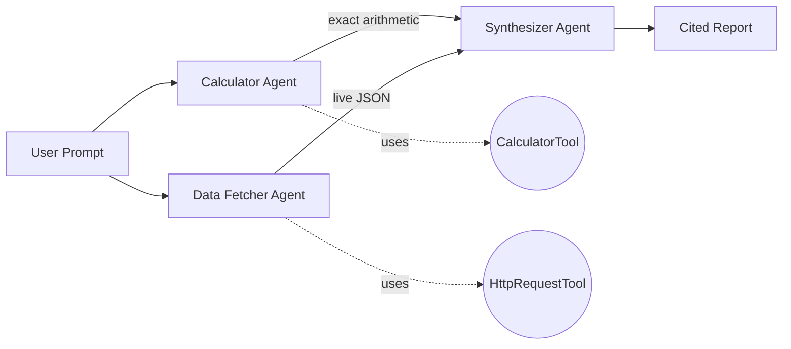

# Agent with Tool Calling

Three agents, two tools, one grounded report. The example shows the LLM autonomously deciding when to invoke each tool — exact arithmetic via `CalculatorTool`, live data via `HttpRequestTool` against the public GitHub API — then a synthesizer agent weaves both into a single cited report.

> **Why this matters:** an LLM left alone hallucinates numbers and invents API responses. Tool calling is how you stop that. This example is the smallest demonstration of that pattern that still produces something a human would actually use.

## Architecture



## Run

```bash
./agent-with-tool-calling/run.sh
# or with a custom problem
./run.sh tool-calling "What is the compound interest on $10000 at 5% for 3 years?"
```

## What you get

The Calculator Agent invokes `calculator(...)` for every operation (no mental math). The Data Fetcher Agent calls `http_request("https://api.github.com/repos/intelliswarm-ai/swarm-ai")` and extracts only the fields it needs. The Synthesizer combines them:

```text
=== Calculation (source: calculator tool) ===
Compound interest on $10,000 @ 5% over 3 years:
  Year 1: 10000 * 1.05 = 10500.00
  Year 2: 10500 * 1.05 = 11025.00
  Year 3: 11025 * 1.05 = 11576.25
  Total interest = 1576.25

=== Live GitHub stats (source: http_request tool) ===
Repo: intelliswarm-ai/swarm-ai
Stars: 247    Forks: 31    Open issues: 12
Last updated: 2026-04-27T18:13:42Z

=== Conclusion ===
Both data points are auditable: the math came from the calculator tool, the
repo stats from a live API call. Neither was inferred by the LLM.
```

(Numbers above are illustrative — your actual run will show current GitHub stats.)

## What you'll learn

- **Tool registration** — `Agent.builder().tools(List.of(calculatorTool, httpRequestTool))` exposes Spring-managed `@Component` tools to the LLM.
- **The model decides when to call** — you don't hard-code invocations. The agent's `goal` + `backstory` shape its decisions.
- **Multi-tool composition** — different agents own different tools, and `dependsOn` plumbs their outputs into a downstream synthesizer.
- **Why tool calling beats prompting** — the Calculator Agent's backstory says "*never* do mental math" because LLMs silently approximate. Tool calls are the only way to make numerics auditable.
- **`toolHook`** — fires on every invocation; used here to record per-tool metrics for the budget tracker.

## Source

- [`ToolCallingExample.java`](src/main/java/ai/intelliswarm/swarmai/examples/basics/ToolCallingExample.java)

## See also

- [`agent-to-agent-task-handoff`](../agent-to-agent-task-handoff/) — minimal `dependsOn` chain (no tools).
- [`shared-context-between-agents`](../shared-context-between-agents/) — same pattern but with structured `inputs` map instead of dependent task outputs.
- [`mcp-model-context-protocol`](../mcp-model-context-protocol/) — same idea but tools come from external MCP servers.
