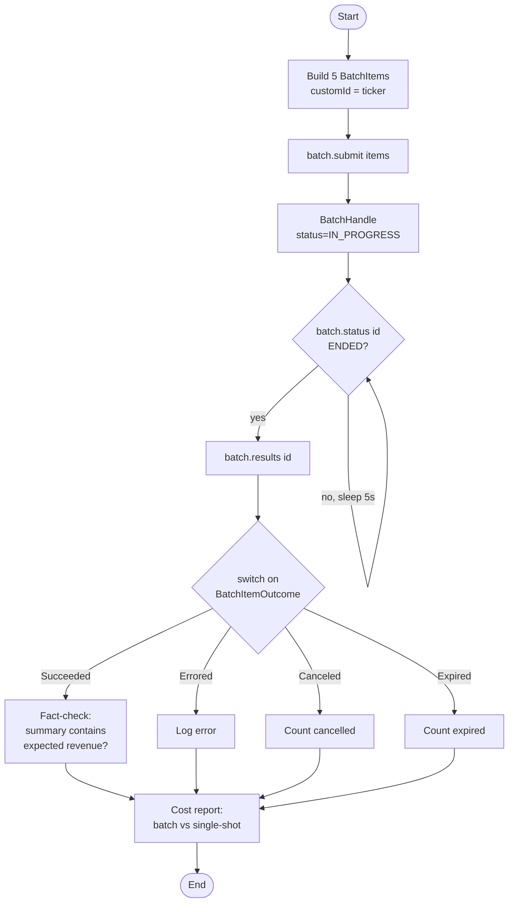

# Anthropic Message Batches

Offline LLM workloads (overnight analytics, document corpora, eval harnesses) don't need real-time latency — and Anthropic prices them at 50% of standard. This example submits five synthetic 10-K filings as a single Message Batch, polls until it finishes, and joins each per-item outcome back to the originating `customId` with a self-checking fact verification step.

## Architecture



## What You'll Learn

- Submitting offline LLM workloads with `AnthropicBatchClient.submit(List<BatchItem>)`
- Tagging requests with caller-chosen `customId` strings to join results back to source records
- Polling a `BatchHandle` via `batch.status(id)` until `BatchProcessingStatus.ENDED`
- Exhaustive sealed-`switch` over `BatchItemOutcome` (Succeeded / Errored / Canceled / Expired)
- Reading per-item `TokenUsage` to model batch vs. single-shot cost in code
- Reusing `AnthropicRequest` (system prompt, model, temperature, max tokens) inside batch items

## Prerequisites

- Java 17+
- `ANTHROPIC_API_KEY` exported (or set in `.env` at the examples repo root) — this calls the real Anthropic API
- Model: `claude-sonnet-4-5` (hardcoded in the example; change in the builder to use another)

## Run

```bash
./anthropic-batch/run.sh
```

`DEMO=1` (default) silences Spring Boot startup chatter so the demo output appears first.

## How It Works

The example builds five `BatchItem` records — one per synthetic 10-K excerpt — each wrapping an `AnthropicRequest` with a financial-analyst system prompt, `temperature=0.0` for deterministic extraction, and a `maxOutputTokens=120` cap that keeps replies to a single-sentence headline. `batch.submit(items)` returns a `BatchHandle` immediately with status `IN_PROGRESS`; the example then polls `batch.status(id)` every five seconds (capped at five minutes) until the batch reaches `ENDED`. Once finished, `batch.results(id)` streams `BatchResult` records keyed by `customId`. A sealed `switch` over `BatchItemOutcome` handles all four terminal cases, and each successful summary is fact-checked by asserting it contains the exact revenue figure from the source filing. Token counts are aggregated and the run prints a side-by-side cost comparison (batch vs. equivalent single-shot calls) plus a projection to 100K items per batch.

## Key Code

```java
AnthropicBatchClient batch = AnthropicBatchClient.from(AnthropicConfig.withApiKey(apiKey));

List<BatchItem> items = new ArrayList<>();
for (var entry : new TreeMap<>(FILINGS).entrySet()) {
    AnthropicRequest req = AnthropicRequest.builder()
            .model("claude-sonnet-4-5")
            .system("You are a financial analyst. In one sentence, name the company, "
                    + "the headline number (revenue), and the single most important "
                    + "year-over-year change.")
            .message(AnthropicMessage.userText("Filing excerpt:\n" + entry.getValue()))
            .maxOutputTokens(120)
            .temperature(0.0)
            .build();
    items.add(new BatchItem(entry.getKey(), req));   // customId = ticker
}

BatchHandle handle = batch.submit(items);
while (handle.processingStatus() != BatchProcessingStatus.ENDED) {
    Thread.sleep(5_000);
    handle = batch.status(handle.id());
}

for (BatchResult r : batch.results(handle.id())) {
    switch (r.outcome()) {
        case BatchItemOutcome.Succeeded ok -> handle(r.customId(), ok.response());
        case BatchItemOutcome.Errored err  -> logger.warn("{}: {}", r.customId(), err.message());
        case BatchItemOutcome.Canceled c   -> { /* batch was cancelled */ }
        case BatchItemOutcome.Expired  e   -> { /* hit the 24h deadline */ }
    }
}
```

## Customization

- Replace the synthetic `FILINGS` map with your own records — any unique string works as `customId`
- Swap the system prompt or model (`claude-sonnet-4-5` → `claude-opus-4` etc.) per item, since each `BatchItem` carries its own `AnthropicRequest`
- Raise the poll cap (currently 60 iterations / 5 minutes) for larger batches — Anthropic guarantees completion within 24h
- Attach `DocumentBlock`s with citations enabled instead of inline text for grounded extraction (see `CitationRequiredPipelineExample`)
- Plug the per-item `TokenUsage` numbers into your own budget tracker instead of the inline cost printout
