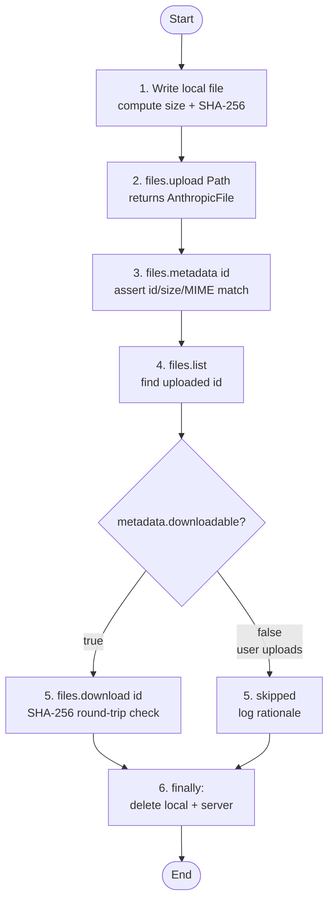

# Anthropic Files API

When the same document is consulted across many requests (RAG corpora, eval harnesses, multi-turn research), re-uploading base64 bytes every call wastes bandwidth and inflates request size. This example walks the full Files API lifecycle — write, upload, refetch metadata, list, download, SHA-256 verify, delete — as a self-checking smoke test that prints a pass/fail line for each step.

## Architecture



## What You'll Learn

- Uploading workspace-scoped documents with `AnthropicFilesClient.upload(Path)`
- Retrieving server-side metadata via `files.metadata(fileId)` for round-trip assertions
- Paginated workspace listing with `files.list()` and filtering by `file.id()`
- Downloading bytes back with `files.download(fileId)` and gating on the `downloadable` flag
- Lifecycle cleanup with `files.delete(fileId)` inside a `finally` block to avoid leaked uploads
- Building self-verifying examples: SHA-256 checksums turn the demo into an eval report

## Prerequisites

- Java 17+
- `ANTHROPIC_API_KEY` exported (or set in `.env` at the examples repo root) — this calls the real Anthropic API
- The Files API ships under the `files-api-2025-04-14` beta header (set automatically by the client)

## Run

```bash
./anthropic-files/run.sh
```

`DEMO=1` (default) silences Spring Boot startup chatter so the demo output appears first.

## How It Works

The example creates a temp text file containing a synthetic ACME 10-K excerpt, records its byte size and SHA-256, then walks six lifecycle stages. `files.upload(Path)` performs a single multipart POST and returns an `AnthropicFile` with the server-issued `file_id`, MIME type, size, and `downloadable` flag. `files.metadata(id)` re-fetches that same record by id so the example can assert id/size/MIME equality. `files.list()` pulls the first page of the workspace and confirms the freshly-uploaded file is present. The download step is gated on `reFetched.downloadable()` — as of 2026-Q1 only model-generated artifacts (code-execution outputs and similar) come back with `downloadable=true`, while arbitrary user uploads are accepted for reference but not for byte-echo. When downloadable, the example pulls the bytes back and verifies the SHA-256 matches the original. The `finally` block always deletes both the local temp file and the server-side file so failed runs don't leak storage.

## Key Code

```java
AnthropicFilesClient files = AnthropicFilesClient.from(AnthropicConfig.withApiKey(apiKey));

AnthropicFile uploaded = null;
try {
    uploaded = files.upload(local);                          // [2] POST multipart
    AnthropicFile reFetched = files.metadata(uploaded.id()); // [3] GET by id
    List<AnthropicFile> workspace = files.list();            // [4] list page
    boolean present = workspace.stream().anyMatch(f -> f.id().equals(uploaded.id()));

    if (reFetched.downloadable()) {                          // [5] gated round-trip
        byte[] bytes = files.download(uploaded.id());
        String roundTripSha = sha256(bytes);
        assert roundTripSha.equals(localSha);                // byte-identical?
    }
} finally {
    if (uploaded != null) files.delete(uploaded.id());       // [6] always cleanup
}
```

## Customization

- Swap the synthetic `SAMPLE_DOC` string for a real PDF or text file path — the API is MIME-agnostic for upload/download symmetry
- Upload a code-execution output (or other model-generated artifact) to exercise the full download + SHA-256 round-trip path
- Iterate `files.list()` pagination to discover and prune stale uploads across the workspace
- Replace the `finally` delete with retention bookkeeping — the Files API is workspace-scoped and uploads persist until explicitly removed
- Reference an uploaded `file_id` from a downstream messages call (substrate integration for `DocumentBlock.File` is the next step in this module)
