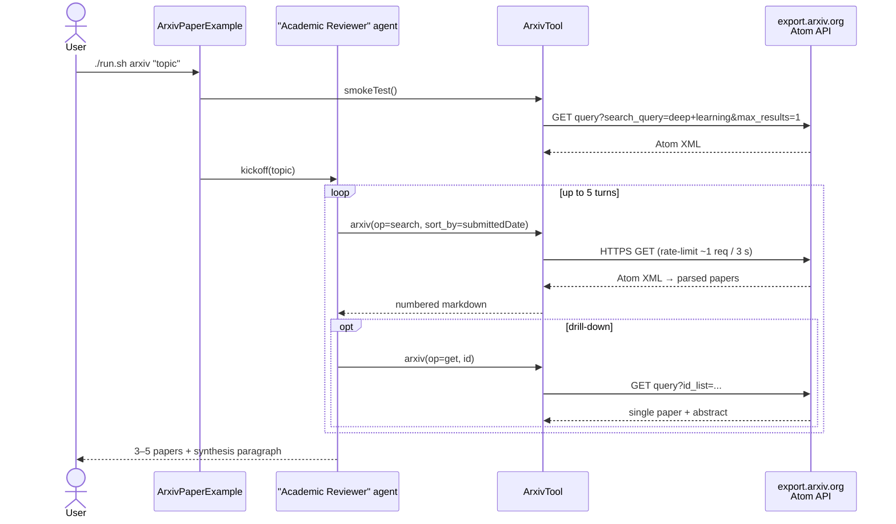

# arXiv Paper Search Example

> **New to SwarmAI?** Start from the [quickstart template](../quickstart-template/) for the
> minimum viable app, then come back here to swap `WikipediaTool` → `ArxivTool` and lift the
> literature-review prompt below.


Exercises **`ArxivTool`** — an academic-literature agent builds a short review of recent arXiv
papers on a given topic, citing IDs, authors, and PDF links pulled from the live Atom feed.

## How it works



## Prerequisites

**API keys / env vars:** none. The arXiv API is public (subject to their rate-limit policy —
~1 req/3 seconds per IP).

**Infrastructure:** none — calls go to `https://export.arxiv.org/api/query`.

## Run

```bash
./run.sh arxiv                                      # default: multi-agent RL
./run.sh arxiv "transformer interpretability"
./run.sh arxiv "large language model alignment"
./run.sh arxiv "graph neural networks"
```

## What to expect

A numbered list of 3-5 recent arXiv papers (title / first author / arXiv ID / abstract summary)
grounded in live API results, followed by a one-paragraph synthesis of the themes the agent
noticed across the papers.

## Value add

Puts an always-current academic-literature survey inside any agent workflow for free. Useful
for research assistants, technical due diligence, prior-art checks, and tracking fast-moving
fields where static training data goes stale in weeks.

## What this proves about the tool

- `operation=search` parses arXiv's Atom XML into a stable markdown list.
- `sort_by=submittedDate` surfaces recent work (within the last ~5 years by default).
- `operation=get` by arXiv ID (e.g. `1706.03762`) retrieves a single paper's metadata + abstract.
- XML → text extraction collapses whitespace correctly (multi-line abstracts don't break the
  numbered-list formatting).
- Empty / unknown ID → clean "no papers found" message, not an exception.
