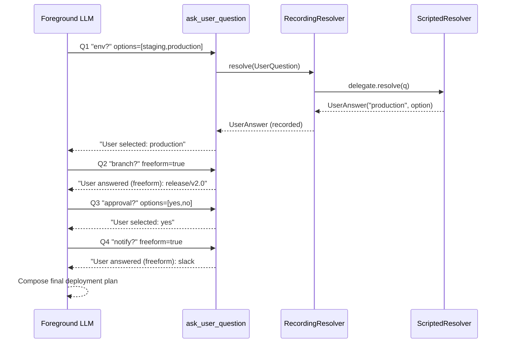

# Ask User Question

An LLM sometimes needs information it cannot infer — target environment, branch name, approval to proceed. This example wires the `ask_user_question` tool into an agent so it can pause mid-run, surface a structured question (option-style or freeform), and resume once an answer arrives. A scripted resolver supplies deterministic answers for automation; swap in a console resolver and it runs interactively.

## Architecture



## What You'll Learn

- Binding the `AskUserQuestionTool` primitive to a Spring AI `ToolCallback`
- Implementing the `UserQuestionResolver` SPI (Scripted, Console, or your own)
- Wrapping a resolver with `RecordingUserQuestionResolver` to capture an audit trail
- Inspecting `UserQuestion` (question, options, allowFreeform) and `UserAnswer` (value, isFreeform)
- Driving a multi-decision conversation through a single agent-callable tool
- Asserting outcomes against `resolver.history()`, `askedQuestions()`, and `receivedAnswers()`

## Prerequisites

- Java 21
- `OPENAI_API_KEY` in the parent `.env` (or `SPRING_PROFILES_ACTIVE=ollama` for local Mistral)
- `swarmai-core` 1.0.24

## Run

```bash
# Default release-planning prompt
./ask-user-question/run.sh

# Custom user goal
./ask-user-question/run.sh "Plan a database migration"
```

## How It Works

The example pre-loads a `ScriptedUserQuestionResolver` with four answers in FIFO order: `"production"`, `"release/v2.0"`, `"yes"`, `"notify slack channel #releases on success"`. That scripted resolver is wrapped in a `RecordingUserQuestionResolver` for audit. `AskUserQuestionTool.callback(resolver)` adapts the resolver into a single Spring AI `ToolCallback` named `ask_user_question`, which is the only tool given to the agent. The system prompt instructs the LLM that the user cannot see plain text and must obtain four specific decisions through tool calls. Each call returns a string like `"User selected: production"` or `"User answered (freeform): release/v2.0"`, which the LLM weaves into a final deployment plan. After the run, a quality check walks `resolver.history()` to confirm at least three questions were asked, the script was fully consumed, both option and freeform answers were exercised, and the final response references at least one user-supplied value.

## Key Code

```java
ScriptedUserQuestionResolver scripted = new ScriptedUserQuestionResolver(
        "production",                                  // env (option)
        "release/v2.0",                                // branch (freeform)
        "yes",                                         // approval (option)
        "notify slack channel #releases on success"    // notification (freeform)
);
RecordingUserQuestionResolver resolver =
        new RecordingUserQuestionResolver(scripted);

ToolCallback askCallback = AskUserQuestionTool.callback(resolver);

String response = chatClient.prompt()
        .system(systemPrompt)
        .user(userPrompt)
        .toolCallbacks(askCallback)
        .call()
        .content();

for (RecordingUserQuestionResolver.Entry e : resolver.history()) {
    UserQuestion q = e.question();
    UserAnswer  a = e.answer();
    // audit each Q/A pair
}
```

## Customization

- Swap `ScriptedUserQuestionResolver` for `ConsoleUserQuestionResolver` to drive the run from stdin
- Implement your own `UserQuestionResolver` (web UI, REST callback, Slack bot) — the rest of the wiring is unchanged
- Change the system prompt to gather different decisions (config keys, file paths, confirmation steps)
- Add more tools alongside `ask_user_question` so the agent can mix user input with tool calls
- Tighten the quality check to assert exact answer values or question wording instead of soft references
