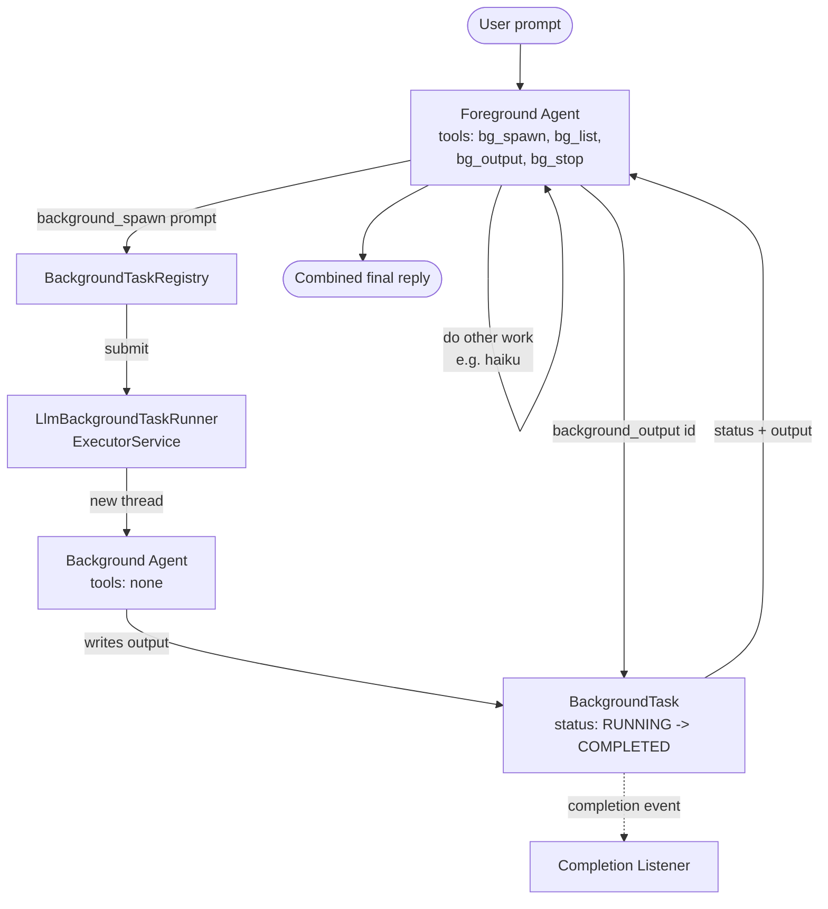

# Background Tasks

Some LLM work is slow — a multi-paragraph research summary, a long synthesis — and blocking the foreground turn on it wastes time. This example gives a foreground agent four background-task tools so it can spawn a slow research prompt asynchronously, do other work (a haiku) while it runs, then poll and combine both results into one reply. Background agents have no `background_*` tools, which structurally prevents recursive spawns.

## Architecture



## What You'll Learn

- Building a foreground tool set with `BackgroundTaskTools.all(registry)` (returns four `ToolCallback`s)
- Wiring a `BackgroundTaskRegistry` to an `LlmBackgroundTaskRunner` backed by an `ExecutorService`
- Inspecting `BackgroundTask` state (`id()`, `status()`, `output()`, `duration()`) and the `BackgroundTaskStatus` enum
- Subscribing to completion via `registry.addCompletionListener(...)`
- Awaiting terminal state with `task.awaitTerminal(Duration)` for deterministic teardown
- Structurally preventing recursion by giving the background runner an empty tool list

## Prerequisites

- Java 21
- `OPENAI_API_KEY` in the parent `.env` (or `SPRING_PROFILES_ACTIVE=ollama` for local Mistral)
- `swarmai-core` 1.0.24

## Run

```bash
# Default: mitochondria summary + coffee haiku, then combined reply
./background-tasks/run.sh

# Custom prompt — preserve the dispatch -> do other work -> poll -> combine pattern
./background-tasks/run.sh "Spawn a background research task on X. Meanwhile, tell me Y. Then combine both."
```

## How It Works

The example builds one shared `ChatClient` and wires an `LlmBackgroundTaskRunner` against an `ExecutorService` with two threads. The runner is handed to a `BackgroundTaskRegistry`, which tracks every spawned task and fires a completion listener that prints `[completion event] task <id> -> <status>`. `BackgroundTaskTools.all(registry)` returns the four `ToolCallback`s — `background_spawn`, `background_list`, `background_output`, `background_stop` — which become the foreground agent's tool set. The foreground system prompt directs the agent to spawn the slow work first, do the quick work next, then call `background_output` to retrieve the async result before producing one combined reply. After the LLM call returns, the example waits on any still-running tasks with `task.awaitTerminal(Duration.ofSeconds(45))` so the demo is deterministic, then prints every spawned task and runs a quality check: at least one task spawned, at least one COMPLETED, output ≥ 50 chars, and the foreground reply references the background topic.

## Key Code

```java
ExecutorService executor = Executors.newFixedThreadPool(2);

LlmBackgroundTaskRunner runner = new LlmBackgroundTaskRunner(
        chatClient, executor, backgroundSystem, List.of());     // no tools = no recursion

BackgroundTaskRegistry registry = new BackgroundTaskRegistry(runner);
registry.addCompletionListener(t ->
        System.out.printf("    [completion event] task %s -> %s (took %ds)%n",
                t.id(), t.status(), t.duration().toSeconds()));

List<ToolCallback> foregroundTools = BackgroundTaskTools.all(registry);

String reply = chatClient.prompt()
        .system(foregroundSystem)
        .user(userPrompt)
        .toolCallbacks(foregroundTools.toArray(new ToolCallback[0]))
        .call().content();

for (BackgroundTask t : registry.active()) {
    t.awaitTerminal(Duration.ofSeconds(45));                    // settle before reporting
}
```

## Customization

- Resize the `ExecutorService` thread pool to allow more (or fewer) concurrent background tasks
- Replace `LlmBackgroundTaskRunner` with your own `BackgroundTaskRunner` SPI (subagent, shell, MCP)
- Hand the background runner a curated tool list to enable specific background skills (still no `background_*` tools)
- Wire `registry.addCompletionListener` to a `SystemReminderChannel` so the foreground agent sees completions on its next turn
- Persist `registry.all()` between sessions to resume long-running task tracking
