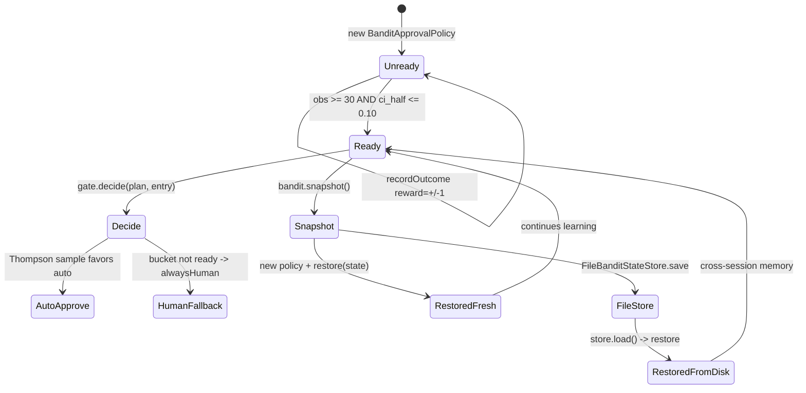

# Bandit Learning

`BanditApprovalPolicy` claims to learn which approval decisions tend to succeed; `BanditPromotionGate` claims to graduate buckets from "always ask a human" to "the bandit decides" once enough evidence accumulates. This example proves both with a deterministic 600-iteration simulation across two buckets — one with underlying P(success)=0.9, one with 0.1 — and demonstrates that `BanditState` snapshots round-trip through both in-memory restore and a `FileBanditStateStore`.

## Architecture



## What You'll Learn

- Constructing `BanditApprovalPolicy` and recording outcomes via `recordOutcome(PlanEntry, reward)`
- Wrapping a bandit with `BanditPromotionGate(minObs, maxCiHalfWidth)` for gated promotion
- Reading per-bucket telemetry: `bucketState(key)`, `meanAuto()`, `observationCount()`, `BanditPromotionGate.halfWidth(α, β)`
- Round-tripping learned state with `bandit.snapshot()` / `bandit.restore(BanditState)`
- Persisting across processes with `FileBanditStateStore.save()` / `load()`
- Composing the gate into a `PlanApprovalPolicy` chain alongside `alwaysHuman()` and static rules

## Prerequisites

- Java 21
- No LLM provider needed — the example does not call `ChatClient`
- `swarmai-core` 1.0.24

## Run

```bash
./run.sh bandit-learning

# or, equivalently
./bandit-learning/run.sh
```

To skip Ollama startup entirely (the LLM provider is never called):

```bash
SPRING_PROFILES_ACTIVE=openai-mini ./run.sh bandit-learning
```

## How It Works

A `BanditApprovalPolicy` is created with zero warmup, and a `BanditPromotionGate` wraps it with `minObs=30` and `maxCiHalfWidth=0.10`. A seeded `Random` (seed 42) drives 600 iterations that alternate between two buckets: `tool:deploy:LOW` (underlying success rate 0.9) and `tool:deploy:HIGH` (0.1). Each iteration builds a `PlanEntry`, draws a Bernoulli outcome from the underlying rate, and calls `bandit.recordOutcome(entry, ±1.0)`. Every 50 iterations, a row prints the per-bucket mean estimate, 95% Wald CI half-width, observation count, gate verdict, and the empirical rate at which the gate auto-approves a probe across 100 Thompson-sampled trials. At iteration 300 the example snapshots the bandit, builds a brand-new `BanditApprovalPolicy`, restores the snapshot, and continues — the curve is indistinguishable from continuing on the original. After 600 iterations a separate demo writes `bandit.snapshot()` to a `FileBanditStateStore` JSON file, builds a fresh policy with zero buckets, loads from disk, and confirms the means match. A final application-guide block prints the recommended composition pattern.

## Key Code

```java
BanditApprovalPolicy bandit = new BanditApprovalPolicy(
        BanditApprovalPolicy.DEFAULT_BUCKET_KEY, /*warmup*/ 0);
BanditPromotionGate gate = new BanditPromotionGate(
        bandit,
        PlanApprovalPolicy.alwaysHuman(),    // fallback for unready buckets
        /*minObs*/ 30,
        /*maxCiHalfWidth*/ 0.10);

for (int i = 1; i <= 600; i++) {
    boolean isGoodBucket = (i % 2 == 0);
    double underlying = isGoodBucket ? 0.9 : 0.1;
    Risk risk = isGoodBucket ? Risk.LOW : Risk.HIGH;
    double reward = rng.nextDouble() < underlying ? 1.0 : -1.0;

    PlanEntry e = PlanEntry.builder()
            .id("iter-" + i).proposedBy("tool:deploy")
            .payload("op-" + i).risk(risk).build();
    bandit.recordOutcome(e, reward);
}

// Snapshot/restore round-trip
BanditState snapshot = bandit.snapshot();
BanditApprovalPolicy reborn = new BanditApprovalPolicy(
        BanditApprovalPolicy.DEFAULT_BUCKET_KEY, 0);
reborn.restore(snapshot);

// Cross-session persistence
BanditStateStore store = new FileBanditStateStore(Path.of("data/bandit.json"));
store.save(bandit.snapshot());      // on shutdown
bandit.restore(store.load());       // on startup
```

## Customization

- Change `GOOD_RATE` / `BAD_RATE` to test the bandit against different underlying distributions
- Tune `minObs` and `maxCiHalfWidth` in the gate to require more (or less) evidence before promotion
- Increase `TOTAL_ITERATIONS` or `PRINT_EVERY` to inspect the convergence curve at finer resolution
- Add additional buckets keyed by `tool:<name>:<Risk>` to model a richer approval space
- Replace `PlanApprovalPolicy.alwaysHuman()` with a composed `PlanApprovalPolicy.all(tier, budget)` chain
