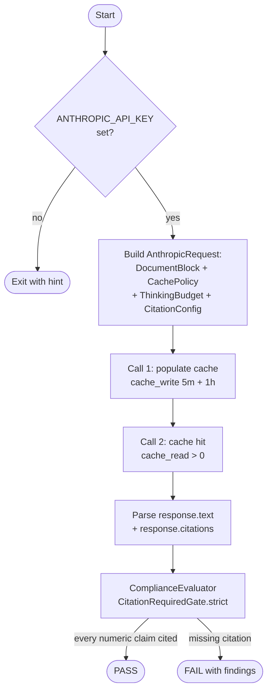

# Citation-Required Compliance Pipeline

When an LLM cites a number it didn't actually see in the source, you ship a hallucination. This example attaches a 10-K excerpt as a document block with citations enabled, asks Claude for a financial summary, then runs the response through a strict compliance gate that fails if any numeric claim isn't anchored to an inline citation.

## Architecture



## What You'll Learn

- Using `AnthropicNativeClient` to call Claude directly (bypassing the generic LLM SPI)
- Attaching source documents with `DocumentBlock.PlainText` and `CitationConfig.ENABLED`
- Configuring prompt caching with `CachePolicy` + `CacheBreakpoint.oneHour` / `fiveMinutes`
- Reading cache-hit telemetry from `CacheUsage` to verify caching fired
- Enabling extended reasoning with `ThinkingBudget.adaptive(ThinkingEffort.MEDIUM)`
- Wiring `CitationRequiredGate.strict()` into a `ComplianceEvaluator` to enforce citation discipline

## Prerequisites

- Java 21+
- `ANTHROPIC_API_KEY` exported in the environment
- Model: `claude-opus-4-7` (configured in code; adaptive thinking + output_config.effort are wired by the 1.0.24 adapter)

## Run

```bash
ANTHROPIC_API_KEY=sk-ant-... ./citation-required-pipeline/run.sh
```

The example issues two requests against the same prompt prefix so you can watch `cache_read` jump from 0 on call 1 to a non-zero value on call 2.

## How It Works

The example builds a single `AnthropicRequest` carrying a synthetic ACME 10-K excerpt as a `DocumentBlock.PlainText` with citations enabled, a `CachePolicy` that places a 1-hour cache breakpoint on the system prompt and a 5-minute breakpoint on the documents, and a medium-effort adaptive thinking budget. The first call to `AnthropicNativeClient.send` populates the cache and prints write telemetry; the second call uses the same prefix and is served from cache (`cache_read > 0`). The response text and inline citations (each anchored to a `CharLocation` or `PageLocation`) are then handed to a `ComplianceEvaluator` configured with `CitationRequiredGate.strict()`, which inspects every numeric claim in the output and fails if it lacks a citation. The verdict prints as PASS, or as FAIL with the specific blocker findings.

## Key Code

```java
AnthropicRequest req = AnthropicRequest.builder()
        .model("claude-opus-4-7")
        .system("You are a financial analyst. Cite every numeric claim back to the filing.")
        .document(new DocumentBlock.PlainText(
                "ACME-10K-FY25", "ACME Corp FY2025 10-K Excerpt",
                SAMPLE_FILING, /* citationsEnabled */ true))
        .message(AnthropicMessage.userText("Summarise ACME's FY25 financial performance..."))
        .cachePolicy(CachePolicy.builder()
                .breakpoint(CacheBreakpoint.oneHour("system"))
                .breakpoint(CacheBreakpoint.fiveMinutes("documents"))
                .build())
        .thinkingBudget(ThinkingBudget.adaptive(ThinkingEffort.MEDIUM))
        .citationConfig(CitationConfig.ENABLED)
        .build();

AnthropicResponse resp = client.send(req);

ComplianceEvaluator evaluator = new ComplianceEvaluator(List.of(CitationRequiredGate.strict()));
ComplianceReport report = evaluator.evaluate(
        ComplianceGate.Output.of(resp.text(), resp.citations()));
```

## Customization

- Swap `SAMPLE_FILING` for your own 10-K / 10-Q excerpt or earnings transcript
- Loosen the gate by replacing `CitationRequiredGate.strict()` with a warning-only variant in your own `ComplianceGate`
- Switch the cache breakpoints to `fiveMinutes` on both segments for short-lived documents, or both `oneHour` for stable corpora
- Change `ThinkingEffort.MEDIUM` to `LOW` (cheaper) or `HIGH` (more deliberate citation matching)
- Add additional gates (e.g. a numeric-range sanity check) to the `ComplianceEvaluator` constructor list
