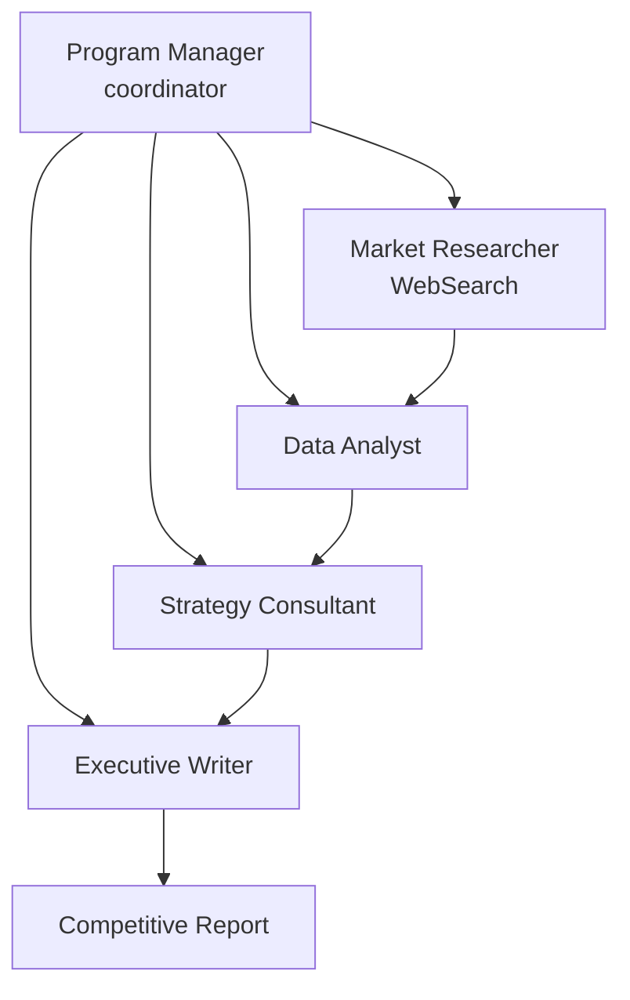

# Competitive Analysis Workflow

Hierarchical multi-agent research workflow that produces a board-level competitive analysis report with market intelligence, data analysis, and strategic recommendations.

## Architecture



## What You'll Learn

- Hierarchical process type with a manager agent coordinating specialists
- Four-stage research pipeline: gather, analyze, strategize, report
- SWOT analysis and comparison matrix generation by AI agents
- Data grounding rules that enforce [CONFIRMED] vs [ESTIMATE] labeling
- Task dependency chaining via `dependsOn()`
- Budget tracking and metrics collection across the full pipeline

## Prerequisites

- Ollama running locally (or OpenAI/Anthropic API key configured)
- No additional API keys required (WebSearchTool works with built-in search)

## Run

```bash
./run.sh competitive-analysis
./run.sh competitive-analysis "AI/ML platform competitive landscape"
./run.sh competitive-analysis "cloud infrastructure market 2026"
```

## How It Works

A Senior Research Program Manager coordinates four specialists through a hierarchical process. The Market Researcher gathers intelligence on key players, market size, and recent developments using the WebSearchTool. The Data Analyst builds comparison matrices and SWOT analyses from the research findings. The Strategy Consultant develops prioritized recommendations with timelines and ROI estimates. Finally, the Report Writer synthesizes everything into an executive report with cross-referenced sections. Each stage depends on the previous one, and the manager agent ensures quality at each handoff.

## Key Code

```java
// Hierarchical process with a manager agent coordinating the team
Swarm researchSwarm = Swarm.builder()
        .id("research-swarm")
        .agent(marketResearcher)
        .agent(dataAnalyst)
        .agent(strategist)
        .agent(reportWriter)
        .managerAgent(projectManager)   // Manager coordinates
        .task(marketResearchTask)       // Stage 1
        .task(dataAnalysisTask)         // Stage 2 (depends on 1)
        .task(strategyTask)             // Stage 3 (depends on 2)
        .task(reportTask)               // Stage 4 (depends on 3)
        .process(ProcessType.HIERARCHICAL)
        .build();
```

## Output

- `output/competitive_analysis_report.md` -- Executive report containing:
  - Executive summary with 5 data-backed takeaways
  - Market landscape with key players table
  - Competitive analysis with comparison matrices and scoring
  - Strategic recommendations with prioritized roadmap
  - Risk assessment with mitigation plans
  - Appendix with full data tables

## Customization

- Pass any research query as a command-line argument to change the topic
- Adjust agent temperatures (Market Researcher at 0.3, Strategist at 0.4 for more creative recommendations)
- Add more tools (e.g., CSVAnalysisTool for structured data analysis)
- Switch to `ProcessType.SEQUENTIAL` to remove manager coordination overhead
- Modify the scoring rubric in the Data Analyst's task description for different comparison dimensions

## YAML DSL

This workflow can also be defined declaratively in YAML. See [`workflows/research-pipeline.yaml`](src/main/resources/workflows/research-pipeline.yaml):

```java
// Load and run via YAML instead of Java
Swarm swarm = swarmLoader.load("workflows/research-pipeline.yaml",
    Map.of("topic", "AI Safety", "outputDir", "output"));
SwarmOutput output = swarm.kickoff(Map.of());
```

The Java example implements a competitive analysis pipeline with a hierarchical process, while the YAML research pipeline offers template variables, budget tracking, and a 3-agent research pipeline covering the same research pattern declaratively.
