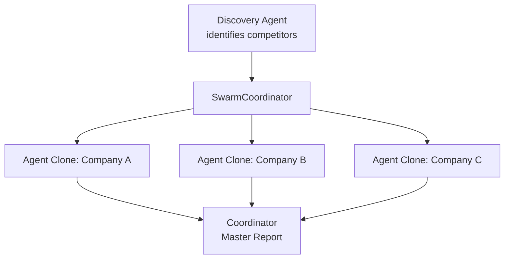

# Competitive Research Swarm

Ask "who competes with Stripe?" — a discovery agent names them, the swarm spawns one analyst per company in parallel, and they share what they learn. When agent #1 writes a revenue parser as a CODE skill, agents #2 and #3 reuse it instantly. A reviewer issues follow-up URL fetches to fill data gaps, then a strategy officer merges everything into one competitive landscape.

## Architecture



## Parallel Agent Coordination

The SwarmCoordinator drives the entire lifecycle:

1. **Discovery** -- A planner agent runs first and outputs `COMPETITOR: Company Name (Ticker: SYMBOL)` lines
2. **Fan-Out** -- The coordinator parses these lines (via `targetPrefix: "COMPETITOR:"`) and clones one research analyst agent per company
3. **Parallel Execution** -- Up to 5 agents run concurrently, each with 3 multi-turn iterations and compaction
4. **Skill Sharing** -- When Agent #1 generates a CODE skill (e.g., a revenue parser), it is registered in the shared `SkillRegistry` and immediately available to Agents #2, #3, etc.
5. **Reviewer Loop** -- A Research Quality Director reviews output and issues `NEXT_COMMANDS` with specific API URLs to fill data gaps
6. **Synthesis** -- A Chief Strategy Officer merges all per-company analyses into a unified competitive landscape report

## Prerequisites

- Java 21+
- Running Ollama instance (or OpenAI-compatible API)
- Model configured via `OLLAMA_MODEL` (default: `mistral:latest`)

## Run

```bash
./run.sh competitive-swarm "Analyze top 5 cloud providers AWS vs Azure vs GCP vs Oracle Cloud vs IBM Cloud"
```

## How It Works

The Competitive Research Swarm uses the `ProcessType.SWARM` coordinator to orchestrate parallel self-improving agents. The workflow starts with a discovery phase where a research analyst identifies the companies to analyze from the user's query, verifying each via the Wikipedia API. The SwarmCoordinator then parses the `COMPETITOR:` prefixed lines and spawns one agent clone per company, running them in parallel (up to `maxParallelAgents: 5`). Each cloned agent has three multi-turn iterations to gather financials, product details, market position, and competitive advantages -- generating reusable CODE skills along the way for tasks like revenue parsing or market share calculation. These skills are stored in a shared `SkillRegistry`, so a skill generated while analyzing AWS becomes instantly available to the Azure and GCP agents. A Research Quality Director reviews the output and drives deeper analysis by issuing `NEXT_COMMANDS` -- specific `http_request` and `web_scrape` calls targeting data gaps. Quality criteria enforce that each company has real financial data, specific product features, and actionable recommendations. Finally, a Chief Strategy Officer synthesizes all per-company analyses into a professional competitive landscape report with comparison tables and SWOT analysis.

## Key Code

```java
// Swarm configuration with parallel fan-out and skill sharing
Swarm swarm = Swarm.builder()
    .id("competitive-research-swarm")
    .agent(researchAnalyst)
    .agent(reportWriter)
    .managerAgent(reviewer)
    .task(discoveryTask)
    .task(analysisTask)
    .task(reportTask)
    .process(ProcessType.SWARM)
    .config("maxIterations", 5)
    .config("maxParallelAgents", 5)
    .config("targetPrefix", "COMPETITOR:")
    .config("qualityCriteria",
        "1. Each company has real financial data with sources cited\n" +
        "2. Product comparison includes specific features\n" +
        "3. SWOT analysis is company-specific, not generic\n" +
        "4. Recommendations are actionable\n" +
        "5. All data from API calls, not LLM knowledge")
    .verbose(true)
    .build();
```

## Output

- `output/competitive_landscape_report.md` -- comprehensive report with executive summary, company profiles, comparison matrix, SWOT analysis, and recommendations
- `output/analysis_COMPANY.md` -- per-company analysis files
- Console summary: duration, tasks completed, skills generated, skills reused, token usage

## Customization

- Change the default query to target a different industry or set of competitors
- Adjust `maxParallelAgents` to control concurrency based on API rate limits
- Modify `targetPrefix` if your discovery agent uses a different line format
- Tune `qualityCriteria` to enforce stricter or more domain-specific quality checks
- Raise `maxIterations` for deeper reviewer-driven analysis cycles
- Add domain-specific tools (e.g., `sec_filings`, `csv_analysis`) to the research tool set

## YAML DSL

This workflow can also be defined declaratively in YAML. See [`workflows/competitive-swarm.yaml`](src/main/resources/workflows/competitive-swarm.yaml):

```bash
# Load and run via YAML instead of Java
Swarm swarm = swarmLoader.load("workflows/competitive-swarm.yaml",
    Map.of("company", "OpenAI", "industry", "AI"));
SwarmOutput output = swarm.kickoff(Map.of());
```

The YAML definition includes SWARM process with distributed fan-out and target discovery.
