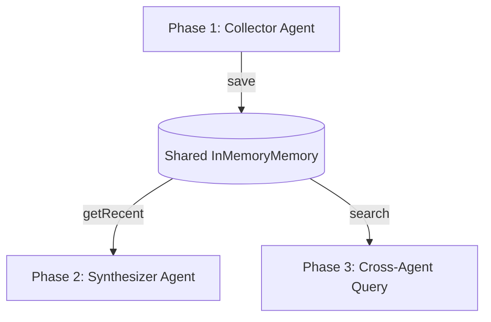

# Conversation Memory Persistence

Demonstrates how agents share and persist knowledge across workflow phases using the Memory interface, enabling cross-agent recall and search.

## Architecture



## What You'll Learn

- Using the `Memory` interface with `save()`, `search()`, `getRecentMemories()`, and `size()`
- Sharing an `InMemoryMemory` instance across multiple agents and swarms
- Binding memory to agents via `Agent.builder().memory()` and swarms via `Swarm.builder().memory()`
- Saving structured entries with metadata maps for filtering and retrieval
- Cross-agent memory queries -- one agent can recall what another agent stored
- Task dependency chains with `dependsOn()` for ordered multi-phase execution

## Prerequisites

- Ollama with `mistral:latest` (or any configured model)
- No additional API keys required

## Run

```bash
# Default topic: "sustainable energy technologies"
./run.sh memory

# Custom topic
./run.sh memory "quantum computing applications in healthcare"
```

## How It Works

The workflow runs in three phases with a shared `InMemoryMemory` instance. In Phase 1 (Learning), a Knowledge Collector agent researches the topic and produces a structured summary. The findings are saved to shared memory with metadata tags (`phase`, `topic`, `type`). In Phase 2 (Recall), a Knowledge Synthesizer agent accesses the same memory store to recall prior findings and builds upon them with actionable insights, strategic recommendations, and gap analysis. Its output is also saved to memory. Phase 3 (Cross-Agent Query) demonstrates direct memory API usage: `search()` finds entries by keyword, `getRecentMemories()` retrieves per-agent history, and `size()` reports total entries.

## Key Code

```java
// Shared memory instance across all agents
Memory sharedMemory = new InMemoryMemory();

// Collector agent with memory binding
Agent collector = Agent.builder()
        .role("Knowledge Collector")
        .goal("Research '" + topic + "' thoroughly...")
        .chatClient(chatClient)
        .memory(sharedMemory)
        .maxTurns(2)
        .build();

// Save findings with metadata for later retrieval
sharedMemory.save(COLLECTOR_ID, findings,
        Map.of("phase", "learning", "topic", topic, "type", "research-summary"));

// Cross-agent queries in Phase 3
List<?> searchResults = sharedMemory.search(topic, 5);
List<?> collectorMemories = sharedMemory.getRecentMemories(COLLECTOR_ID, 3);
List<?> synthMemories = sharedMemory.getRecentMemories(SYNTHESIZER_ID, 3);
```

## Customization

- Replace `InMemoryMemory` with a persistent store (Redis, database) for cross-session memory
- Add more agents to the pipeline to demonstrate N-way memory sharing
- Use metadata maps to filter memory entries by phase, type, or agent
- Increase `maxTurns` on agents for deeper research before saving to memory

## YAML DSL

This workflow can also be defined declaratively in YAML. See [`workflows/memory-persistence.yaml`](src/main/resources/workflows/memory-persistence.yaml):

```java
// Load and run via YAML instead of Java
Swarm swarm = swarmLoader.load("workflows/memory-persistence.yaml",
    Map.of("topic", "AI trends"));
SwarmOutput output = swarm.kickoff(Map.of());
```

The YAML definition includes agent-level memory for cross-session recall.
