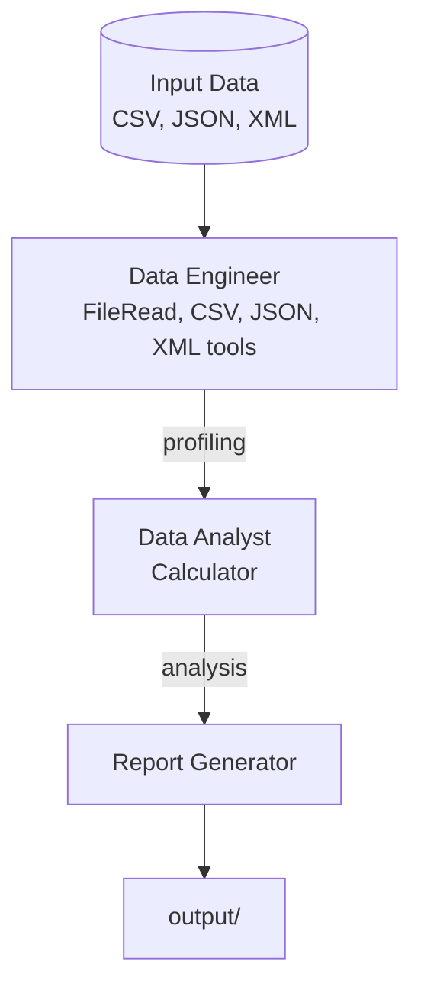

# Data Pipeline Workflow

Drop in a CSV, JSON, or XML file and walk away with a business insights report. A data engineer profiles the file with `CSVAnalysisTool` (describe, stats, filter), a data analyst computes derived metrics through `CodeExecutionTool`, and a report generator writes the findings — no input file? It auto-generates a sample.

## Architecture



## What You'll Learn

- Sequential process type with strict stage ordering
- Six data-focused tools: FileReadTool, FileWriteTool, CSVAnalysisTool, JSONTransformTool, XMLParseTool, CodeExecutionTool
- Auto-generated sample dataset when no input file is provided
- CSVAnalysisTool operations: describe, stats, head, count, filter
- CodeExecutionTool for computing derived metrics
- Business-oriented reporting from raw data analysis

## Prerequisites

- Ollama running locally (or OpenAI/Anthropic API key configured)
- A data file to analyze (CSV, JSON, or XML) -- or let it auto-generate a sample
- No additional API keys required

## Run

```bash
./run.sh data-pipeline                    # uses auto-generated sample data
./run.sh data-pipeline data/sample.csv    # analyze a specific CSV file
./run.sh data-pipeline output/sales.csv   # analyze any CSV
```

## How It Works

When no data file is specified, the workflow generates a sample 20-row employee dataset with columns for ID, name, department, salary, experience, performance score, and city. The Data Engineer profiles the file using FileReadTool for raw preview and CSVAnalysisTool for schema detection, column statistics, and data quality checks (nulls, duplicates, type issues). The Data Scientist then performs statistical analysis: descriptive statistics for numeric columns, distribution counts for categorical columns, segment comparisons across groups, and outlier detection. Finally, the Business Analyst translates all findings into an executive report with actionable recommendations, each tied to a specific data point.

## Key Code

```java
// Sequential pipeline: profile -> analyze -> report
Swarm swarm = Swarm.builder()
        .id("data-pipeline")
        .agent(dataEngineer)
        .agent(dataScientist)
        .agent(businessAnalyst)
        .task(profilingTask)       // Stage 1: data dictionary + quality
        .task(analysisTask)        // Stage 2: stats + patterns
        .task(insightsTask)        // Stage 3: business insights
        .process(ProcessType.SEQUENTIAL)
        .build();

// Auto-generate sample data when none is provided
fileWriteTool.execute(Map.of(
    "path", "output/sample_data.csv",
    "content", sampleCsv,
    "mode", "overwrite"
));
```

## Output

- `output/data_pipeline_report.md` -- Business insights report containing:
  - Executive summary with 3-5 key findings in business language
  - Dataset overview (data dictionary, shape, quality assessment)
  - Key metrics tables with descriptive statistics
  - Segment analysis with group comparisons
  - Patterns and trends identified from statistical analysis
  - 3-5 actionable recommendations each referencing specific metrics
  - Data quality notes and limitations
- `output/sample_data.csv` -- Auto-generated sample dataset (if no input file provided)

## Customization

- Pass any CSV file path as the first argument to analyze your own data
- Add support for JSON/XML by adding a format detection step in the Data Engineer task
- Extend the CSVAnalysisTool operations (e.g., correlation analysis, pivot tables)
- Add a fourth stage for automated visualization recommendations
- Increase the Data Scientist's `maxTurns` (default 2) for more thorough exploration
- Modify the sample dataset generator to create domain-specific test data

## YAML DSL

This workflow can also be defined declaratively in YAML. See [`workflows/data-pipeline.yaml`](src/main/resources/workflows/data-pipeline.yaml):

```bash
# Load and run via YAML instead of Java
Swarm swarm = swarmLoader.load("workflows/data-pipeline.yaml",
    Map.of("dataPath", "/data/sample.csv"));
SwarmOutput output = swarm.kickoff(Map.of());
```

The YAML definition includes 3-agent data pipeline with tool hooks and task conditions.
