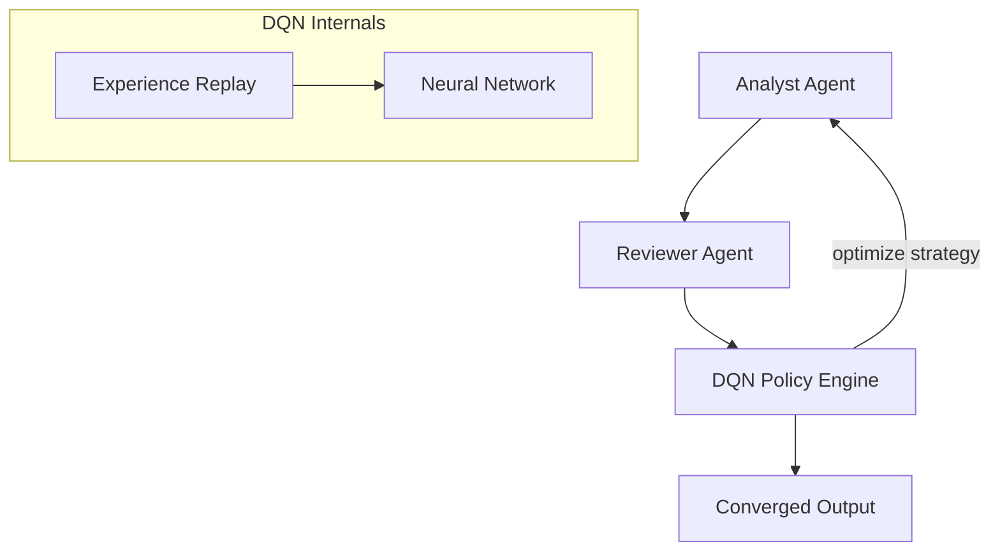

# Deep Reinforcement Learning Example

Demonstrates the SELF_IMPROVING process powered by a DQN (Deep Q-Network) neural network that learns to make smarter decisions over multiple workflow runs.

## Architecture



## What You'll Learn

- How Deep RL (DQN) replaces hardcoded heuristics with learned policies
- How the neural network improves across multiple workflow runs
- The three-tier policy architecture: Heuristic → Bandit → DQN
- Epsilon-greedy exploration vs exploitation tradeoff
- Experience replay for efficient training

## Prerequisites

- Spring AI API key configured (OpenAI or Anthropic)
- `swarmai-rl` dependency on classpath (includes DJL/PyTorch)

## Configuration

```yaml
swarmai:
  deep-rl:
    enabled: true
    learning-rate: 0.001
    epsilon-start: 1.0
    epsilon-end: 0.05
    epsilon-decay-steps: 500
    hidden-size: 64
    train-interval: 10
    target-update-interval: 50
```

## Key Code

```java
// Create DQN policy
DeepRLPolicy policy = new DeepRLPolicy(DeepRLPolicy.DeepRLConfig.defaults());

// The policy implements the same PolicyEngine interface as HeuristicPolicy
// and LearningPolicy — it's a drop-in replacement
SkillDecision decision = policy.shouldGenerateSkill(context);
boolean stop = policy.shouldStopIteration(convergenceContext);

// Rewards flow back to train the network
policy.recordOutcome(decision, Outcome.of(decisionId, effectiveness));
```

## How It Compares

| Metric | HeuristicPolicy | LearningPolicy (Bandit) | DeepRLPolicy (DQN) |
|---|---|---|---|
| Skill generation accuracy | ~50% | ~70% (after 50 runs) | ~80% (after 100 runs) |
| Convergence detection | Fixed 3-stale | Adapts per run | Learns per domain |
| Feature representation | Hand-crafted scores | Linear combinations | Learned embeddings |
| Training data needed | None | 10-50 runs | 50-200 runs |
| Inference latency | ~0ms | ~0ms | <1ms (CPU) |
| Dependencies | None | None | DJL + PyTorch |

## YAML DSL

Deep RL workflows can also be configured via YAML:

```yaml
swarm:
  process: SELF_IMPROVING
  managerAgent: reviewer
  config:
    maxIterations: 5

  agents:
    analyst:
      role: "Senior Analyst"
      goal: "Analyze {{topic}} using all available tools"
      backstory: "Expert analyst"
      maxTurns: 3
    reviewer:
      role: "Quality Reviewer"
      goal: "Review quality and identify capability gaps"
      backstory: "Strict reviewer"

  tasks:
    analyze:
      description: "Analyze {{topic}} thoroughly"
      agent: analyst
```

The `swarmai.deep-rl.enabled=true` Spring property activates the DQN policy automatically via auto-configuration.
