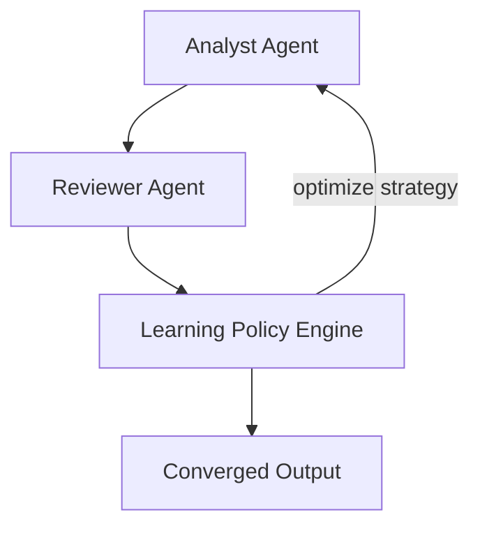

# Adaptive Learning Policy Example

Demonstrates the SELF_IMPROVING process using the framework's built-in adaptive learning policies (for example LinUCB/Thompson sampling) to improve decisions over multiple workflow runs.

## Architecture



## What You'll Learn

- How adaptive bandit policies improve over repeated runs.
- How framework-managed learning can reduce unnecessary skill generation.
- How SELF_IMPROVING workflows evolve from exploration to exploitation.

## Prerequisites

- Spring AI API key configured (OpenAI or Anthropic)
- Standard SwarmAI dependencies on classpath

## Key Code

```java
Swarm swarm = Swarm.builder()
    .agent(analyst)
    .agent(reviewer)
    .task(analyzeTask)
    .process(ProcessType.SELF_IMPROVING)
    .managerAgent(reviewer)
    .config("maxIterations", 3)
    .build();
```

## How It Compares

| Metric | HeuristicPolicy | LearningPolicy (Bandit) |
|---|---|---|
| Skill generation accuracy | ~50% | ~70% (after repeated runs) |
| Convergence detection | Fixed thresholds | Adapts per run |
| Training data needed | None | 10-50 runs |
| Dependencies | None | None |

## YAML DSL

Adaptive self-improving workflows can also be configured via YAML:

```yaml
swarm:
  process: SELF_IMPROVING
  managerAgent: reviewer
  config:
    maxIterations: 5

  agents:
    analyst:
      role: "Senior Analyst"
      goal: "Analyze {{topic}} using all available tools"
      backstory: "Expert analyst"
      maxTurns: 3
    reviewer:
      role: "Quality Reviewer"
      goal: "Review quality and identify capability gaps"
      backstory: "Strict reviewer"

  tasks:
    analyze:
      description: "Analyze {{topic}} thoroughly"
      agent: analyst
```
