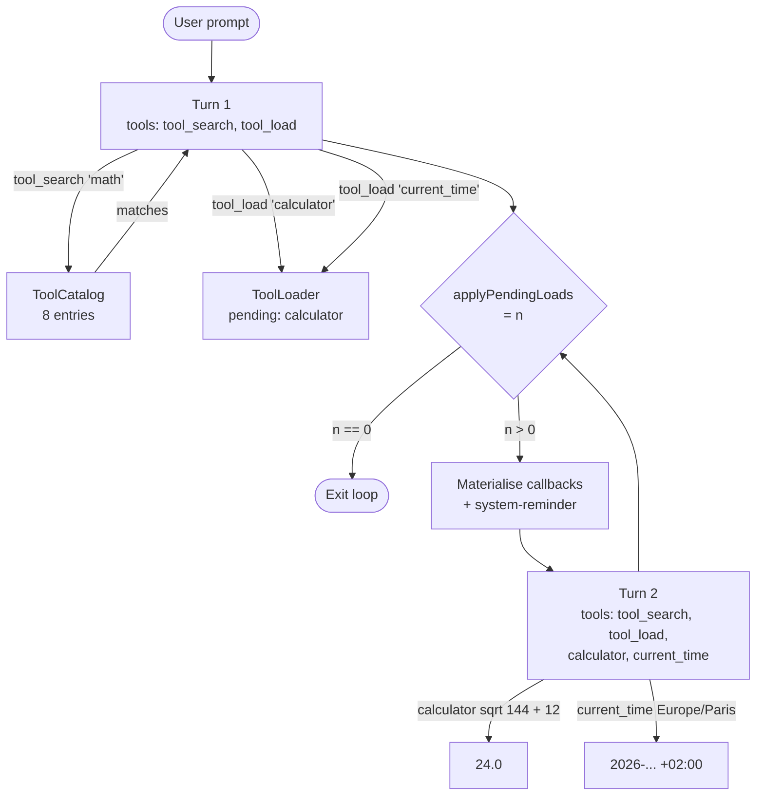

# Deferred Tool Loading

Dumping every tool's JSON schema into every prompt wastes context and confuses small models. This example shows how an agent can start with just two bootstrap tools — `tool_search` and `tool_load` — discover what it needs from an 8-tool catalog, request the specific tools, and have them materialised by the harness between turns. By turn two the requested callbacks are real and callable; the agent uses them and produces the final answer.

## Architecture



## What You'll Learn

- Registering `CatalogEntry` records into a `ToolCatalog` and wiring a `ToolSearchService`
- Building bootstrap callbacks with `ToolSearchTool.callback(svc)` and `ToolLoadTool.callback(loader)`
- Registering tool implementations with `loader.registerCallback(name, ToolCallback)`
- Driving a multi-turn loop where `loader.applyPendingLoads()` returns the exit condition (0 = done)
- Carrying conversation history across turns with `AssistantMessage` / `UserMessage`
- Steering the agent between turns via `<system-reminder>` blocks listing newly-loaded tools

## Prerequisites

- Java 21
- `OPENAI_API_KEY` in the parent `.env` (or `SPRING_PROFILES_ACTIVE=ollama` for local Mistral)
- `swarmai-core` 1.0.24

## Run

```bash
# Default: ask for the current time in Europe/Paris
./deferred-tool-loading/run.sh

# Custom prompt that forces both calculator and current_time to be loaded
./deferred-tool-loading/run.sh "Convert 100 USD to EUR and tell me the time in Tokyo"
```

## How It Works

A `ToolCatalog` is populated with eight `CatalogEntry` records (calculator, current_time, weather_lookup, currency_convert, translate, html_extract, base64_encode, uuid_generate) — metadata only, no callbacks attached. A `ToolLoader` wraps the catalog and receives `loader.registerCallback("calculator", ...)` and `loader.registerCallback("current_time", ...)` for the two tools this example actually implements; the other six remain catalogued but unimplemented, which exercises the `NO_CALLBACK_REGISTERED` path. The agent's initial tool set is just `tool_search` and `tool_load`. Each turn calls `chatClient.prompt().messages(history).toolCallbacks(currentTools).call()`, then `loader.applyPendingLoads()` materialises any `tool_load` requests made during the turn and returns a count. If the count is 0, the loop exits; otherwise the tool set is rebuilt as `[searchCb, loadCb] + loader.loadedCallbacks()` and a `<system-reminder>` block announcing the newly-loaded names is appended to history before the next turn. The quality check asserts ≥ 2 turns, ≥ 1 load applied, ≥ 1 invocation of a loaded tool, and a final reply containing a number or time-like value.

## Key Code

```java
List<ToolCallback> currentTools = new ArrayList<>();
currentTools.add(searchCb);                 // tool_search bootstrap
currentTools.add(loadCb);                   // tool_load bootstrap

for (int turn = 1; turn <= MAX_TURNS; turn++) {
    String reply = chatClient.prompt()
            .messages(history)
            .toolCallbacks(currentTools.toArray(new ToolCallback[0]))
            .call().content();
    history.add(new AssistantMessage(reply));

    int newlyLoaded = loader.applyPendingLoads();
    if (newlyLoaded == 0) break;            // exit condition

    currentTools.clear();
    currentTools.add(searchCb);
    currentTools.add(loadCb);
    currentTools.addAll(loader.loadedCallbacks());

    history.add(new UserMessage(
        "<system-reminder>\nLoaded since last turn: " + loader.loadedNames()
        + "\n</system-reminder>\n\nContinue with your plan."));
}
```

## Customization

- Add new `CatalogEntry` records and matching `loader.registerCallback(...)` suppliers to grow the catalog
- Drop a tool's callback registration to test the `NO_CALLBACK_REGISTERED` branch of `LoadRequestStatus`
- Cap `MAX_TURNS` (default 4) lower for stricter orchestration budgets
- Replace the `<system-reminder>` text to bias the agent toward unloading idle tools (an LRU eviction pattern)
- Add a producer that watches `loader.pendingNames()` and triggers external installs (MCP attach, plugin fetch) before the next `applyPendingLoads()` call
