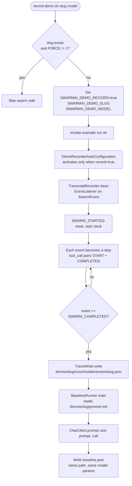

# Demo Recorder

A Spring Boot auto-configured trace recorder for SwarmAI examples. It subscribes to the framework's `SwarmEvent` bus, captures every step of a workflow as JSON, and produces a sibling `baseline.json` from a raw-LLM call against the same prompt — so the website's `/demos/:slug` page can play back swarm-vs-baseline side by side without anything being simulated.

## Architecture



## What You'll Learn

- Listening to framework events with Spring's `@EventListener` on `SwarmEvent`
- Activating beans conditionally via `@ConditionalOnProperty(swarmai.demo.record=true)` so the recorder is inert by default
- Pairing `TOOL_STARTED` and `TOOL_COMPLETED` events into a single `tool_call` step with duration
- Building a separate `@SpringBootApplication` (`BaselineRunner`) that reuses the same `ChatClient.Builder` for an apples-to-apples baseline
- Producing a deterministic `reproducibility` block (model, seed, temperature, top-p, framework git SHA, prompt hash) embedded in every trace
- Using `@PreDestroy` to flush a partial trace if the run crashes before `SWARM_COMPLETED`

## Prerequisites

- Java 21
- Maven
- SwarmAI 1.0.24 on the classpath (via the examples parent pom)
- For Ollama: nothing to set — the parent `run.sh` auto-starts Ollama and pulls `mistral:latest`
- For OpenAI: `OPENAI_API_KEY` in `swarm-ai-examples/.env` (auto-sourced)
- For Anthropic: `ANTHROPIC_API_KEY` in `swarm-ai-examples/.env`

## Run

```bash
# Default model (mistral via Ollama)
./demo-recorder/record-demo.sh stock-market-analysis

# Curated launch demo set
./demo-recorder/record-demo.sh launch mistral-ollama

# Against GPT-4o (requires OPENAI_API_KEY)
./demo-recorder/record-demo.sh stock-market-analysis gpt-4o

# Force overwrite an existing trace
FORCE=1 ./demo-recorder/record-demo.sh stock-market-analysis

# RAG demo (uses RagDemoRunner main class instead of run.sh)
./demo-recorder/record-rag-demo.sh
```

Output lands under `demos/<slug>/runs/<model>/<framework-version>/`:

```
demos/stock-market-analysis/runs/mistral-ollama/1.0.24/
├── stock-market-analysis.json   left panel of the website
└── baseline.json                right panel of the website
```

## How It Works

`record-demo.sh` exports `SWARMAI_DEMO_RECORD=true` plus `SLUG`, `MODEL`, `PROVIDER`, and `OUT_DIR`, then invokes the example's normal `run.sh`. Inside the JVM, `DemoRecorderAutoConfiguration` is gated on `swarmai.demo.record=true` — if that flag is absent the auto-config contributes zero beans and the example runs untouched. When the flag is set, three beans are wired: a Jackson `ObjectMapper`, a `TraceWriter`, and a `TranscriptRecorder` that registers itself as a Spring `@EventListener`. Every `SwarmEvent` published by the framework becomes a step in an in-memory list. `TOOL_STARTED` and `TOOL_COMPLETED` events are paired into a single `tool_call` step with `durationMs`. When `SWARM_COMPLETED` arrives the recorder flushes — or, if the JVM dies first, `@PreDestroy` writes whatever was captured. After the swarm side finishes, the script runs `BaselineRunner` as a separate Spring Boot main: it loads `demos/<slug>/prompt.md`, calls the same `ChatClient` with no workflow, and writes `baseline.json` with the same `reproducibility` block (so cost, tokens, wall time, and final output are directly comparable).

## Key Code

```java
@AutoConfiguration
@EnableConfigurationProperties(DemoRecorderProperties.class)
@ConditionalOnProperty(prefix = "swarmai.demo", name = "record", havingValue = "true")
public class DemoRecorderAutoConfiguration {
    @Bean
    public TranscriptRecorder transcriptRecorder(DemoRecorderProperties props, TraceWriter writer) {
        return new TranscriptRecorder(props, writer);
    }
}

public class TranscriptRecorder {
    @EventListener
    public synchronized void onEvent(SwarmEvent event) {
        if (event.getType() == SwarmEvent.Type.SWARM_STARTED) resetForNextSwarm(event.getSwarmId());
        if (startMs < 0) startMs = System.currentTimeMillis();
        long t = System.currentTimeMillis() - startMs;
        // ... pair TOOL_STARTED/COMPLETED into one step, accumulate the rest ...
        if (event.getType() == SwarmEvent.Type.SWARM_COMPLETED) flush();
    }
}
```

## Customization

- Change the output root with `SWARMAI_DEMO_OUT_DIR` (default `demos/`)
- Override the framework-version segment in the path with `SWARMAI_VERSION=1.0.24`
- Pin recording parameters via `swarmai.demo.{temperature,seed,topP,maxTokens}` so the `reproducibility` block in the trace matches your model config
- Add new model display names by editing `model_display_name()` in `record-demo.sh`
- Replace `BaselineRunner`'s single `ChatClient.prompt().call()` with a chain-of-thought or retrieval-augmented baseline if you want a stronger comparison point
- Add a new demo to the `LAUNCH_DEMOS` array so `./record-demo.sh launch` picks it up
