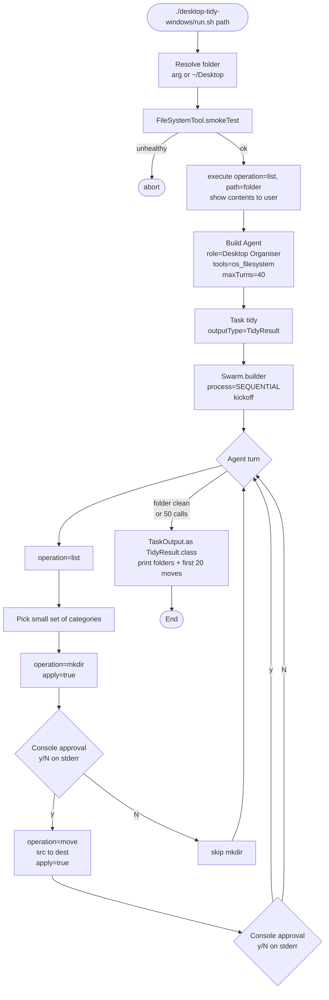

# Desktop Tidy

A single-agent workflow that tidies a folder (default: `~/Desktop`) by listing what's there, picking a handful of category folders, creating the ones that don't exist, and moving each loose file into the right one. Every `mkdir` and `move` flows through the supervised approval gate — the agent only proposes, the human approves each mutation at the console.

> The directory is still named `desktop-tidy-windows/` for backward compatibility, but the example now runs on Windows, macOS, and Linux via the cross-platform `os_filesystem` tool introduced in 1.0.13.

## Architecture



## What You'll Learn

- Building a single-agent `Swarm` with `Agent.builder()` + `Task.builder()` + `Swarm.builder()` and `ProcessType.SEQUENTIAL`
- Wiring the cross-platform `FileSystemTool` (category `swarmai.tools.os`) into an agent via `.tools(List.of(fsTool))`
- Letting `ConsoleApprovalGateHandler` intercept every `apply=true` mutation and prompt the operator for `y/N`
- Returning structured output by setting `Task.outputType(TidyResult.class)` and reading it back with `TaskOutput.as(TidyResult.class)`
- Activating an example only when a tool category is enabled, via `@ConditionalOnProperty(prefix = "swarmai.tools.os", name = "enabled")`
- Enforcing a hard turn limit (`maxTurns(40)`) and a per-turn tool-call budget so OpenAI's 128-tool-call cap doesn't bite

## Prerequisites

- Java 21
- Windows, macOS, or Linux (the tool detects the host at runtime via `java.nio.file`)
- SwarmAI 1.0.24 (the `swarmai.tools.os` category landed in 1.0.13)
- Ollama with `mistral:latest` running locally — the parent `run.sh` auto-pulls it
- The target folder must be inside `swarmai.tools.os.filesystem.allowed-roots` (defaults to `~/Desktop`, `~/Downloads`, `~/Documents` via `${user.home}` expansion)

## Run

```bash
# Tidy ~/Desktop (default)
./desktop-tidy-windows/run.sh

# Or an explicit folder — must be allowlisted
./desktop-tidy-windows/run.sh "$HOME/Desktop"
./desktop-tidy-windows/run.sh "$HOME/Downloads"
./desktop-tidy-windows/run.sh "C:/Users/me/Desktop"
```

## How It Works

`run.sh` forwards to the parent `run.sh desktop-tidy` which boots the Spring Boot examples app with `swarmai.tools.os.enabled=true`. `DesktopTidyExample` resolves the target folder (CLI arg or `~/Desktop`), smoke-tests the `FileSystemTool`, and prints the current listing so you can see what the agent will see. It then builds a single `Agent` ("Desktop Organiser") whose backstory pins down a strict protocol: always `list` first, parse the listing's fixed column layout, propose six-or-fewer category folders, `mkdir` each missing one with `apply=true`, then `move` every loose file. The agent gets the `FileSystemTool` as its only tool. Each mutating call hits the safety gate — `ConsoleApprovalGateHandler` prints the proposed operation to stderr and blocks on stdin for `y/N`. After at most 40 turns (or once the folder is empty), the task returns a `TidyResult` JSON which the example deserializes with `TaskOutput.as(TidyResult.class)` and prints as folders created plus the first 20 moves.

## Key Code

```java
Agent organiser = Agent.builder()
    .role("Desktop Organiser")
    .goal("Tidy the contents of " + folder + " by grouping items into a small set of "
            + "category folders (Apps, Documents, Images, Videos, Archives, Misc).")
    .backstory("...always list first, mkdir missing categories, move each loose file...")
    .chatClient(chatClient)
    .tools(List.of(fsTool))
    .maxTurns(40)
    .verbose(true)
    .build();

Task tidy = Task.builder()
    .description("Inspect " + folder + " and tidy it...")
    .expectedOutput("Structured summary of folders created, files moved, items skipped")
    .outputType(TidyResult.class)
    .agent(organiser)
    .build();

Swarm swarm = Swarm.builder()
    .agent(organiser).task(tidy)
    .process(ProcessType.SEQUENTIAL)
    .eventPublisher(eventPublisher)
    .build();

SwarmOutput result = swarm.kickoff(Map.of("folder", folder.toString()));
TidyResult tr = result.getTaskOutputs().get(0).as(TidyResult.class);
```

## Customization

- Change the category set in the agent's `backstory` (e.g. add `Code`, `Music`, drop `Misc`)
- Raise or lower `.maxTurns(40)` for larger folders, or tighten the per-turn 50-call hard limit in the backstory
- Add more allowlisted roots via `swarmai.tools.os.filesystem.allowed-roots` if you want to tidy a path outside the defaults
- Swap `ConsoleApprovalGateHandler` for an auto-approve handler in tests, or for a Slack/UI gate in production
- Replace the `TidyResult`/`FileMove` POJOs with your own structured shape if you want to capture e.g. file sizes or detected duplicates
