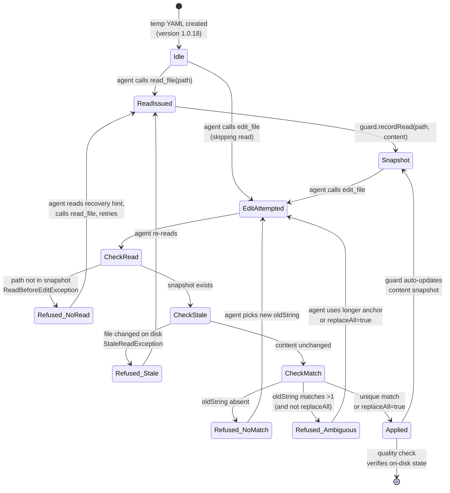

# Edit Discipline

Blind file edits are unsafe — the LLM might edit a file it never read, replace an ambiguous substring, or operate on content that has changed underneath it. `EditDisciplineGuard` makes those failures impossible by refusing the edit and returning an error message that tells the LLM exactly how to recover.

## Architecture



## What You'll Learn

- Wiring `EditDisciplineGuard` to two `FunctionToolCallback`s (`read_file`, `edit_file`) so a single guard enforces invariants across both
- Recording reads with `guard.recordRead(path, content)` to populate the snapshot used for stale-read detection
- Applying edits via `guard.applyEdit(path, currentContent, oldString, newString, replaceAll)` and catching `ReadBeforeEditException`, `NoMatchException`, `AmbiguousMatchException`
- Building tools from typed input POJOs (`ReadInput`, `EditInput`) via `FunctionToolCallback.builder(...).inputType(...)`
- Writing exception messages that double as recovery instructions for the LLM (the load-bearing part — without them the agent gets stuck)
- Asserting end-to-end behaviour via a quality check that reads the on-disk state and verifies only the intended line changed

## Prerequisites

- Java 21
- SwarmAI 1.0.24 (the discipline guard landed in 1.0.19)
- `OPENAI_API_KEY` set in `swarm-ai-examples/.env` (auto-sourced by the parent runner)
- Default model: `gpt-4o-mini` via the OpenAI Spring AI profile

## Run

```bash
./edit-discipline/run.sh
```

## How It Works

The example creates a temporary YAML file pinned to `version: 1.0.18` and asks the LLM to bump it to `1.0.19`. The user message deliberately *describes* the file's contents inline — tempting the model to skip `read_file` and call `edit_file` directly. Both tools are wired through a single `EditDisciplineGuard`. If the LLM jumps to `edit_file` first, the guard throws `ReadBeforeEditException` and the example surfaces the error message as the tool result; the LLM reads the hint, calls `read_file`, and retries. Each tool call increments one of six atomic counters (reads, attempts, successes, no-read refusals, no-match refusals, ambiguous refusals). When the LLM finishes, the example reads the file back from disk and runs a four-point quality check: was the file read at least once, did an edit succeed, is the version line `1.0.19`, and is every other line untouched. A well-behaved model passes on the first try; a less careful one passes after one refusal and recovery.

## Key Code

```java
EditDisciplineGuard guard = new EditDisciplineGuard();

Function<EditInput, String> editFn = input -> {
    String currentContent = Files.readString(Path.of(input.path), UTF_8);
    String newContent;
    try {
        newContent = guard.applyEdit(Path.of(input.path), currentContent,
                input.oldString, input.newString, Boolean.TRUE.equals(input.replaceAll));
    } catch (EditDisciplineGuard.ReadBeforeEditException e) {
        editRefusedNoRead.incrementAndGet();
        return "Error: " + e.getMessage();   // hint tells the LLM how to recover
    } catch (EditDisciplineGuard.AmbiguousMatchException e) {
        editRefusedAmbiguous.incrementAndGet();
        return "Error: " + e.getMessage();
    }
    Files.writeString(Path.of(input.path), newContent, UTF_8);
    editSuccesses.incrementAndGet();
    return "Edit applied.";
};

ToolCallback readCb = FunctionToolCallback.builder("read_file", readFn)
        .inputType(ReadInput.class).build();
ToolCallback editCb = FunctionToolCallback.builder("edit_file", editFn)
        .inputType(EditInput.class).build();

chatClient.prompt().system(systemPrompt).user(userPrompt)
        .toolCallbacks(readCb, editCb).call().content();
```

## Customization

- Change the seed file content / target version in `initialContent` + `userPrompt` to test different edit shapes (e.g. multiline replacements, deletions with empty `newString`)
- Force the ambiguous-match path by giving the LLM an `oldString` that appears more than once (or remove the system-prompt rule about picking the smallest unique anchor)
- Simulate a stale read by mutating the file from another thread between `recordRead` and `applyEdit` — `StaleReadException` will fire
- Swap `FunctionToolCallback` for your own `ToolCallback` implementation if you want richer error shaping
- Tighten or relax the quality check (`runQualityCheck`) — e.g. assert zero refusals if you want to enforce read-first on the first try
