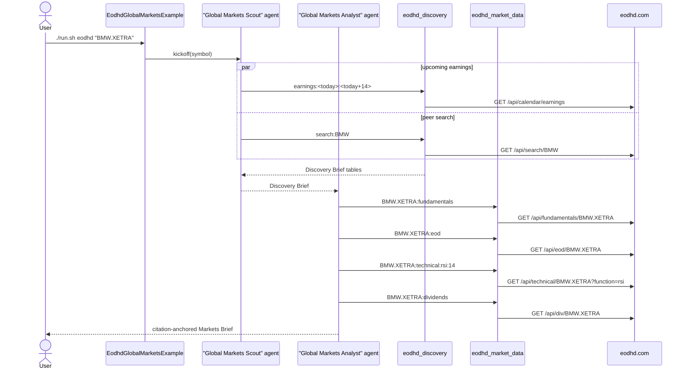

# EODHD Global Markets Example

> **New to SwarmAI?** Start from the [quickstart template](../quickstart-template/) for the
> minimum viable app, then swap `WikipediaTool` → `EodhdMarketDataTool` and use the
> two-agent global-markets prompt below.

Exercises the two EODHD tools shipped with SwarmAI:

- **`eodhd_market_data`** — historical EOD OHLCV, intraday bars, real-time quotes,
  fundamentals, dividends, splits, news, server-computed technical indicators
  (RSI, MACD, SMA, EMA, BBANDS, …), and macro economic indicators by country.
- **`eodhd_discovery`** — fuzzy ticker search, stock screener, and earnings / IPO /
  analyst-trends / economic-event calendars.

A two-agent pipeline — a **Global Markets Scout** uses discovery to find peer
tickers and upcoming earnings, then a **Global Markets Analyst** uses market data
to write a citation-anchored one-page brief on a focal symbol.

## How it works



## Prerequisites

**API key (required):**

| Env var          | How to get it                                                          |
|------------------|------------------------------------------------------------------------|
| `EODHD_API_KEY`  | Sign up at https://eodhd.com/ — the free tier allows 20 requests/day. |

```bash
export EODHD_API_KEY=your-eodhd-token-here
# or set the Spring property in application.yml:
#   eodhd.api-key: your-token-here
```

How to get the key, in detail:

1. Open https://eodhd.com/ in a browser.
2. Click **Register** (top right) and create an account — email confirmation only,
   no credit card needed for the free tier.
3. After confirming, go to your **Dashboard → Settings → API Tokens**.
   Your default token is shown there as `Demo Token` for the free tier.
4. Copy the token and export it as `EODHD_API_KEY` in your shell, or paste it into
   `~/.swarmai/.env` so every example picks it up automatically.
5. The free tier covers `/eod`, `/fundamentals` (US tickers), `/exchanges-list`,
   `/search`, and a small daily-call quota — plenty to try this example end-to-end.
   Paid plans unlock global fundamentals, intraday, technicals, macro indicators,
   and the higher-volume calendar endpoints. The tools degrade gracefully when an
   endpoint isn't covered by your tier — they return an empty section rather than
   crashing.

**Infrastructure:** none — calls go to `eodhd.com`.

## Run

```bash
./run.sh eodhd                    # BMW.XETRA (default)
./run.sh eodhd "AAPL.US"
./run.sh eodhd "VOD.LSE"
./run.sh eodhd "7203.TSE"         # Toyota
./run.sh eodhd "CBA.AU"           # Commonwealth Bank of Australia
```

## What to expect

A two-section markdown report saved to `output/eodhd_global_markets_<symbol>.md`:

1. **Discovery Brief** — upcoming earnings table + peer-ticker table from `eodhd_discovery`.
2. **Global Markets Brief** — snapshot (cap, P/E, sector), recent 30-day price
   action, RSI(14) read, dividend history, and 2-3 peer tickers cross-referenced
   from the Discovery Brief.

Every numeric figure carries an `[EODHD: <endpoint>, <period>]` citation tag the
tool emitted, so the brief is straightforward to fact-check or feed into a
downstream verifier.

## Value add

The canonical "global market data + discovery → LLM-driven brief" demo. The same
pattern applies to any financial workflow that needs international tickers, long
historical windows, or pre-computed indicators — the tools return citation-anchored
markdown and the agent shapes it into a report.

## What this proves about the tools

- `eodhd_market_data` accepts compact input grammar (`SYMBOL[.EXCHANGE][:endpoint[:args…]]`)
  and routes to the right EODHD endpoint — `eod`, `intraday`, `fundamentals`,
  `dividends`, `splits`, `news`, `technical`, `macro`, or all of the symbol-level
  ones in a single `all` call.
- `eodhd_discovery` parses operation grammar (`<op>[:<arg1>[:<arg2>…]]`) and
  preserves bracket-nested JSON-array filter expressions so the EODHD screener
  syntax flows through unmodified.
- Both tools share the same `EODHD_API_KEY` configuration and report `isHealthy()`
  as `false` when the key is missing — letting examples fail fast with a clear
  hint instead of mid-run HTTP 401s.
