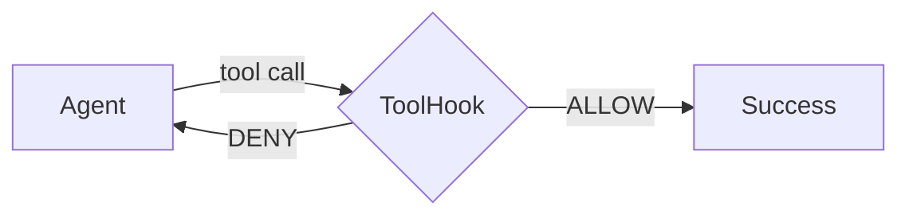
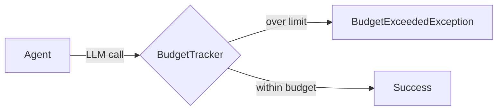
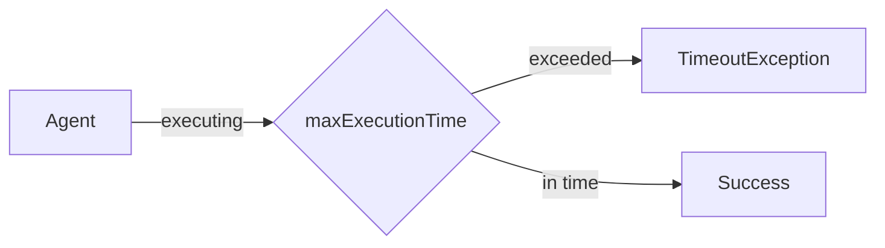

# Error Handling and Resilience

Demonstrates production-grade failure handling across three scenarios: tool failure recovery, budget enforcement, and timeout handling.

## Architecture

**Scenario 1: Tool Failure Recovery**



**Scenario 2: Budget Enforcement**



**Scenario 3: Timeout Handling**



## What You'll Learn

- Using `ToolHook.deny()` to reject tool calls without crashing the agent
- Building a `ToolHook` that simulates transient failures and allows retries
- Configuring `BudgetPolicy` with `HARD_STOP`, token limits, and cost caps
- Catching `BudgetExceededException` for graceful degradation
- Setting `Task.maxExecutionTime()` to prevent runaway tasks
- Preserving partial output from timed-out or budget-exceeded workflows

## Prerequisites

- Ollama with `mistral:latest` (or any configured model)
- No additional API keys required

## Run

```bash
./run.sh error-handling
```

## How It Works

Three independent scenarios run sequentially. In Scenario 1, a `ToolHook` denies the first call to `CalculatorTool` (simulating a rate limit or network blip) then allows subsequent retries -- the agent adapts by retrying or estimating. In Scenario 2, a `BudgetPolicy` with `HARD_STOP` action, 50k token limit, and $0.10 cost cap is configured; if exceeded, the framework throws `BudgetExceededException` which the caller catches for graceful degradation. In Scenario 3, a `Task` with `maxExecutionTime(10_000)` (10 seconds) forces the agent to be interrupted mid-generation, demonstrating that partial output is still retrievable. A summary table reports each scenario's outcome and recovery strategy.

## Key Code

```java
// Scenario 1: ToolHook that denies first call, allows retries
ToolHook transientFailureHook = new ToolHook() {
    @Override
    public ToolHookResult beforeToolUse(ToolHookContext ctx) {
        if (callCount.incrementAndGet() == 1) {
            return ToolHookResult.deny("Service temporarily unavailable. Please retry.");
        }
        return ToolHookResult.allow();
    }
};

// Scenario 2: Tight budget with HARD_STOP
BudgetPolicy tightBudget = BudgetPolicy.builder()
        .maxTotalTokens(50_000)
        .maxCostUsd(0.10)
        .onExceeded(BudgetPolicy.BudgetAction.HARD_STOP)
        .warningThresholdPercent(50.0)
        .build();

// Scenario 3: Short execution timeout
Task longTask = Task.builder()
        .description("Write an exhaustive 2000-word analysis...")
        .agent(analyst)
        .maxExecutionTime(10_000)  // 10 seconds
        .build();
```

## Customization

- Adjust the failure pattern in the `ToolHook` (e.g., deny every Nth call, deny specific tools only)
- Change `BudgetPolicy` limits to match your cost tolerance and switch between `HARD_STOP` and `WARN`
- Increase or decrease `maxExecutionTime` depending on expected LLM latency
- Add `afterToolUse` logic to the hook for error inspection and logging

## YAML DSL

This example demonstrates error handling scenarios (tool failure recovery, budget enforcement, timeout handling) that use programmatic Java hooks and cannot be fully expressed in YAML. The individual patterns (tool hooks, budget tracking) are available in the YAML DSL -- see [`audited-research.yaml`](src/main/resources/workflows/audited-research.yaml) and [`enterprise.yaml`](src/main/resources/workflows/enterprise.yaml) for examples.
