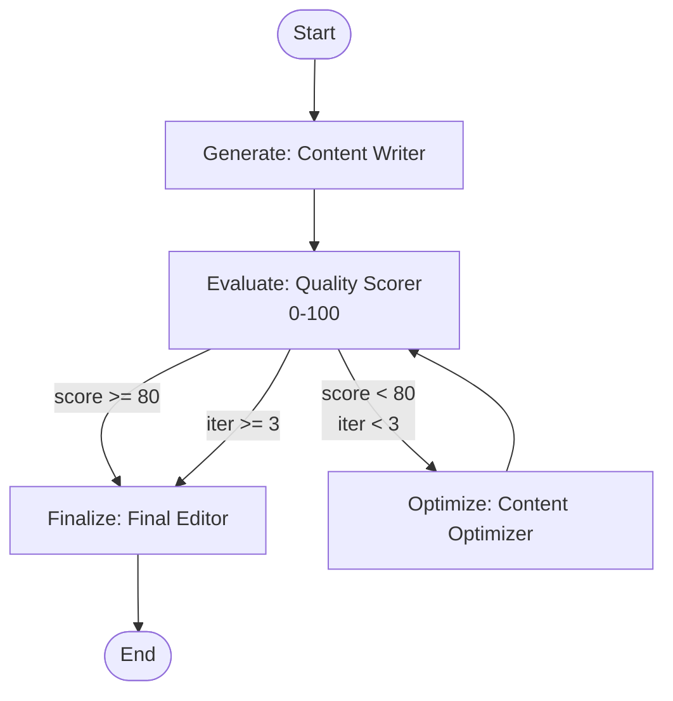

# Evaluator-Optimizer Workflow

First draft is rarely shipping-quality — so don't ship it. A writer drafts, a scorer grades it 0–100, and if it falls below the bar an optimizer rewrites with the evaluator's targeted feedback. The loop runs up to 3 rounds and exits the moment quality clears 80, with iteration count and accumulated feedback flowing through typed state channels.

## Architecture



## What You'll Learn

- Building iterative improvement loops with `SwarmGraph` and `addConditionalEdge()`
- Using `Channels.counter()` to track iteration count across loop iterations
- Using `Channels.appender()` to accumulate feedback across evaluation rounds
- Multi-exit conditional routing (three possible destinations from one node)
- Creating specialized agents for distinct roles (writer, evaluator, optimizer, editor)
- Extracting structured data (scores, priority fixes) from agent output with regex

## Prerequisites

- Ollama with `mistral:latest` (or any configured model)
- No additional API keys required

## Run

```bash
# Default topic: "The future of sustainable energy and its impact on global economies"
./run.sh evaluator-optimizer

# Custom topic
./run.sh evaluator-optimizer "the rise of autonomous AI agents"
```

## How It Works

The workflow constructs a `SwarmGraph` with four nodes forming an improvement loop. A Content Writer generates an initial article (400-600 words). A Quality Evaluator scores it on a 0-100 scale and provides structured feedback (SCORE, STRENGTHS, WEAKNESSES, PRIORITY_FIX). If the score is below 80 and fewer than 3 iterations have occurred, the content routes to a Content Optimizer that makes targeted improvements based on accumulated feedback (stored in an `appender` channel). The optimized content loops back to the evaluator. Once the score reaches 80 or the iteration limit is hit, a Final Editor polishes grammar and formatting without changing substance. Each agent is built with a role-appropriate temperature (0.7 for writing, 0.2 for evaluation, 0.5 for optimization, 0.1 for editing).

## Key Code

```java
CompiledSwarm compiled = SwarmGraph.create()
        .addAgent(placeholderAgent)
        .addTask(placeholderTask)
        .addEdge(SwarmGraph.START, "generate")
        .addNode("generate", state -> { /* Content Writer */ })
        .addEdge("generate", "evaluate")
        .addNode("evaluate", state -> { /* Quality Evaluator: score + feedback */ })

        // Three-way conditional routing from evaluate
        .addConditionalEdge("evaluate", state -> {
            int score = state.valueOrDefault("score", 0);
            int iter = state.valueOrDefault("iteration", 1);
            if (score >= QUALITY_THRESHOLD) return "finalize";
            if (iter >= MAX_ITERATIONS)     return "finalize";
            return "optimize";
        })

        .addNode("optimize", state -> { /* Improve based on feedback */ })
        .addEdge("optimize", "evaluate")  // loop back

        .addNode("finalize", state -> { /* Final polish */ })
        .addEdge("finalize", SwarmGraph.END)
        .stateSchema(schema)
        .compileOrThrow();
```

## Customization

- Change `QUALITY_THRESHOLD` (default 80) to require higher or lower quality before approval
- Adjust `MAX_ITERATIONS` (default 3) to allow more or fewer refinement rounds
- Modify the evaluator's scoring rubric in the task prompt to emphasize different quality dimensions
- Add additional nodes (e.g., fact-checking, SEO optimization) between optimize and evaluate
- Replace the `lastWriteWins` content channel with `appender` to preserve all draft versions

## YAML DSL

This workflow can also be defined declaratively in YAML. See [`workflows/graph-evaluator.yaml`](src/main/resources/workflows/graph-evaluator.yaml):

```java
// Load and run via YAML instead of Java
CompiledWorkflow workflow = swarmLoader.loadWorkflow("workflows/graph-evaluator.yaml");
SwarmOutput output = workflow.kickoff(Map.of());
```

The YAML definition includes graph-based evaluator-optimizer feedback loop with score threshold.
