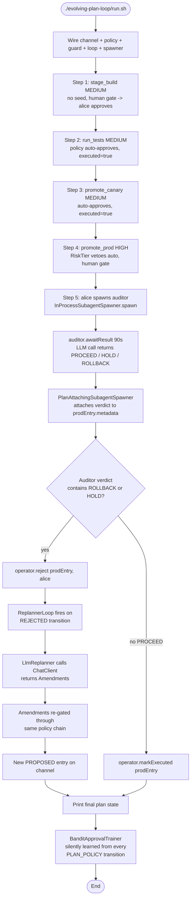

# Evolving Plan Loop

In real systems the plan changes as outcomes arrive — a step gets rejected, a risk threshold trips, an auditor recommends rollback — and the workflow needs to amend itself without rewriting its own topology. This example wires the full SwarmAI plan-loop chain (channel + policy + guard + replanner + subagent + operator + bandit observer) around a simulated four-step deploy and shows each primitive doing real work.

## Architecture



## What You'll Learn

- Using `InMemoryPlanChannelAccessor` as the single integration point — every component reads/writes the same `EvolvingPlan` channel
- Composing approval policies with `PlanApprovalPolicy.all(RiskTieredApprovalPolicy(), DriftBudgetApprovalPolicy(5))` and attaching a `BanditApprovalPolicy` as an observer via `BanditApprovalTrainer.attach(channel, bandit)`
- Wrapping the safety chain with `PlanAwareMutationGuard(humanDelegate, channel, policy)` so tool calls go through policy before the human gate
- Spawning an investigator via `InProcessSubagentSpawner.spawn(SubagentSpec)` and writing its verdict back to the plan entry through `PlanAttachingSubagentSpawner`
- Reacting to rejections with `ReplannerLoop.start(channel, replanner, ReplanTriggerPolicy.onRejection(), contextSupplier, policy)` and getting structured amendments from `LlmReplanner` via a real `ChatClient`
- Auto-deriving replan observations from terminal transitions with `ChannelDerivedReplanContextSupplier.builder(channel).goal(...).maxObservations(8)`

## Prerequisites

- Java 21
- SwarmAI 1.0.24 (the plan-loop primitives were stabilised in 1.0.19+)
- Ollama with `mistral:latest` for the default profile (auto-pulled by the parent `run.sh`)
- Optional: `OPENAI_API_KEY` in `swarm-ai-examples/.env` to run against GPT-4o-mini instead

## Run

```bash
# Default (Ollama + mistral:latest)
./evolving-plan-loop/run.sh
# or, equivalently
./run.sh plan-loop

# OpenAI profile
SPRING_PROFILES_ACTIVE=openai-mini OPENAI_API_KEY=sk-... ./run.sh plan-loop
```

> Output is non-deterministic: the auditor's verdict and the replanner's amendment shape both depend on the LLM. Sometimes the auditor says PROCEED; sometimes the replanner returns `Amendments.none(...)` because its JSON didn't parse. Both branches are handled and printed. For a deterministic run see `PlanLoopShowcaseTest` in the SwarmAI repo.

## How It Works

The example wires an in-memory `PlanChannelAccessor`, a composed `PlanApprovalPolicy` (risk tier + drift budget of 5), a silent bandit observer, a human-gate delegate, a `PlanAwareMutationGuard`, an `LlmReplanner` driven by the injected `ChatClient.Builder`, and a `ReplannerLoop` configured to fire on rejection. Four simulated deploy actions then flow through the guard: `stage_build` (MEDIUM, no policy seed yet → human gate), `run_tests` and `promote_canary` (MEDIUM with seed → auto-approve and `guard.observe(success=true)`), and `promote_prod` (HIGH → risk tier forces human routing). Before letting prod execute, the operator spawns an in-process auditor subagent with a `SubagentSpec` that includes `parentMetadata("subagent.attachTo", prodEntry.id())`, so `PlanAttachingSubagentSpawner` will write the result back onto the entry's metadata. The auditor calls the LLM and returns a verdict ending in `PROCEED` / `HOLD` / `ROLLBACK`. If `HOLD` or `ROLLBACK`, the operator calls `PlanOperator.reject(prodEntry.id(), "alice", reason)` — the `ReplannerLoop` catches the `REJECTED` transition, asks `LlmReplanner` for an amendment, re-gates the amendment through the same policy chain, and appends a fresh `PROPOSED` entry. Throughout, `BanditApprovalTrainer` watches `PLAN_POLICY` transitions and accumulates per-bucket success rates so a future run can promote it from observer to vetoer.

## Key Code

```java
InMemoryPlanChannelAccessor channel = new InMemoryPlanChannelAccessor();
PlanOperator operator = new PlanOperator(channel);

BanditApprovalPolicy bandit = new BanditApprovalPolicy(
        BanditApprovalPolicy.DEFAULT_BUCKET_KEY, /*warmup*/ 0);
PlanApprovalPolicy policy = PlanApprovalPolicy.all(
        new RiskTieredApprovalPolicy(),
        new DriftBudgetApprovalPolicy(5));
BanditApprovalTrainer.attach(channel, bandit);             // observer, learns silently

MutationGuard humanDelegate = plan ->
        MutationGuard.Decision.approve("alice", "operator approved at gate");
PlanAwareMutationGuard guard = new PlanAwareMutationGuard(humanDelegate, channel, policy);

LlmReplanner replanner = new LlmReplanner(chatClientBuilder.build());
ReplannerLoop loop = ReplannerLoop.start(channel, replanner,
        ReplanTriggerPolicy.onRejection(),
        ChannelDerivedReplanContextSupplier.builder(channel)
                .goal("Ship the change safely. If any step was rejected, propose a concrete recovery action.")
                .maxObservations(8).build(),
        policy);                                            // re-gates amendments

SubagentSpawner spawner = new PlanAttachingSubagentSpawner(
        new InProcessSubagentSpawner(chatClientBuilder.build(), subagentExecutor), channel);
Subagent auditor = spawner.spawn(SubagentSpec.builder()
        .type("auditor").systemPrompt("...").userPrompt("Should promote_prod proceed?")
        .timeout(Duration.ofSeconds(60))
        .parentMetadata(PlanAttachingSubagentSpawner.ATTACH_KEY, prodEntry.id())
        .build());
SubagentResult audit = auditor.awaitResult(Duration.ofSeconds(90));

if (audit.output().toUpperCase().contains("ROLLBACK")) {
    operator.reject(prodEntry.id(), "alice", "auditor recommended rollback");
    // ReplannerLoop fires on REJECTED -> LlmReplanner amends -> policy re-gates -> PROPOSED
}
```

## Customization

- Promote the bandit from observer to vetoer by adding it to the chain: `PlanApprovalPolicy.all(tier, budget, bandit)` (or `.any(...)` for a faster track) once you trust its per-bucket data
- Replace the stub `humanDelegate` with a real UI / Slack / CLI gate that prompts an operator
- Tighten the drift budget (`new DriftBudgetApprovalPolicy(N)`) or add new policies to the `all(...)` composition
- Swap `InProcessSubagentSpawner` for a different `SubagentSpawner` (e.g. one that calls a remote service) — the `PlanAttachingSubagentSpawner` wrapper still attaches the verdict to the entry
- Change the replanner trigger to `ReplanTriggerPolicy.onAny()` or a custom one so amendments fire on more than just rejections
- Add a `BanditPromotionGate` that watches the trainer and reports when a bucket has enough observations to be safely promoted
