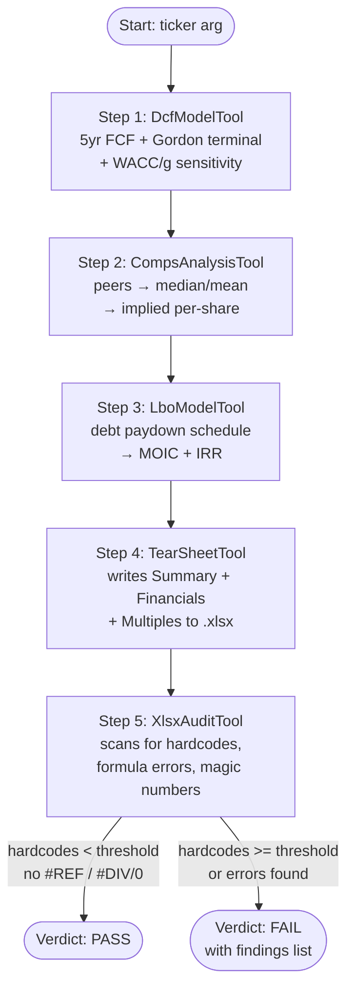

# Financial Model Builder

Junior analysts produce models full of hardcoded numbers and broken references — and reviewers waste hours catching them. This example chains four finance tools (DCF, comps, LBO, tear sheet) to produce a complete valuation package as an Excel file, then runs an audit tool over the file that flags exactly the kinds of issues a senior would flag. No LLM calls, no API keys — pure deterministic Java + Apache POI.

## Architecture



## What You'll Learn

- Composing deterministic finance computation tools — `DcfModelTool`, `CompsAnalysisTool`, `LboModelTool`
- Authoring multi-sheet Excel workbooks via `XlsxAuthorTool` and the higher-level `TearSheetTool`
- Reading Excel back and grading it with `XlsxAuditTool` (hardcode ratio, formula errors, magic numbers)
- The shape of the tool I/O contract — `Map<String, Object>` in, `Map<String, Object>` out
- Wiring tools as Spring `@Component` beans with constructor-injected output paths
- Why "FAIL" can be the success signal in a pipeline that tests its own audit step

## Prerequisites

- Java 21+
- No API keys, no Ollama, no network — runs fully offline
- Apache POI is pulled in transitively by `swarmai-tools-office`

## Run

```bash
./financial-model-builder/run.sh           # default ticker ACME
./financial-model-builder/run.sh TSLA      # custom ticker (label only)
```

Output workbook lands at `output/financial-model/financial-model.xlsx`.

## How It Works

The example instantiates the four finance tools and the office tools with a shared output directory, then runs five sequential steps. `DcfModelTool` projects 5 years of free cash flow against the supplied growth, margin, and capex assumptions, applies the Gordon-growth terminal, discounts at the WACC, and emits enterprise/equity/per-share values plus a 3×3 sensitivity grid. `CompsAnalysisTool` takes target financials and a peer set, computes EV/Revenue, EV/EBITDA, and P/E summary statistics, and back-solves implied per-share values at the median multiple. `LboModelTool` builds a leveraged buyout cash-flow schedule and returns MOIC and IRR. `TearSheetTool` (which composes `XlsxAuthorTool`) writes Summary, Financials, and Multiples sheets to disk — deliberately using hardcoded literals so the next step has something to catch. Finally `XlsxAuditTool` opens the just-written file, counts formulas vs. hardcoded constants, scans for `#REF!` / `#DIV/0!`, and returns a PASS/FAIL verdict with the offending cells. The expected verdict here is FAIL — that's the point: the audit step is proving it can detect a weak model.

## Key Code

```java
Map<String, Object> dcfResult = (Map<String, Object>) dcfModel.execute(Map.ofEntries(
        Map.entry("ticker", ticker),
        Map.entry("baseRevenue", 1000.0),
        Map.entry("baseEbitdaMargin", 0.30),
        Map.entry("revenueGrowth", List.of(0.15, 0.12, 0.10, 0.08, 0.06)),
        Map.entry("wacc", 0.09),
        Map.entry("terminalGrowth", 0.025),
        Map.entry("netDebt", 200.0),
        Map.entry("sharesOutstanding", 100.0)));

Map<String, Object> tearResult = (Map<String, Object>) tearSheet.execute(Map.of(
        "path", "financial-model.xlsx",
        "company", Map.of("ticker", ticker, "name", ticker + " Corp", ...),
        "financials", List.of(/* per-year rows */),
        "multiples", /* from comps breakdown */));

Map<String, Object> auditResult = (Map<String, Object>) xlsxAudit.execute(
        Map.of("path", "financial-model.xlsx", "hardcodeThresholdRatio", 0.5));
// auditResult.get("audit") → "PASS" or "FAIL"
```

## Customization

- Change `ticker` and the `baseRevenue` / `baseEbitdaMargin` / `revenueGrowth` inputs to value a different company
- Adjust `wacc` and `terminalGrowth` in the DCF step to see how sensitivity shifts the per-share value
- Replace the synthetic `PEER1`/`PEER2`/`PEER3` peer set with real multiples for your target's sector
- Tune `hardcodeThresholdRatio` (default 0.5) — lower the bar to make the auditor stricter
- Extend `TearSheetTool` calls with named ranges / formula cells to see the audit flip from FAIL to PASS
