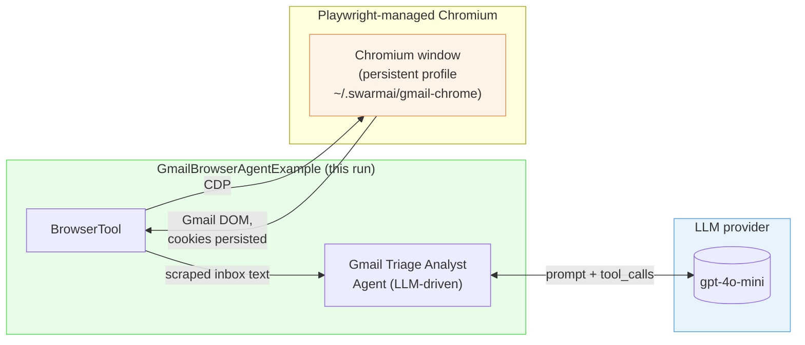
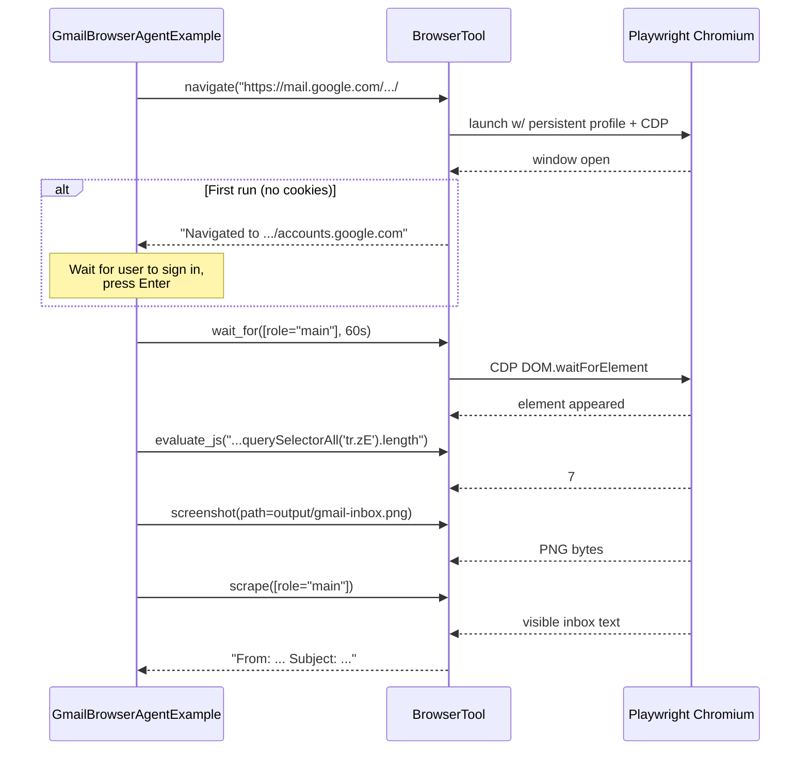

# Gmail Browser Agent

> Drive your real Gmail through the framework's `BrowserTool`. Counts unread,
> scrapes the inbox, takes a screenshot, and — when an LLM is configured —
> runs a triage agent that surfaces what to read first. **No Chrome flags, no
> CDP setup — just run it.**
> _New in framework 1.0.16 (`BrowserTool` + Playwright)._

---

## Quick start

```bash
./gmail-browser-agent/run.sh
```

Or right-click → Run `GmailBrowserAgentExample.main()` in your IDE.

That's it. On first run:

1. The example detects Chrome on this OS and spawns it with a dedicated profile
   at `~/.swarmai/gmail-chrome-cdp` (a sibling of your everyday Chrome profile —
   no collision).
2. A **real Chrome** window opens at gmail.com.
3. You sign in normally — Google sees a regular Chrome and lets you through.
4. Hit **Enter** in the terminal when you reach your inbox.
5. The example reads the inbox, counts unread, takes a screenshot, and (if you
   set `SPRING_PROFILES_ACTIVE=openai-mini` + `OPENAI_API_KEY`) runs an LLM
   triage agent.

On subsequent runs, the cookies are saved at `~/.swarmai/gmail-chrome-cdp/` —
no signin, straight to the inbox. Nothing to remember, nothing to type.

> **Why your real Chrome and not Playwright's bundled Chromium?** Google's signin
> flow detects Playwright's Chromium and refuses to authenticate ("This browser
> or app may not be secure"). Connecting to your real, unmodified Chrome is the
> only reliable way to drive Gmail. The example handles the spawn for you.

---

## What you'll see

```
================================================================================
Gmail Browser Agent — using Playwright-managed Chromium (persistent profile)
Profile dir: /home/you/.swarmai/gmail-chrome
FIRST RUN — a Chromium window will open. Sign in to Gmail INSIDE that window.
================================================================================

PHASE 1 — Deterministic browser steps (no LLM)
[navigate Gmail]            Navigated to https://mail.google.com/...  title="Inbox - you@..."

>>> Sign in to Gmail in the Chromium window that just opened.
>>> When you reach your inbox, return here and press ENTER.
                                                              ← (you press Enter)

[wait for inbox container]  Element appeared: [role="main"]
[unread row count]          7
[screenshot]                Saved screenshot to .../output/gmail-inbox.png
[inbox snippet]             3,184 chars
                            From: GitHub <noreply@github.com>  PR #42 ready for review …

PHASE 2 — LLM-driven triage of the scraped inbox
Triage report:
**Top 5 messages**
- GitHub PR #42 ready for review — your colleague tagged you, blocking their merge
- Stripe invoice $X due on …
…
**Deadlines / time-sensitive**
…
**Suspicious / phishing-looking**
- "Account verification" email from a non-google.com sender
```

---

## Why this is easier than the old `attach`-mode setup

| | Old (attach) | New (persistent) |
|---|---|---|
| Steps before first run | Launch Chrome with `--remote-debugging-port=9222 --user-data-dir=...`, verify with curl, sign in | _none_ |
| What needs to be on PATH | Real Chrome | _nothing_ — Playwright bundles Chromium |
| Conflicts with your regular Chrome | Yes if you forget `--user-data-dir` | _never_ |
| Sign-in needed | Once, in your real Chrome | Once, in the Playwright window the example pops up |
| Re-runs | Need to keep Chrome+debug-port alive | Just run the example |

The only one-time hit is Playwright downloading Chromium on first launch
(~150 MB to `~/.cache/ms-playwright/`).

---

## Architecture



The orange box — the Chromium window — is something the example pops up. You
sign in there once. Cookies stay in `~/.swarmai/gmail-chrome/` so the next run
goes straight to the inbox.

---

## What gets executed (Phase 1)



---

## Phase 2 — LLM triage (only with `SPRING_PROFILES_ACTIVE=openai-mini`)

The scraped inbox text gets passed to a `Gmail Triage Analyst` Agent:

> "Read the user's inbox text and surface what deserves attention now. Be
> concise — bullet points, not paragraphs. Group by sender/topic, flag things
> that look time-sensitive, and explicitly call out anything that smells like
> phishing."

The agent doesn't get tool access — it just analyses the scraped text and
produces a structured report. This is the safe default. To let the agent
TAKE ACTIONS in Gmail (mark read, archive, reply), see the README in
`swarmai-tools/.../tool/common/BrowserTool.java`.

---

## Security guard

The example sets:
```yaml
swarmai.tools.browser.allowed-hosts: google.com,gmail.com
```

Any navigation outside those domains is rejected at the BrowserTool layer
with a clear `ERROR: SecurityException: Host '...' is not in
swarmai.tools.browser.allowed-hosts` — you can't accidentally pivot from
this example to scrape another site, and a future "agent decides where to go"
extension can't either.

---

## Troubleshooting

**"Playwright is downloading Chromium" hangs forever**
- Check your network. The download is from `cdn.playwright.dev` (~150 MB).
- Set `PLAYWRIGHT_BROWSERS_PATH=/some/dir` if you want a different cache location.

**The Chromium window opened but I'm stuck on a Google Recaptcha**
- Headed Playwright Chromium occasionally trips Google's risk signals on
  brand-new profiles. Try the `attach` mode (sign in to your real Chrome
  first, then attach) — see "Power user: attach mode" below.

**I want to start fresh**
```bash
rm -rf ~/.swarmai/gmail-chrome
```
Next run will trigger the first-run signin flow again.

**I see the agent triage referencing emails I don't recognise**
- The scraped text only includes what's visible in the inbox `[role="main"]`.
  Gmail virtualizes the message list, so only ~50 rows are in the DOM at a
  time. Scroll, then re-run; or extend the example to scroll first.

---

## Power user: `attach` mode

If you want to drive your everyday Chrome (to inherit your regular session),
launch Chrome separately and switch the run.sh flag:

```bash
# Linux
google-chrome --remote-debugging-port=9222 --user-data-dir=$HOME/cdp-chrome
# (sign in to Gmail in that Chrome window, ONCE)

./gmail-browser-agent/run.sh \
    --swarmai.tools.browser.mode=attach \
    --swarmai.tools.browser.cdp-url=http://localhost:9222
```

This is more fragile (different `--user-data-dir` requirements per OS,
existing-Chrome-process gotchas) but inherits cookies/logins from the Chrome
you already use. The default `persistent` mode is the easier path.

---

## Files

| File | Role |
|---|---|
| `GmailBrowserAgentExample.java` | Main entry. Phase 1 deterministic + Phase 2 LLM triage. Self-enables persistent mode in `main()` so IDE Run works. |
| `BrowserToolFunctionConfig.java` | Spring AI `Function<BrowserTool.Request, String>` bridge — needed if you give the agent access to the tool |
| `run.sh` | Forwards the right `swarmai.tools.browser.*` flags |

## See also

- `swarmai-tools/.../tool/common/BrowserTool.java` — the framework tool
- `mcp-server-host/` — for "expose this BrowserTool to Claude Desktop" patterns
