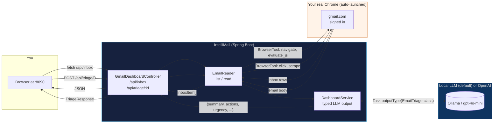

# IntelliMail

> AI-powered inbox triage on top of your real Gmail. Local LLM by default — your inbox text never leaves your machine.


## What it does

A small Spring Boot web app on `http://localhost:8090` that:

1. **Reads your real Gmail** via the framework's `BrowserTool` (CDP-attached real Chrome — Google's bot detection accepts it).
2. **Lists inbox rows** as cards in a clean dark UI matching the intelliswarm Studio palette.
3. **Triages each email** on demand: opens it, scrapes the body, runs a local LLM, returns a typed `{summary, actions[], urgency, phishingSuspected}` object.
4. **Renders** that triage inline as bulleted action chips + an urgency badge + a phishing warning where appropriate.

Everything stays local by default — Ollama on `localhost:11434`, BrowserTool driving your already-signed-in Chrome.

## Quick start

```bash
./gmail-dashboard/run.sh
```

Or right-click → Run `GmailDashboardExample.main()` in your IDE.

On first run:
1. The example detects + launches Chrome with a dedicated `~/.swarmai/intellimail-chrome` profile.
2. Sign in to Gmail in that Chrome window.
3. Open http://localhost:8090 in any browser.
4. Click **↻ Refresh inbox**.
5. Click **Triage** on any email — or **⚡ Triage all visible** to do them in batch.

## What the UI looks like

```
┌──────────────────────────────────────────────────────────────────────────┐
│ [logo] Intelli·Mail                                       ● Ready        │
├──────────────────────────────────────────────────────────────────────────┤
│ [↻ Refresh inbox] [⚡ Triage all visible]      8 emails · loaded in 1.2s │
├──────────────────────────────────────────────────────────────────────────┤
│ ┌──────────────────────────────────────────────────────────────────┐   │
│ │ GitHub                  PR #42 ready for review              12:34   │
│ │                         Your colleague tagged you on …       [Triage]│
│ │ ─────────────────────────────────────────────────────────────────── │
│ │ [HIGH] PR #42 needs your review before the team's release tag.       │
│ │   Action items                                                       │
│ │   [Review the diff in #42] [Reply to colleague's question on line 87]│
│ │   Triaged in 3,127 ms                                                │
│ └──────────────────────────────────────────────────────────────────┘   │
│ ┌──────────────────────────────────────────────────────────────────┐   │
│ │ Stripe                  Invoice #INV-001 due Apr 30          11:18   │
│ │                         Your subscription will renew …       [Triage]│
│ └──────────────────────────────────────────────────────────────────┘   │
└──────────────────────────────────────────────────────────────────────────┘
```

Branding matches intelliswarm Studio: `#1a1a2e` background, `#4fc3f7` accent, dark cards.

## REST API

| Endpoint | Purpose |
|---|---|
| `GET /api/inbox` | Scrape the visible inbox via BrowserTool, return `[{id, sender, subject, snippet, time}]` |
| `POST /api/triage/{id}` | Open email at index `id`, scrape body, run LLM, return `{item, triage:{summary, actions, urgency, phishingSuspected}, elapsedMs}` |
| `GET /api/health` | Liveness probe |

## LLM provider matrix

| Profile | Cost | Latency | Data leaves machine? | When to use |
|---|---|---|---|---|
| `ollama` (default) | $0 | 30–90 s on CPU, 2–4 s on GPU | **NO** | Personal email, work inboxes with confidential subjects |
| `openai-mini` | ~$0.0005/email | 2–5 s | Yes — 4,000-char body slice per email | Quick demo, lots of emails to process, no privacy concerns |

Switch:

```bash
SPRING_PROFILES_ACTIVE=openai-mini OPENAI_API_KEY=sk-… ./gmail-dashboard/run.sh
```

## Architecture



## Privacy summary

| Data | Goes to local Ollama | Goes to OpenAI (if you opt in) | Stays on your laptop |
|---|---|---|---|
| Sender names | ✅ | ✅ | — |
| Subject lines | ✅ | ✅ | — |
| Email bodies (per-email triage) | ✅ | ✅ (4,000-char slice) | — |
| Cookies / session tokens | ❌ | ❌ | ✅ at `~/.swarmai/intellimail-chrome/` |
| Your password / 2FA codes | ❌ | ❌ | ❌ (you type into Chrome) |

The `~/.swarmai/intellimail-chrome/` profile dir is equivalent to a saved Chrome session — treat it like an SSH key.

## Files

```
gmail-dashboard/
├── src/main/java/.../gmaildashboard/
│   ├── GmailDashboardExample.java   Spring Boot main, real-Chrome launch, web mode
│   ├── GmailDashboardController.java REST endpoints
│   ├── EmailReader.java             BrowserTool wrapper: list inbox, open + scrape email
│   ├── DashboardService.java        Typed LLM triage (summary + actions + urgency)
│   └── EmailDtos.java               Records: InboxItem, EmailTriage, TriageResponse
├── src/main/resources/static/
│   ├── index.html                   The UI
│   └── intelliswarm-logo.png        Brand mark (copied from swarmai-core/static/studio)
├── run.sh
└── README.md
```

## Trade-offs honestly

- **Inbox scraping is selector-based.** Gmail rotates CSS classes (`bog`, `y2`, `xW`, `zE` etc.) every few quarters. If a Google update lands and the selectors stop matching, the inbox list will be empty — fix the selectors in `EmailReader.java`.
- **The triage prompt is intentionally short** so it works on smaller local models (3B–7B). Bigger models would benefit from longer context.
- **Per-email triage is sequential** (the BrowserTool drives a single Chrome page). You can't triage 50 emails in parallel — it'd be 50 sequential round-trips.
- **No mark-as-read / archive / reply.** Triage is read-only by design — way safer for a first pass.

## See also

- `gmail-browser-agent/` — a CLI-only sibling that prints the same triage to stdout (no UI).
- `swarmai-tools/.../tool/common/BrowserTool.java` — the framework primitive this builds on.
