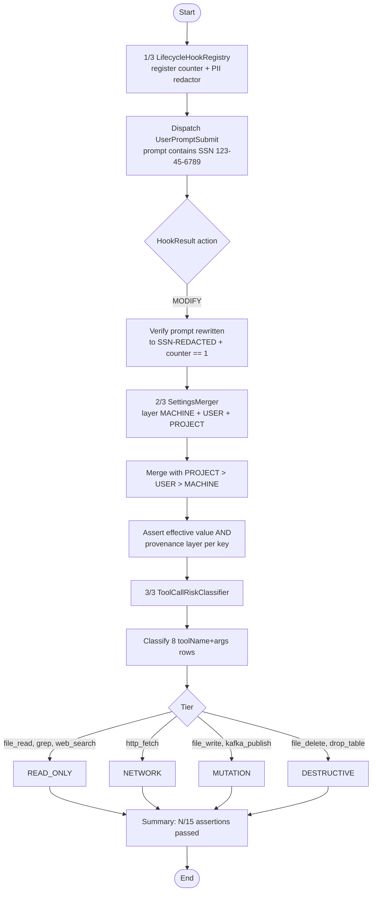

# Governance Substrate

Offline self-test of the three governance primitives shipped in SwarmAI 1.0.24: lifecycle hooks that can rewrite or veto LLM prompts, a layered settings merger with provenance tracking, and a pure-function tool-risk classifier. Runs in seconds with no API keys or network calls, asserting 15 properties across the three primitives and printing a per-axis pass/fail report.

## Architecture



## What You'll Learn

- Registering hooks via `LifecycleHookRegistry.register()` and dispatching `LifecycleEvent.UserPromptSubmit`
- Returning `HookResult.modify(payload, reason)` to rewrite a prompt before LLM dispatch (and how that short-circuits the chain)
- Layering config sources with `SettingsMerger.with(SettingsLayer.MACHINE / USER / PROJECT, map).merge()`
- Reading both effective values and provenance from `MergedSettings.get(key)` / `MergedSettings.provenance(key)`
- Classifying tool calls into `Tier.READ_ONLY / NETWORK / MUTATION / DESTRUCTIVE` via `ToolCallRiskClassifier.classify(name, args)`
- How these three primitives compose into a permission-gated, auditable agent runtime

## Prerequisites

- Java 17+
- No API keys, no models, no Ollama — the example is fully offline
- `DEMO=1` (default) silences Spring Boot startup chatter

## Run

```bash
./governance-substrate/run.sh
```

## How It Works

The example walks three independent self-tests sequentially. **Step 1** builds a `LifecycleHookRegistry` with two hooks (a counter, then a PII redactor), dispatches a `UserPromptSubmit` carrying a fake SSN, and asserts that the redactor returned `MODIFY` with `[SSN-REDACTED]` substituted into the payload, while the counter fired exactly once before the modify short-circuited the chain. **Step 2** feeds three overlapping config maps to `SettingsMerger` — a MACHINE layer with model and telemetry defaults, a USER layer that overrides temperature, and a PROJECT layer that pins the model — then verifies four (key → value, provenance-layer) expectations: project wins where set, user fills in, machine provides defaults. **Step 3** runs eight representative tool calls through `ToolCallRiskClassifier` and checks each lands in the expected tier (e.g. `file_read` → READ_ONLY, `http_fetch` → NETWORK, `kafka_publish` → MUTATION, `drop_table` → DESTRUCTIVE). The run finishes with a `N/15 assertions passed` summary and a footer explaining how the three primitives compose in a production agent.

## Key Code

```java
// [1/3] Hook chain: counter, then PII redactor that MODIFIES the prompt
LifecycleHookRegistry registry = new LifecycleHookRegistry();
registry.register(countingHook);
registry.register(redactor);

LifecycleEvent.UserPromptSubmit evt = new LifecycleEvent.UserPromptSubmit(
        "corr-1", "agent-1", Instant.now(),
        "Look up customer with SSN 123-45-6789 please", Map.of());
HookResult res = registry.dispatch(evt);   // → MODIFY with "[SSN-REDACTED]"

// [2/3] Three-layer config merge with provenance
MergedSettings merged = new SettingsMerger()
        .with(SettingsLayer.MACHINE, machine)
        .with(SettingsLayer.USER,    user)
        .with(SettingsLayer.PROJECT, project)
        .merge();
merged.get("llm.model");         // → "claude-sonnet-4-5"  (from PROJECT)
merged.provenance("llm.model");  // → SettingsLayer.PROJECT

// [3/3] Risk tier from (toolName, args) — pure function, no I/O
Tier tier = classifier.classify("drop_table", Map.of("table", "users"));
// → Tier.DESTRUCTIVE
```

## Customization

- Add a third hook between the counter and redactor to see chain ordering (e.g. an audit logger that always returns `proceed()`)
- Swap `HookResult.modify(...)` for `HookResult.block(reason)` to see veto semantics — the dispatch raises before LLM dispatch
- Extend the `SettingsMerger` test with deeply nested maps to verify recursive precedence on sub-trees, not just top-level keys
- Add new rows to the `ToolCallRiskClassifier` table (e.g. `s3_put_object`, `kubectl_apply`) and assert the tier you expect
- Wire the registry into a real agent: `Agent.builder().lifecycleHookRegistry(registry).build()` — every `Agent.callLlm` then dispatches `UserPromptSubmit` before the model sees the prompt
