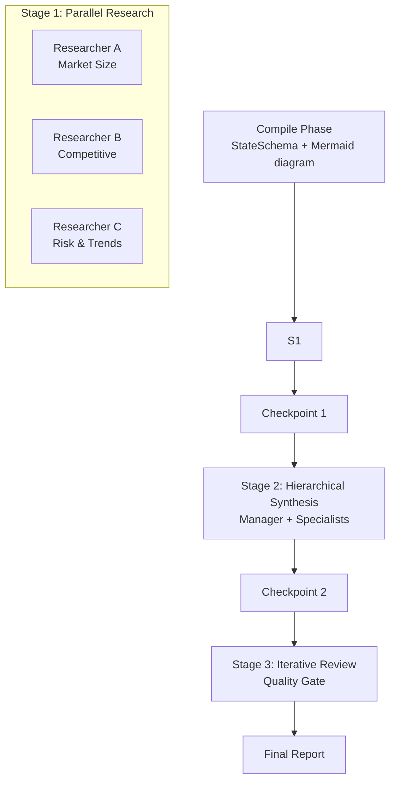

# Governed Pipeline Workflow

Multi-stage analysis pipeline with compile-time validation, typed state channels, checkpoints, and a functional quality gate.

## Architecture



## Features Combined

This example demonstrates 10 framework features working together:

| Feature | How It's Used |
|---|---|
| Type-Safe State Channels | `StateSchema` with appender, counter, and lastWriteWins channels for concurrent state merges |
| Sealed Lifecycle | `SwarmGraph.compile()` catches misconfiguration before any tokens are spent |
| Composite Process | Three process types chained: Parallel -> Hierarchical -> Iterative |
| Checkpoints | `InMemoryCheckpointSaver` snapshots state between each stage for crash recovery |
| Mermaid Diagram | `MermaidDiagramGenerator` produces a visual flowchart of the compiled graph |
| Functional Graph | `addNode` / `addConditionalEdge` implement the quality gate routing logic |
| Budget Tracking | `BudgetPolicy` enforces a 1M-token / $10 ceiling with 75% warning threshold |
| Lifecycle Hooks | `BEFORE_WORKFLOW`, `AFTER_TASK`, `AFTER_WORKFLOW` hooks log audit events and update state counters |
| Shared Memory | `InMemoryMemory` is shared across all agents so later stages see earlier findings |
| Interrupt After | `interruptAfter("synthesis")` pauses execution after hierarchical synthesis for inspection |

## Prerequisites

- Java 21+
- Running Ollama instance (or OpenAI-compatible API)
- Model configured via `OLLAMA_MODEL` (default: `mistral:latest`)

## Run

```bash
./run.sh governed-pipeline "AI infrastructure market 2026"
```

## How It Works

The workflow begins by constructing a `StateSchema` with typed channels -- appender channels accumulate findings from parallel agents, a counter channel tracks completed tasks, and lastWriteWins channels hold the pipeline status and quality score. A `SwarmGraph` is built with all five agents and five tasks, then `compile()` validates the configuration and produces a `CompiledSwarm` -- catching wiring errors before any tokens are spent. Execution proceeds through three composite stages: first, three researcher agents run in parallel, each investigating a different facet of the topic (market size, competitive landscape, risks/trends). Their outputs feed into a hierarchical synthesis stage where a Manager agent merges all findings into a unified brief. The brief then enters an iterative review loop where a Reviewer agent scores quality on a 0-100 rubric. After the main pipeline, a functional graph implements a quality gate using `addConditionalEdge` -- routing to "finalize" if the score is 80+ or "revise" otherwise. Checkpoints are saved between each stage so the pipeline can resume from the last good state after a crash. Lifecycle hooks at `BEFORE_WORKFLOW`, `AFTER_TASK`, and `AFTER_WORKFLOW` maintain an audit trail in the state channels.

## Key Code

```java
// Functional graph quality gate with conditional routing
SwarmGraph qualityGateGraph = SwarmGraph.create()
    .addNode("assess", state -> {
        int score = assessQuality(output);
        return Map.of(
            "qualityScore", score,
            "auditLog", "Quality assessed: " + score + "/100");
    })
    .addConditionalEdge("assess", state -> {
        int score = state.valueOrDefault("qualityScore", 0);
        return score >= 80 ? "finalize" : "revise";
    })
    .addNode("finalize", state -> Map.of("status", "APPROVED"))
    .addNode("revise", state -> Map.of("status", "NEEDS_REVISION"))
    .addEdge(SwarmGraph.START, "assess")
    .addEdge("finalize", SwarmGraph.END)
    .addEdge("revise", SwarmGraph.END);
```

## Output

- `output/governed_pipeline_report.md` -- full report with metadata, stage breakdown, and analysis
- `output/governed_pipeline_diagram.mmd` -- Mermaid flowchart of the compiled graph
- `output/governed-pipeline_metrics.json` -- token usage and cost metrics
- Console log with per-task token breakdown, checkpoint status, and quality gate result

## Customization

- Add more parallel researchers by creating additional agents and tasks in Stage 1
- Adjust the quality threshold by changing the `score >= 80` condition in the quality gate
- Replace `InMemoryCheckpointSaver` with a persistent implementation for production crash recovery
- Tune the budget ceiling via `BudgetPolicy.builder().maxTotalTokens()` and `.maxCostUsd()`
- Change the `interruptAfter` node to pause at a different stage for manual inspection

## YAML DSL

This workflow can also be defined declaratively in YAML. See [`workflows/governed-pipeline.yaml`](src/main/resources/workflows/governed-pipeline.yaml):

```java
// Load and run via YAML instead of Java
Swarm swarm = swarmLoader.load("workflows/governed-pipeline.yaml",
    Map.of("topic", "AI governance"));
SwarmOutput output = swarm.kickoff(Map.of());
```

The YAML definition includes approval gates with policies, workflow hooks, task conditions, and budget tracking.
