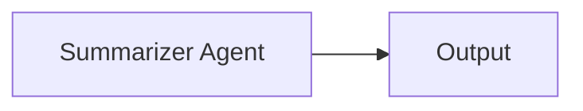

# Hello World — Single Agent

The simplest possible SwarmAI setup: one agent, one task, sequential process, no tools.

## Architecture



## What You'll Learn

- How to create an Agent, a Task, and a Swarm
- Execute with `swarm.kickoff()`
- Basic workflow metrics collection

## Run

```bash
./hello-world-single-agent/run.sh
# or
./run.sh bare-minimum "renewable energy"
```

## Key Concepts

- **Agent** — defined with `role`, `goal`, and `backstory` to shape the LLM's behavior.
- **Task** — a unit of work with a `description` and `expectedOutput`.
- **Swarm** — wires agents and tasks together under a `ProcessType` (here `SEQUENTIAL`).
- **`swarm.kickoff(inputs)`** — starts execution; the inputs map passes runtime variables.

## YAML DSL

This workflow can also be defined in YAML. See [`src/main/resources/workflows/basics.yaml`](src/main/resources/workflows/basics.yaml):

```java
Swarm swarm = swarmLoader.load("workflows/basics.yaml",
    Map.of("topic", "renewable energy"));
SwarmOutput output = swarm.kickoff(Map.of());
```

## Source

- [`BareMinimumExample.java`](src/main/java/ai/intelliswarm/swarmai/examples/basics/BareMinimumExample.java)
