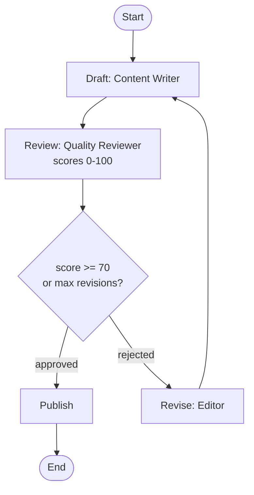

# Human-in-the-Loop

Some decisions shouldn't be left to a model alone. This pipeline drafts content, scores it, and either ships it, sends it back for revision, or pauses for a human reviewer at a checkpoint — picking up exactly where it left off when approval lands. Quality scores stand in for human verdicts so the example runs end-to-end without you in the loop, but the gate is wired the same way.

## Architecture



## What You'll Learn

- Building approval-gated workflows with `SwarmGraph` conditional edges
- Using diverse `Channels` types: `lastWriteWins()`, `appender()`, and `counter()`
- Implementing revision loops that route rejected content back to the draft node
- Adding lifecycle hooks with `HookPoint.BEFORE_TASK` and `AFTER_TASK`
- Checkpoint persistence via `CheckpointSaver` and `InMemoryCheckpointSaver`
- Simulating human approval decisions with quality score thresholds

## Prerequisites

- Ollama with `mistral:latest` (or any configured model)
- No additional API keys required

## Run

```bash
# Default topic: "AI trends in enterprise 2026"
./run.sh human-loop

# Custom topic
./run.sh human-loop "The impact of quantum computing on cybersecurity"
```

## How It Works

The workflow builds a `SwarmGraph` with five nodes forming a revision loop. A Content Writer agent drafts an article, then a Quality Reviewer scores it 0-100 on clarity, accuracy, impact, and completeness. An approval gate checks whether the score meets the threshold (70) or the maximum revision count (2) has been reached. If rejected, the content routes back through a `revise` node to the `draft` node, carrying accumulated feedback via an `appender` channel. If approved, a Publisher agent formats the article with metadata for publication. `BEFORE_TASK` and `AFTER_TASK` hooks simulate notification queues and checkpoint logging. An `InMemoryCheckpointSaver` persists state between stages for pause/resume capability.

## Key Code

```java
CompiledSwarm compiled = SwarmGraph.create()
        .addAgent(placeholderAgent)
        .addTask(placeholderTask)
        .stateSchema(schema)
        .checkpointSaver(new InMemoryCheckpointSaver())
        .addEdge(SwarmGraph.START, "draft")
        .addEdge("draft", "review")
        .addEdge("review", "approval_gate")

        .addNode("approval_gate", state -> {
            int score = state.valueOrDefault("quality_score", 0);
            int iter = state.valueOrDefault("iteration", 0L).intValue();
            boolean approved = score >= APPROVAL_THRESHOLD || iter >= MAX_REVISIONS;
            return Map.of("approved", approved);
        })

        // Conditional: approved -> publish, rejected -> revise
        .addConditionalEdge("approval_gate", state -> {
            return state.valueOrDefault("approved", false) ? "publish" : "revise";
        })

        .addNode("revise", state -> Map.of())
        .addEdge("revise", "draft")        // loop back
        .addEdge("publish", SwarmGraph.END)

        .addHook(HookPoint.BEFORE_TASK, ctx -> { /* notify */ return ctx.state(); })
        .addHook(HookPoint.AFTER_TASK, ctx -> { /* checkpoint */ return ctx.state(); })
        .compileOrThrow();
```

## Customization

- Change `APPROVAL_THRESHOLD` (default 70) to raise or lower the quality bar
- Adjust `MAX_REVISIONS` (default 2) to allow more revision rounds
- Replace `InMemoryCheckpointSaver` with a persistent store for production pause/resume
- Add a real human approval step by integrating a REST endpoint or message queue at the approval gate
- Customize the scoring rubric in the Quality Reviewer's prompt

## YAML DSL

This workflow can also be defined declaratively in YAML. See [`workflows/graph-human-loop.yaml`](src/main/resources/workflows/graph-human-loop.yaml):

```java
// Load and run via YAML instead of Java
CompiledWorkflow workflow = swarmLoader.loadWorkflow("workflows/graph-human-loop.yaml");
SwarmOutput output = workflow.kickoff(Map.of());
```

The YAML definition includes graph-based quality gate with revision loop and checkpoints.
