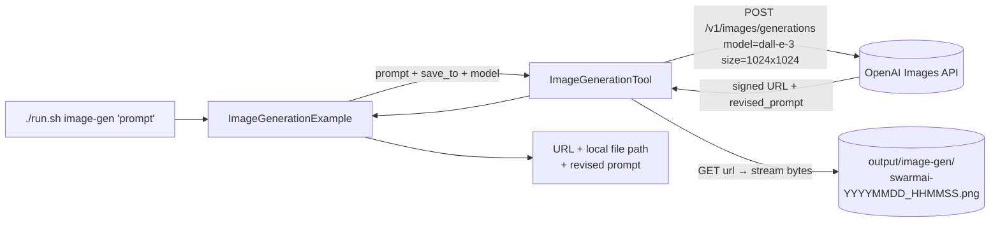

# Image Generation (DALL-E) Example

> **New to SwarmAI?** Start from the [quickstart template](../quickstart-template/) for the
> minimum viable app. This example is a *direct-tool-drive* showcase (no LLM agent in the loop),
> so the shape is simpler — autowire `ImageGenerationTool` and call `.execute(Map.of(...))`.


Exercises **`ImageGenerationTool`** — calls OpenAI's Images API (DALL-E 3 by default, also
supports DALL-E 2 and gpt-image-1) with a prompt, downloads the result, saves it to disk.

## How it works



## Prerequisites

**API key (required):**

| Env var          | How to get it                                         |
|------------------|-------------------------------------------------------|
| `OPENAI_API_KEY` | https://platform.openai.com/api-keys                  |

```bash
export OPENAI_API_KEY=sk-...
```

> **Costs money per run.** DALL-E 3 at 1024×1024 standard quality is ~$0.040/image. DALL-E 2 at
> 256×256 is ~$0.016/image. See https://openai.com/api/pricing for current rates.

**Infrastructure:** none — calls `api.openai.com`.

### Running against an Azure OpenAI / proxy

Set `swarmai.tools.image.base-url` (Spring property) or pass per-call `api_key` to use a
different endpoint (Azure OpenAI, LiteLLM proxy, etc.). The tool assumes an OpenAI-compatible
Images API.

## Run

```bash
./run.sh image-gen                                              # default bee-swarm illustration
./run.sh image-gen "a futuristic city skyline at dusk, cinematic"
./run.sh image-gen "a minimalist vector logo for an AI startup"
```

Generated images land in `./output/image-gen/swarmai-YYYYMMDD_HHMMSS.png`.

## What to expect

The tool sends the prompt to OpenAI's Images API (DALL-E 3 by default), downloads the returned
PNG, and saves it to `./output/image-gen/swarmai-YYYYMMDD_HHMMSS.png`. The console prints the
source URL (for inspection) and the local file path.

## Value add

Visual generation for any workflow — product mockups, marketing imagery, diagram placeholders,
storyboard frames, social-media graphics — without swapping frameworks mid-pipeline. Works
against any OpenAI-compatible Images endpoint (Azure OpenAI, LiteLLM proxies).

## What this proves about the tool

- Default model (`dall-e-3`) + size (`1024x1024`) produce a valid PNG and save it to disk.
- Size validation is model-aware: `dall-e-3` only accepts `{1024x1024, 1792x1024, 1024x1792}`,
  `dall-e-2` accepts `{256x256, 512x512, 1024x1024}`, `gpt-image-1` has its own set.
- `gpt-image-1` correctly omits the `response_format` field (OpenAI rejects it for that model).
- URL-mode responses are downloaded to the `save_to` path — both the URL (for inspection) and
  the local file are usable.
- Multi-image (`n > 1` with `save_to`) appends `-1`, `-2` indices to filenames.
- 401 / 429 surface as specific friendly messages ("key rejected" / "rate-limited").
- Empty prompt is caught before a paid API call.
