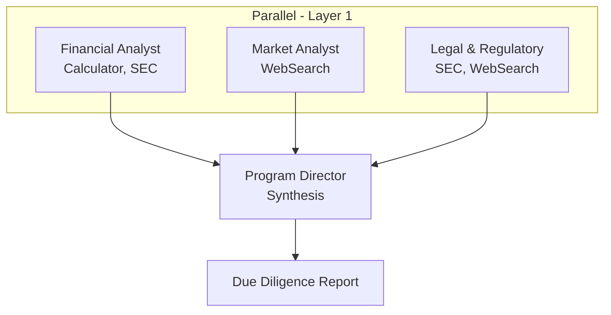

# Due Diligence Workflow

Parallel multi-agent due diligence investigation that runs financial, news/sentiment, and legal research streams concurrently, then synthesizes a GO/CAUTION/NO-GO investment decision.

## Architecture



## What You'll Learn

- Parallel process with three independent research streams
- Dynamic context management per agent
- Anti-hallucination guardrails (cite every number, declare data gaps)
- Task ID assignment for structured result tracking
- CompactionConfig for managing context window across multi-turn agents
- Permission levels (READ_ONLY for research agents)

## Prerequisites

- Ollama running locally (or OpenAI/Anthropic API key configured)
- Optional: API keys for richer web search results via WebSearchTool

## Run

```bash
./run.sh due-diligence AAPL
./run.sh due-diligence MSFT
./run.sh due-diligence TSLA
```

## How It Works

The workflow launches three specialist agents concurrently. The Financial Analyst extracts revenue, margins, debt levels, and red flags from SEC filings. The News Analyst gathers material events, management changes, and market sentiment from web sources. The Legal Analyst reviews litigation, regulatory actions, and insider transactions from filings and public records. Once all three complete, the DD Program Director synthesizes findings into a GO/CAUTION/NO-GO verdict with a confidence level, risk matrix, and data quality assessment. Each research stream operates independently, so failures in one do not block the others.

## Key Code

```java
// Three independent research streams + synthesis
Task financialTask = Task.builder()
        .id("financial-health")       // Named IDs for tracking
        .description(/* ... */)
        .agent(financialAnalyst)
        .build();

Task synthesisTask = Task.builder()
        .id("dd-synthesis")
        .agent(ddManager)
        .dependsOn(financialTask)     // Waits for all 3
        .dependsOn(newsTask)
        .dependsOn(legalTask)
        .outputFile("output/due_diligence_report.md")
        .build();
```

## Output

- `output/due_diligence_report.md` -- Due diligence summary with:
  - Executive summary with GO/CAUTION/NO-GO verdict
  - Financial health assessment (revenue, margins, cash flow, red flags)
  - Market and news assessment (material events, sentiment)
  - Legal and regulatory assessment (litigation, insider transactions)
  - Top 5 risks ranked by likelihood and impact
  - Data quality assessment showing available vs missing data
- Per-stream result metrics (character count, token usage) logged to console

## Customization

- Change the target company by passing a different ticker symbol
- Add industry-specific agents (e.g., an FDA analyst for pharma companies)
- Switch to `ProcessType.SEQUENTIAL` to run research streams one at a time for lower token usage
- Adjust `maxExecutionTime` per task (default 120-240 seconds) for slower models
- Modify the synthesis task to output a structured JSON verdict instead of markdown

## YAML DSL

This workflow can also be defined declaratively in YAML. See [`workflows/due-diligence.yaml`](src/main/resources/workflows/due-diligence.yaml):

```bash
# Load and run via YAML instead of Java
Swarm swarm = swarmLoader.load("workflows/due-diligence.yaml",
    Map.of("ticker", "AAPL"));
SwarmOutput output = swarm.kickoff(Map.of());
```

The YAML definition includes parallel multi-stream analysis with workflow hooks.
