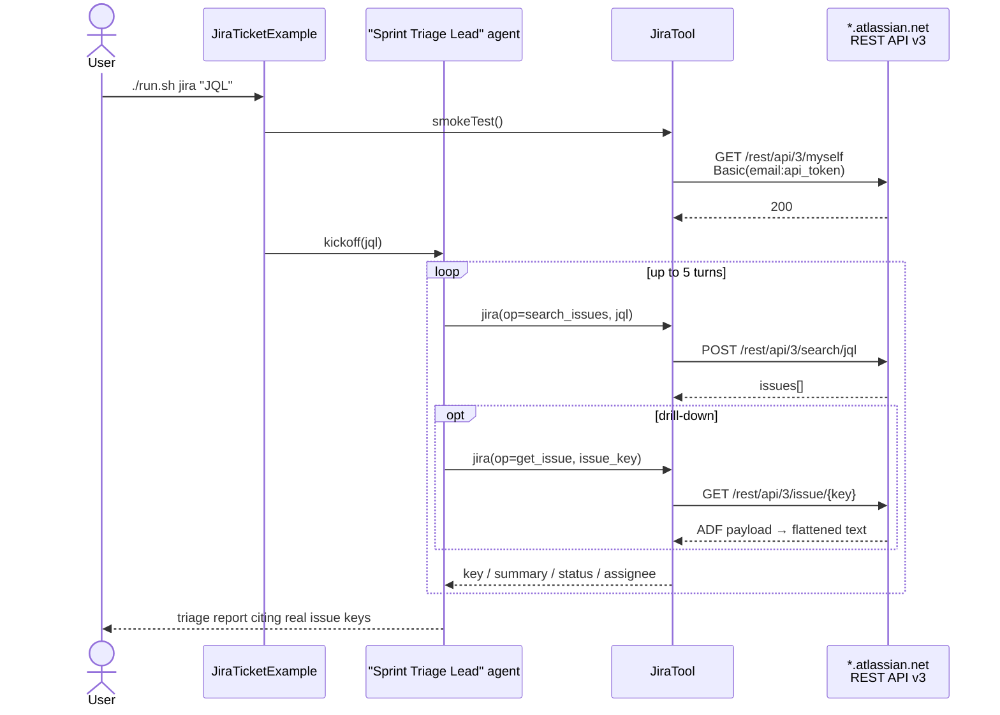

# Jira Ticket Management Example

> **New to SwarmAI?** Start from the [quickstart template](../quickstart-template/) for the
> minimum viable app, then swap `WikipediaTool` → `JiraTool` and lift the Sprint Triage Lead
> prompt below.


Exercises **`JiraTool`** — a triage-lead agent pulls open issues via JQL, summarises them, and
suggests next actions. Write operations (create / comment) are also supported via the same tool.

## How it works



## Prerequisites

### Option A — use Jira Cloud (recommended)

| Env var           | How to get it                                                                 |
|-------------------|-------------------------------------------------------------------------------|
| `JIRA_BASE_URL`   | e.g. `https://your-company.atlassian.net` (no trailing slash needed)          |
| `JIRA_EMAIL`      | Your Atlassian account email                                                  |
| `JIRA_API_TOKEN`  | Generate at https://id.atlassian.com/manage-profile/security/api-tokens       |
| `JIRA_TEST_PROJECT` (optional) | Project key to exercise `create_issue` + `add_comment`           |

```bash
export JIRA_BASE_URL=https://your-company.atlassian.net
export JIRA_EMAIL=you@example.com
export JIRA_API_TOKEN=your-api-token
```

### Option B — spin up Jira locally in Docker

Atlassian publishes the official `atlassian/jira-software` image. First-run setup walks you
through licensing and creating an admin user.

```bash
docker run --name jira \
  -p 8080:8080 \
  -v jira_data:/var/atlassian/application-data/jira \
  -d atlassian/jira-software:latest
```

Once started:

1. Open http://localhost:8080 and complete setup (a free evaluation license covers testing).
2. Create a project (e.g. key `ACME`) with a couple of issues.
3. Generate an API token for your admin user and set the env vars as in Option A,
   pointing `JIRA_BASE_URL=http://localhost:8080`.

Jira Software needs ~2 GB RAM and a few minutes to boot — allocate Docker accordingly.

## Run

```bash
./run.sh jira                                                           # default: assignee=currentUser()
./run.sh jira "project = ACME AND status = \"In Progress\""
./run.sh jira "assignee = currentUser() AND updated >= -7d"
```

## What to expect

The triage-lead agent runs the provided JQL, renders each issue (key / summary / status / type
/ priority / assignee / URL), and suggests concrete next actions. Optional `create_issue` and
`add_comment` flows are wired up through the same tool.

## Value add

Turns Jira into a conversational surface. Engineering managers can ask "what's blocked this
sprint?", QA leads can batch-triage flaky bugs, and retros can pull from ticket history in
plain English — all without leaving chat and without a single custom-built Jira script.

## What this proves about the tool

- `search_issues` with any JQL works end-to-end; each issue is rendered with key/summary/status/type/priority/assignee/url.
- `get_issue` pulls full detail including ADF description + comments (the tool walks the ADF
  tree and flattens it to plain text — the LLM sees readable prose, not raw JSON).
- `create_issue` wraps the description in a minimal ADF doc so the Jira API accepts it.
- `add_comment` likewise wraps the comment body in ADF.
- 401 / 403 / 404 / 400 all surface as distinct human-readable messages.
- Base URL with a trailing slash is normalised (no double-slash in request URLs).
