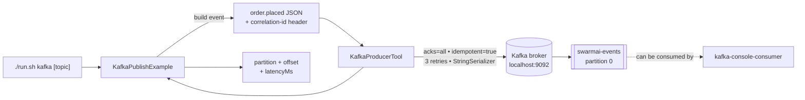

# Kafka Event Publishing Example

> **New to SwarmAI?** Start from the [quickstart template](../quickstart-template/) for the
> minimum viable app. This example is *direct-tool-drive* — autowire `KafkaProducerTool` and
> call `.execute(Map.of(...))` (no LLM agent needed to publish events).


Exercises **`KafkaProducerTool`** — publishes a synthetic `order.placed` event (JSON value +
correlation-id header) to a Kafka topic. This is the canonical demo for the Spring + Kafka
moat: no Python agent framework credibly integrates with enterprise event-driven infra.

## How it works



## Prerequisites

**API keys / env vars:**

| Env var                     | Purpose                                                   |
|-----------------------------|-----------------------------------------------------------|
| `KAFKA_BOOTSTRAP_SERVERS`   | Comma-separated broker list, e.g. `localhost:9092`        |
| `KAFKA_TEST_TOPIC` (opt.)   | Target topic. Default: `swarmai-events`                   |

```bash
export KAFKA_BOOTSTRAP_SERVERS=localhost:9092
export KAFKA_TEST_TOPIC=swarmai-events
```

### Spin up Kafka in Docker

**Shortcut — use the provided helpers:**

```bash
./docker-up.sh                 # starts broker + creates topic 'swarmai-events'
./docker-up.sh orders.v1       # custom topic name
./docker-down.sh               # tear down + wipe volume
```

That brings up a KRaft-mode single-node broker via `docker-compose.yml`, waits for health, and
creates the topic for you.

**Manual equivalent** (if you prefer): use the official Apache Kafka image directly:

```bash
docker run --rm -d --name kafka \
  -p 9092:9092 \
  apache/kafka:3.7.1

docker exec -it kafka \
  /opt/kafka/bin/kafka-topics.sh --create \
    --topic swarmai-events \
    --bootstrap-server localhost:9092 \
    --partitions 1 \
    --replication-factor 1
```

**Alternative — Redpanda** (drop-in Kafka API, faster to boot):

```bash
docker run --rm -d --name redpanda \
  -p 9092:9092 \
  redpandadata/redpanda:latest \
    redpanda start --overprovisioned --smp 1 \
      --memory 1G --reserve-memory 0M --node-id 0 --check=false \
      --kafka-addr PLAINTEXT://0.0.0.0:9092 \
      --advertise-kafka-addr PLAINTEXT://localhost:9092
```

**Verify topic contents** (consume while you re-run the example):

```bash
docker exec -it kafka \
  /opt/kafka/bin/kafka-console-consumer.sh \
    --topic swarmai-events \
    --from-beginning \
    --bootstrap-server localhost:9092 \
    --property print.key=true --property print.headers=true
```

## Run

```bash
./run.sh kafka                         # uses $KAFKA_TEST_TOPIC or 'swarmai-events'
./run.sh kafka orders.v1               # override topic
```

Sample output (illustrative — your run will show your data):

```
Publishing a synthetic order.placed event to topic='swarmai-events'

=== KafkaProducerTool result ===
Published to **swarmai-events**
partition: 0
offset:    7
timestamp: 1745832134912
latencyMs: 18
```

Consumed back via `kafka-console-consumer` (with `--property print.key=true --property print.headers=true`):

```
correlation-id:c4f1e6d8-2a93-4b71-9e5c-77a1d3b4e8f0,source:swarmai-kafka-example,schema-version:1	c4f1e6d8-2a93-4b71-9e5c-77a1d3b4e8f0	{"event":"order.placed","orderId":"a3b8c4d2-1e9f-4a6b-8c0d-2e3f4a5b6c7d","total":19.99,"at":"2026-04-28T10:42:14.873"}
```

## What to expect

The tool publishes a synthetic `order.placed` event — JSON value plus a `correlation-id`
header — to the target Kafka topic using an idempotent producer (`acks=all`, 3 retries).
Verify receipt by running `kafka-console-consumer` with the same broker + topic.

## Value add

The canonical Spring-native demo for event-driven enterprise integration. No Python agent
framework can credibly integrate with Kafka, SASL/SSL, and exactly-once semantics the way a
JVM-based agent framework can — this is a concrete moat for regulated-industry adoption.

## What this proves about the tool

- Idempotent producer with `acks=all` + 3 retries is the default — safe for exactly-once-ish semantics.
- Custom headers attach as UTF-8 bytes and survive round-trip through the broker.
- Record `key` is used for partition hashing (same order-id always lands on the same partition).
- Extra producer properties (SASL, SSL, compression) are passed via the `config` map param.
- Missing `KAFKA_BOOTSTRAP_SERVERS` surfaces a clean setup error — not a Kafka internal exception.
- Broker unreachability triggers a bounded timeout with a readable error message.
