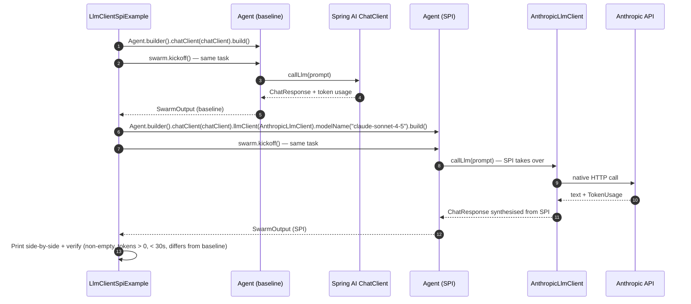

# LlmClient SPI in Agent

Before 1.0.24, `Agent.callLlm` was hardwired to Spring AI's `ChatClient`, which meant native provider features like Anthropic prompt caching and extended thinking were unreachable from `Agent` even though `swarmai-native-anthropic` already implemented them. This example runs the same task twice — once on the Spring AI baseline, once with `Agent.builder().llmClient(AnthropicLlmClient.from(...))` — and prints both outputs side-by-side with wall time, token counts, and a verification block confirming the SPI actually fired.

## Architecture



## What You'll Learn

- Plugging a native provider into `Agent` via the new `Agent.Builder.llmClient(LlmClient)` hook
- Constructing an `AnthropicLlmClient` from `AnthropicConfig.withApiKey(...)`
- Why the Spring AI `ChatClient` is still required even when the SPI is set (streaming + tool-bearing fallback)
- Reading `SwarmOutput.getTotalPromptTokens()` / `getTotalCompletionTokens()` populated from the native adapter's `TokenUsage`
- Building two `Agent` instances that differ by a single `.llmClient(...)` line and running them through identical `Task` + `Swarm` machinery
- Proving the SPI fired by verifying token usage is plumbed through and output text differs from the baseline

## Prerequisites

- Java 17+
- `ANTHROPIC_API_KEY` in your environment (or `.env` at the examples repo root) — required for the SPI path
- `OPENAI_API_KEY` (or whichever provider matches your active Spring profile) for the baseline run — the default `openai-mini` profile works fine
- Model: `claude-sonnet-4-5` for the SPI path, Spring profile model for the baseline

## Run

```bash
./llm-client-spi/run.sh
```

## How It Works

The example runs the same prompt (`"In one paragraph, summarise why prompt caching matters for production LLM workloads..."`) through two agents built with the same `Agent.Builder` API. **Run 1 (baseline)** uses `.chatClient(chatClient)` only — `Agent.callLlm` goes through Spring AI's existing path, prompt-template and tool-callback layer included. **Run 2 (SPI)** keeps `.chatClient(chatClient)` as a fallback but adds `.llmClient(AnthropicLlmClient.from(AnthropicConfig.withApiKey(apiKey)))` and pins `modelName("claude-sonnet-4-5")`; for text-only single-shot calls the SPI takes over and dispatches directly to the Anthropic API. Each run is wrapped in a `Task` + `Swarm.builder().process(SEQUENTIAL).kickoff(...)` and timed with `Instant.now()`. The example then prints two panels (wall time, char count, token counts, first 240 chars of output) and a verification block: non-empty text, token usage plumbed through, completed under 30s, and output distinct from the baseline (proves the SPI actually fired rather than silently shadowing the Spring AI call).

## Key Code

```java
AnthropicLlmClient anthropic = AnthropicLlmClient.from(AnthropicConfig.withApiKey(apiKey));

Agent spiAgent = Agent.builder()
        .role("Caching Educator")
        .goal("Explain prompt caching to engineers")
        .backstory("You write clear, no-fluff technical prose.")
        // ChatClient is still required (streaming + tool-bearing fallback)
        .chatClient(chatClient)
        // New in 1.0.24: SPI takes over the single-shot text path
        .llmClient(anthropic)
        .modelName("claude-sonnet-4-5")
        .maxTurns(1)
        .permissionMode(PermissionLevel.READ_ONLY)
        .build();

Swarm swarm = Swarm.builder()
        .agent(spiAgent)
        .task(task)
        .process(ProcessType.SEQUENTIAL)
        .build();
SwarmOutput out = swarm.kickoff(Collections.emptyMap());
// out.getTotalPromptTokens() / getTotalCompletionTokens() come from
// AnthropicLlmClient's native TokenUsage, plumbed through the SPI.
```

## Customization

- Change `modelName("claude-sonnet-4-5")` to another Anthropic model (`claude-opus-4-5`, `claude-haiku-4-5`) to compare latency and prose style
- Swap the `taskDescription` / `expectedOutput` to test the SPI on your own prompts
- Implement your own `LlmClient` for a different provider (Gemini, Mistral, local llama.cpp) and pass it via `.llmClient(...)` — the rest of the agent is unchanged
- Bump `maxTurns(1)` and add tools to the agent — note tool-bearing calls fall back to Spring AI today, so you can observe both paths in one run
- Layer the SPI with the governance substrate: `Agent.builder().lifecycleHookRegistry(registry).llmClient(anthropic)` — hooks fire before the SPI dispatch
