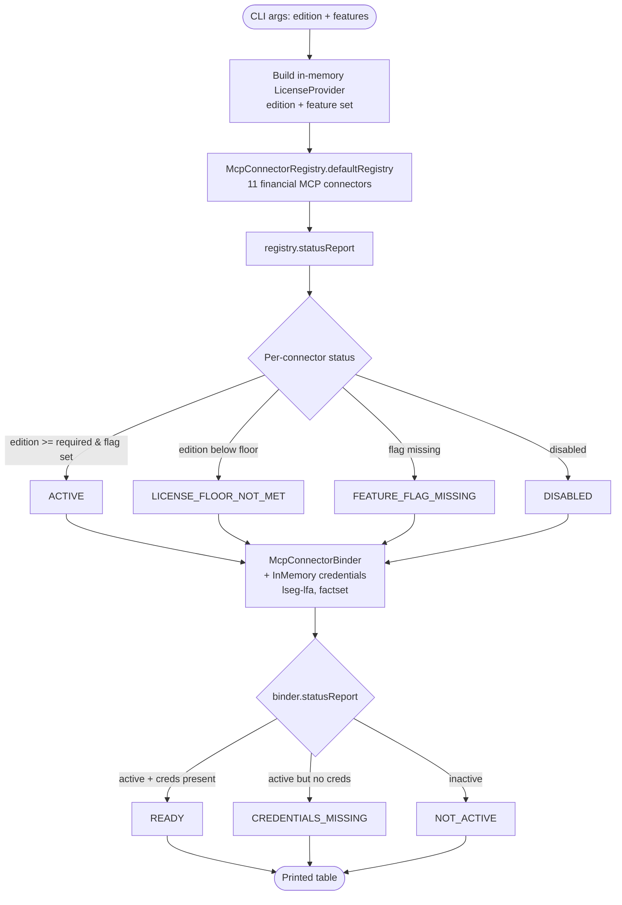

# MCP Connector Status

Inspect the financial MCP connector catalog under a chosen license edition and feature-flag set, then see which connectors would actually bind given the credentials on hand. Runs entirely offline against an in-memory `LicenseProvider` and `McpCredentialResolver.InMemory` — no network, no API keys — so you can preview license gating before paying for a single upstream.

## Architecture



## What You'll Learn

- Using `LicenseProvider` to gate framework features by edition (COMMUNITY / TEAM / BUSINESS / ENTERPRISE) and feature flag
- Building `McpConnectorRegistry.defaultRegistry(license)` and reading `statusReport()` to explain why each connector is or isn't active
- Wiring an `McpConnectorBinder` with an `McpCredentialResolver` to layer credential availability on top of license gating
- The two-phase activation model: license decides *eligibility*, credentials decide *readiness*
- `McpCredentials.bearer(...)` / `McpCredentials.apiKey(...)` factory helpers for in-memory credential setup
- Where to plug `McpCredentialResolver.FromEnvironment` when you're ready to call live endpoints

## Prerequisites

- Java 21+
- SwarmAI 1.0.24 on the classpath (provided by the parent examples project)
- No API keys, no Ollama, no network — the example is fully offline

## Run

```bash
# Show what an ENTERPRISE license with every feature flag would activate
./mcp-connector-status/run.sh ENTERPRISE all

# Show only Egnyte under a TEAM license
./mcp-connector-status/run.sh TEAM mcp.egnyte

# Show two BUSINESS-tier connectors
./mcp-connector-status/run.sh BUSINESS mcp.daloopa,mcp.morningstar

# Show that COMMUNITY edition activates none
./mcp-connector-status/run.sh COMMUNITY
```

Arguments are positional: `[EDITION] [comma,separated,features|all]`. Both are optional and default to `ENTERPRISE all`.

## How It Works

The example first synthesises a `LicenseProvider` from the CLI arguments — an anonymous implementation that returns a `LicenseInfo` with the chosen `Edition` and feature set, valid for 24 hours. It then calls `McpConnectorRegistry.defaultRegistry(license)`, which loads the 11 predefined financial connectors (LSEG LFA, S&P Capital IQ, FactSet, PitchBook, Chronograph, Daloopa, Morningstar, Moody's, MT Newswires, Aiera, Egnyte) and applies the license filter. `statusReport()` returns a per-connector result explaining the outcome: `ACTIVE`, `LICENSE_FLOOR_NOT_MET`, `FEATURE_FLAG_MISSING`, or `DISABLED`. The example prints a tabular view of each one with vendor, required edition, and the reason string. It then constructs an `McpConnectorBinder` using `McpCredentialResolver.InMemory` populated for only `lseg-lfa` and `factset` — this second `statusReport()` shows `READY` vs `CREDENTIALS_MISSING` so you can see how license-eligibility and credential-availability compose into the final activation decision.

## Key Code

```java
LicenseProvider license = new LicenseProvider() {
    @Override public LicenseInfo getLicense() {
        return new LicenseInfo("demo", edition,
                Instant.now().plusSeconds(86_400), 100, features);
    }
    @Override public boolean hasFeature(String f) { return features.contains(f); }
    @Override public boolean isValid() { return true; }
};

McpConnectorRegistry registry = McpConnectorRegistry.defaultRegistry(license);
registry.statusReport().forEach((name, result) -> {
    // result.status() ∈ { ACTIVE, LICENSE_FLOOR_NOT_MET, FEATURE_FLAG_MISSING, DISABLED }
    // result.definition().vendor(), result.definition().requiredEdition(), result.reason()
});

McpCredentialResolver creds = new McpCredentialResolver.InMemory(Map.of(
        "lseg-lfa", McpCredentials.bearer("demo-token"),
        "factset",  McpCredentials.apiKey("demo-key")));
McpConnectorBinder binder = new McpConnectorBinder(registry, creds);
binder.statusReport();  // READY / CREDENTIALS_MISSING / NOT_ACTIVE / FAILED
```

## Customization

- Pass different `Edition` values (`COMMUNITY`, `TEAM`, `BUSINESS`, `ENTERPRISE`) to see the tier floors move
- Swap `McpCredentialResolver.InMemory` for `new McpCredentialResolver.FromEnvironment()` to pick up real bearer tokens, API keys, and OAuth tokens from env vars (`SWARM_MCP_LSEG_LFA_BEARER`, `SWARM_MCP_FACTSET_API_KEY`, `SWARM_MCP_SP_CAPITAL_IQ_OAUTH_TOKEN`, …)
- Add or remove entries in `ALL_FEATURES` to change the default catalog projection
- Replace the anonymous `LicenseProvider` with your own (file-based, server-validated, JWT-backed, …) — the registry only cares about the interface
- Use `binder.bind(connectorName)` instead of `statusReport()` to actually obtain a bound connector handle once you have credentials wired
