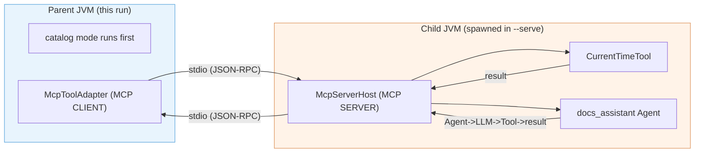
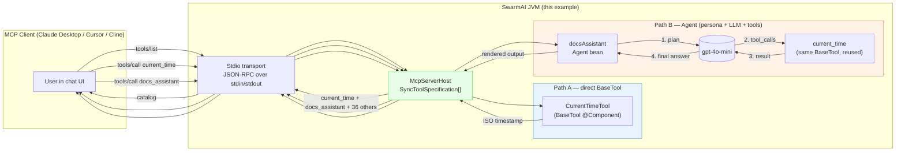
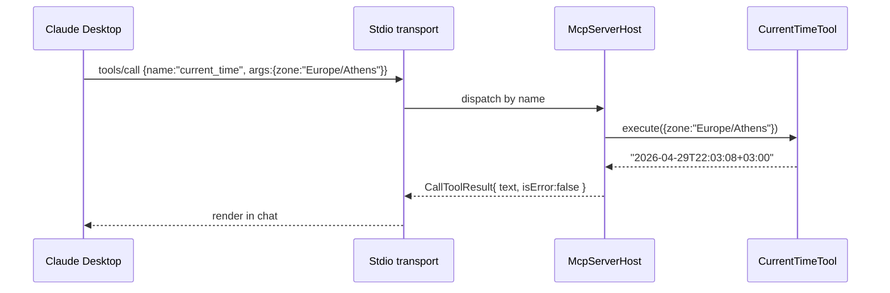
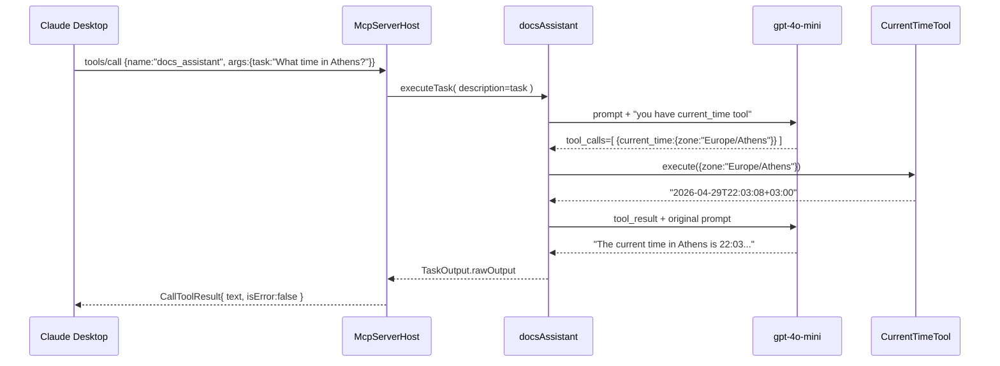

# MCP Server Host

> Publish your SwarmAI `BaseTool` and `Agent` beans as an MCP server so any MCP
> client — Claude Desktop, Cursor, Cline, another SwarmAI workflow — can
> discover and call them. _New in framework 1.0.14 (`McpServerHost`)._

---

## What you get in 30 seconds

```bash
./run.sh                    # boots the framework with the MCP server enabled
                            # then introspects + round-trips a real call
```

End-to-end output excerpt (cut for brevity):

```
MCP tools advertised by the live server: 38
    • current_time              Returns the current time. Optional 'zone' parameter…
    • docs_assistant            Docs Assistant: Answer questions about the SwarmAI…
    …

Agent round-trip via McpServerHost.callTool (LLM-driven):
  Task: "What time is it in Athens right now? Answer in one short sentence."

  [AGENT_STARTED: Docs Assistant]
  [TOOL_STARTED: current_time]    ← the agent picked the tool itself
  [TOOL_COMPLETED: current_time]
  [LLM_REQUEST]
  [AGENT_COMPLETED: Docs Assistant]

  docs_assistant returned in 5526ms  (isError=false)
  ┌─────────── agent response ───────────
  │ The current time in Athens is 22:03 (10:03 PM) on April 29, 2026.
  └──────────────────────────────────────
```

---

## Why this is interesting

Two granularities of MCP exposure, in the same server, with no per-bean glue
code:

| Granularity | Source | Lands as MCP tool | What the MCP client gets |
|---|---|---|---|
| **Tool** | `CurrentTimeTool` (a `BaseTool` bean) | `current_time` | atomic, deterministic capability |
| **Agent** | `docsAssistant` (an `Agent` bean) | `docs_assistant` | a persona that reasons + uses tools itself |

Calling `docs_assistant` from Claude Desktop with `{"task": "..."}` runs the
whole Agent — its goal, backstory, tool list, and an LLM. The agent then
chooses which sub-tools to invoke. **Claude Desktop never sees the
sub-tools** — they're internal to the agent.

---

## The full external-client experience: `--client-demo`

The catalog mode demonstrates the in-process side. To see the **actual MCP
wire** — the same JSON-RPC pipe Claude Desktop would use — run:

```bash
SPRING_PROFILES_ACTIVE=openai-mini ./run.sh --client-demo
```

This:

1. Boots THIS process as catalog (server + introspection runs)
2. Spawns a CHILD JVM with the same classpath, in `--serve` mode
3. Connects the framework's existing `McpToolAdapter` (the MCP **client**)
   to the child's stdio
4. Discovers the tool list over the wire
5. Calls `current_time` over the wire (real JSON-RPC frames)
6. Calls `docs_assistant` over the wire — the LLM round-trip happens INSIDE
   the child, the result comes back to this process as plain MCP text
7. Closes the child cleanly

It's the same code path your real users hit. Useful as a smoke test before
shipping a server config to Claude Desktop.



---

## Architecture: the two call paths in this example



The blue path is the simple one: an MCP `tools/call` reaches a `BaseTool.execute`
in one hop. The orange path is where it gets interesting — a single MCP
`tools/call` triggers an LLM round-trip that may itself fan out to other
SwarmAI tools (here, the same `current_time` is used recursively).

---

## What the `current_time` tool call looks like



One round-trip. No LLM involved. Useful when the "tool" is a deterministic
capability — a database query, a file read, a cron expression checker.

---

## What the `docs_assistant` Agent call looks like



**Two LLM round-trips, one tool invocation, single MCP request.** The MCP
client doesn't know the agent is reasoning or that there's a tool involved —
it just got back a useful answer.

---

## Run modes

```bash
# Catalog mode (default) — boots the framework with the MCP server enabled,
# lists what is published, and round-trips a real LLM-driven agent call.
# Uses gpt-4o-mini if SPRING_PROFILES_ACTIVE=openai-mini, Ollama otherwise.
./run.sh
SPRING_PROFILES_ACTIVE=openai-mini ./run.sh

# Client-loopback mode — does the catalog above AND THEN spawns this same
# example as a child JVM in --serve mode, connects the framework's MCP CLIENT
# adapter (McpToolAdapter) to it via real stdio, and calls tools/agents over
# the wire. The full external-MCP-client experience without needing Claude
# Desktop to be installed.
./run.sh --client-demo
SPRING_PROFILES_ACTIVE=openai-mini ./run.sh --client-demo

# Serve mode — stdio MCP server. Use this from Claude Desktop / Cursor / Cline.
# Logs go to stderr so the stdout pipe stays clean for the protocol.
./run.sh --serve
```

> **Tool-calling and Ollama**: with `SPRING_PROFILES_ACTIVE=ollama` (the default
> if `OPENAI_API_KEY` is unset), the local `mistral` / `llama3` weights often
> DON'T issue OpenAI-style `tool_calls` reliably — you'll see the agent answer
> with hallucinated data instead of triggering `current_time`. Run with
> `openai-mini` to see the agent actually pick up the tool. The framework's
> tool-calling layer is fine; it's a model-capability gap.

The catalog mode is the right one for confirming the framework wires up
correctly. A successful run proves all four paths are healthy:

| Probe | Confirms |
|---|---|
| `current_time {}` | Default-args dispatch works |
| `current_time {zone:Europe/Athens}` | JSON args correctly unpacked into `BaseTool.execute(Map)` |
| `current_time {zone:Not/A/Zone}` | Tool's own error string surfaces as a normal text result |
| `totally_made_up {}` | Unknown-tool returns `isError=true` instead of throwing |
| `docs_assistant {task:"..."}` | Full Agent→LLM→Tool chain composes through MCP |

---

## How the bridge to Spring AI works

The framework's `McpServerHost` reads `BaseTool.getFunctionName()`,
`getDescription()`, and `getParameterSchema()` directly — no extra glue. **But**
when an Agent calls a tool via the LLM (the orange path above), Spring AI's
tool-calling layer dispatches by **bean name**. So the example also exposes:

```java
@Bean
@Description("Returns the current time in a specified IANA timezone…")
public Function<CurrentTimeTool.Request, String> current_time(CurrentTimeTool tool) {
    return req -> tool.execute(Map.of("zone", req.zone())).toString();
}
```

The bean name `current_time` matches `CurrentTimeTool.getFunctionName()` and
matches the name in the LLM's `tool_calls` response. Without this bridge, the
LLM advertises the tool but the framework can't dispatch the resulting call:

```
java.lang.IllegalStateException: No ToolCallback found for tool name: current_time
```

User-defined tools always need this `@Bean Function<…>` adapter; framework-
shipped tools (`calculator`, `web_search`, etc.) get them from
`ToolsConfiguration` automatically.

---

## Wire it up to Claude Desktop

Drop this into Claude Desktop's MCP config
(macOS: `~/Library/Application Support/Claude/claude_desktop_config.json`):

```json
{
  "mcpServers": {
    "swarmai-example": {
      "command": "bash",
      "args": [
        "/absolute/path/to/swarm-ai-examples/mcp-server-host/run.sh",
        "--serve"
      ],
      "env": {
        "SPRING_PROFILES_ACTIVE": "openai-mini",
        "OPENAI_API_KEY": "sk-..."
      }
    }
  }
}
```

Restart Claude Desktop. You'll see `current_time` and `docs_assistant` in the
tool list. Calling `docs_assistant` with `{"task": "What time is it in Athens?"}`
runs the agent — it'll call `current_time` itself and answer with the actual
time.

Cursor / Cline have equivalent settings UIs that take the same `command`,
`args`, and `env` shape.

---

## Why `--serve` redirects logging

In serve mode `stdout` IS the MCP wire — anything written there becomes part of
the JSON-RPC stream. The bundled `run.sh` adds
`--logging.console-output=stderr` and `--spring.main.banner-mode=off` so
nothing pollutes stdout. If you launch the JAR yourself, do the same.

---

## Filtering what gets exposed

By default every `BaseTool` and `Agent` bean is published. To narrow it:

```yaml
swarmai:
  mcp:
    server:
      enabled: true
      includeTools:  [current_time, web_search]   # whitelist (wins over excludes)
      includeAgents: [docs_assistant]
      # or, "everything except":
      excludeTools:  [shell_command]
      excludeAgents: [internal_only_agent]
```

---

## Files in this example

| File | Role |
|---|---|
| `CurrentTimeTool.java` | A `BaseTool` with no external deps. Showcases path A (direct exposure). |
| `DocsAssistantConfig.java` | Defines the `docsAssistant` Agent bean **and** the `current_time` Spring AI tool-callback bridge. |
| `McpServerHostExample.java` | Boots the framework, prints the live catalog, round-trips both paths. |
| `run.sh` | Launches the example in catalog or `--serve` mode. |

## See also

- `swarmai-core/.../tool/mcp/McpServerHost.java` — the host implementation in the framework.
- `swarmai-core/.../tool/mcp/McpToolAdapter.java` — the **inverse**: consume external MCP servers.
- `agent-with-tool-calling/` — the same Spring AI tool-callback pattern without the MCP layer.
