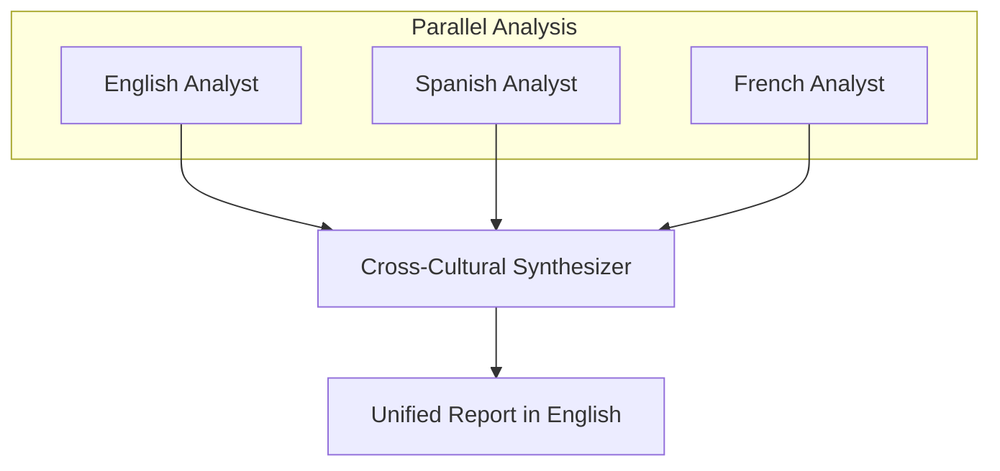

# Multi-Language Agent Workflow

Demonstrates parallel agents that research and write in different languages, then a synthesizer combines their outputs into a unified cross-cultural analysis.

## Architecture



## What You'll Learn

- Using `ProcessType.PARALLEL` with `dependsOn` for fan-out / fan-in patterns
- Controlling agent output language through backstory instructions (no `language()` on Agent)
- Getting culturally diverse perspectives from the same underlying model
- Synthesizing multilingual inputs into a comparative cross-cultural analysis
- Building lightweight workflows with no tools (pure reasoning agents)

## Prerequisites

- Ollama with `mistral:latest` (or any configured model)
- No additional API keys required

## Run

```bash
# Default topic: "artificial intelligence regulation"
./run.sh multi-language

# Custom topic
./run.sh multi-language "climate change policy"
```

## How It Works

Three Regional Analyst agents run in parallel, each instructed via backstory to research and write in a specific language (English, Spanish, French). Each analyst frames the topic through the cultural lens of their region: the English analyst focuses on Anglo-American institutions and common-law traditions, the Spanish analyst covers Spain and Latin America with civil-law and EU perspectives, and the French analyst emphasizes French digital sovereignty and francophone viewpoints. Once all three complete, a Cross-Cultural Synthesizer agent reads all outputs and produces a unified report comparing how different cultures view the topic, identifying themes unique to each perspective and common ground across all three.

## Key Code

```java
// Parallel tasks with no dependencies run concurrently
Task englishTask = Task.builder().agent(englishAnalyst).build();
Task spanishTask = Task.builder().agent(spanishAnalyst).build();
Task frenchTask  = Task.builder().agent(frenchAnalyst).build();

// Synthesis task waits for all three
Task synthesisTask = Task.builder()
        .agent(synthesizer)
        .dependsOn(englishTask)
        .dependsOn(spanishTask)
        .dependsOn(frenchTask)
        .build();

Swarm swarm = Swarm.builder()
        .process(ProcessType.PARALLEL)   // auto-layers by dependsOn graph
        .build();
```

## Customization

- Add more languages by creating additional analyst agents with appropriate backstories
- Change the cultural framing in each backstory to emphasize different regional priorities
- Increase `maxTurns` on the regional analysts to allow tool-assisted research
- Swap `ProcessType.PARALLEL` for `ProcessType.SEQUENTIAL` to compare execution strategies
- Add a reviewer agent between the regional analysts and synthesizer for quality gating

## YAML DSL

This workflow can also be defined declaratively in YAML. See [`workflows/multilanguage.yaml`](src/main/resources/workflows/multilanguage.yaml):

```java
// Load and run via YAML instead of Java
Swarm swarm = swarmLoader.load("workflows/multilanguage.yaml",
    Map.of("topic", "AI Safety", "language", "es"));
SwarmOutput output = swarm.kickoff(Map.of());
```

The YAML definition includes workflow-level language setting and multilingual agents.
