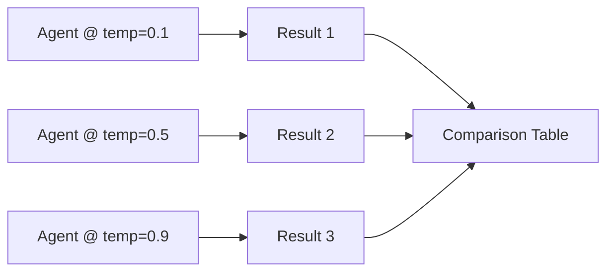
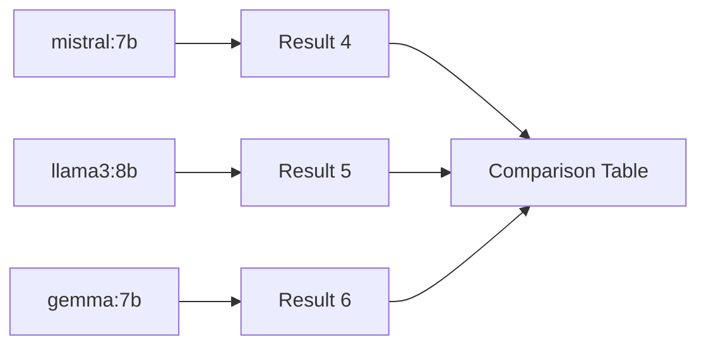

# Multi-Provider Comparison

Demonstrates model-agnostic agent design by running the same analysis task across different temperature settings and model variants, then comparing the results side by side.

## Architecture

**Phase 1: Temperature Sweep** (same model, different temperatures)



**Phase 2: Model Variants** (same temperature, different models)



## What You'll Learn

- Using `Agent.builder().modelName()` to target specific models within a provider
- Using `Agent.builder().temperature()` to control output determinism vs. creativity
- Running identical tasks across multiple configurations for A/B comparison
- Extracting structured metrics (word count, sections, tokens, themes) from agent output
- Building comparison tables and theme frequency analysis from multiple runs

## Prerequisites

- Ollama with `mistral:latest` (required for temperature sweep)
- For model variant comparison, also pull: `ollama pull llama3:8b` and `ollama pull gemma:7b`
- Runs with graceful error handling if some models are unavailable

## Run

```bash
# Default topic: "AI agent frameworks in 2026"
./run.sh multi-provider

# Custom topic
./run.sh multi-provider "the future of autonomous vehicles"
```

## How It Works

The workflow runs in two phases. Phase 1 performs a temperature sweep on the default model at 0.1 (deterministic), 0.5 (balanced), and 0.9 (creative), producing the same structured analysis at each setting. Phase 2 runs the same analysis across three model variants (`mistral:7b`, `llama3:8b`, `gemma:7b`) at a fixed temperature of 0.5, using `Agent.builder().modelName()` to target each model. Each run produces a `RunResult` capturing word count, section count, token usage, duration, and extracted themes. After all runs complete, comparison tables and a theme frequency analysis show how temperature and model choice affect output style, length, and thematic emphasis.

## Key Code

```java
// Temperature sweep: same model, different creativity levels
for (int i = 0; i < TEMPERATURES.length; i++) {
    tempResults.add(runAnalysis(topic, null, TEMPERATURES[i], TEMP_LABELS[i], metrics));
}

// Model variant comparison via Agent.modelName()
for (String model : MODEL_VARIANTS) {
    modelResults.add(runAnalysis(topic, model, 0.5, model, metrics));
}

// Inside runAnalysis: modelName switches the target model
Agent.Builder ab = Agent.builder()
        .role("Technology Analyst")
        .chatClient(chatClient)
        .temperature(temperature)
        .permissionMode(PermissionLevel.READ_ONLY);
if (modelName != null) ab.modelName(modelName);
Agent analyst = ab.build();
```

## Customization

- Add or change models in `MODEL_VARIANTS` to compare any Ollama-hosted or API-backed model
- Adjust the `TEMPERATURES` array to test different creativity levels
- Modify the analysis prompt to benchmark different task types (summarization, creative writing, coding)
- Add timing thresholds to flag slow models automatically

## YAML DSL

This workflow can also be defined declaratively in YAML. See [`workflows/multiprovider.yaml`](src/main/resources/workflows/multiprovider.yaml):

```java
// Load and run via YAML instead of Java
Swarm swarm = swarmLoader.load("workflows/multiprovider.yaml",
    Map.of("topic", "AI Safety"));
SwarmOutput output = swarm.kickoff(Map.of());
```

The YAML definition includes per-agent model selection (openai/gpt-4o-mini, anthropic/claude-sonnet).
