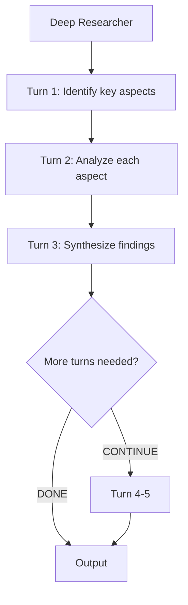

# Multi-Turn Deep Reasoning

A single agent that reasons across multiple LLM turns with automatic context compaction.

## Architecture



## What You'll Learn

- Enable multi-turn reasoning with `maxTurns`
- Prevent token overflow using `CompactionConfig`
- Let the agent autonomously decide when analysis is complete

## Run

```bash
./multi-turn-deep-reasoning/run.sh
# or
./run.sh multi-turn "the impact of LLMs on software engineering"
```

## Key Concepts

- **`maxTurns(5)`** — allows the agent up to 5 LLM calls, using CONTINUE/DONE markers to control flow.
- **`CompactionConfig.of(3, 4000)`** — after 3 turns, older context is summarized to stay under 4000 tokens.
- Multi-turn is useful when a task requires iterative reasoning that cannot fit in a single prompt.
- The agent autonomously decides when to continue and when its analysis is complete.

## Source

- [`MultiTurnExample.java`](src/main/java/ai/intelliswarm/swarmai/examples/basics/MultiTurnExample.java)
