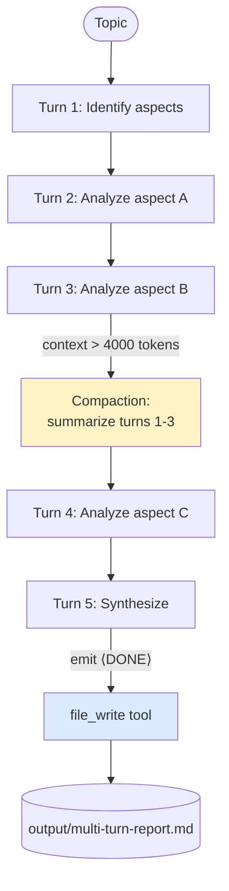

# Multi-Turn Deep Reasoning

A single agent that reasons across **5 LLM turns** on one topic, with automatic context compaction once the conversation gets too long, and writes the final report to disk via `FileWriteTool`. This is the pattern for *deep* analysis — when handing off to multiple agents would just dilute the chain of thought.

> **The trade-off:** more agents add diversity. More turns add depth. This example shows the depth side: one strong reasoner, given room to think, with the framework keeping its working memory from blowing up.

## Architecture



## Run

```bash
./multi-turn-deep-reasoning/run.sh
# or with your own topic
./run.sh multi-turn "the impact of LLMs on software engineering"
./run.sh multi-turn "what changed about CAP theorem after Cosmos DB and Spanner"
```

After it runs, open `output/multi-turn-report.md`.

## What you get

A multi-section markdown analysis on disk:

```text
=== Turn 1 ===
I'll structure this analysis around four aspects:
  1. Code generation and review
  2. Architecture and design decisions
  3. Onboarding and tribal knowledge
  4. Failure modes and trust calibration

=== Turn 2 ===
Aspect 1: Code generation and review.
  Findings: ...

=== Turn 3 ===
Aspect 2: Architecture and design decisions.
  Findings: ...

[ COMPACTION TRIGGERED — turns 1-3 summarized to 800 tokens ]

=== Turn 4 ===
Aspect 3: Onboarding and tribal knowledge.
  Findings: ...

=== Turn 5 ===
Synthesis. <DONE>
[file_write] → output/multi-turn-report.md (3.2 KB)
```

## What you'll learn

- **`maxTurns(5)`** — caps how many LLM calls the agent makes. Each turn is a full reasoning step; the agent emits a `<CONTINUE>` or `<DONE>` marker the framework parses to decide whether to loop.
- **`compactionConfig(CompactionConfig.of(3, 4000))`** — once the agent has done 3 turns, if the running context exceeds 4000 tokens, older turns are summarized into a single compressed block. **This is the difference between "deep reasoning" and "context-window crash."**
- **The agent owns the early-exit decision** — it can finish in turn 3 by emitting `<DONE>` if it has enough material. The 5-turn cap is a budget, not a target.
- **`FileWriteTool` + `outputFile`** — the agent persists its final markdown to disk via tool call. The `outputFile` field on `Task` is a hint that gets injected into the prompt; the tool call is what actually writes.
- **When to use multi-turn** — when the topic genuinely requires building on previous reasoning (research, debugging, multi-aspect analysis). When it doesn't (classification, summarization, single-step transforms), one turn is faster and just as good.

## Multi-turn vs. multi-agent — when to pick which

| Need | Use |
|------|-----|
| Diverse perspectives, parallel coverage | Multi-agent (`Swarm` with `PARALLEL`) |
| Iterative deepening, one chain of thought | Multi-turn (this example) |
| Both | Composite — see [`governed-pipeline-with-checkpoints`](../governed-pipeline-with-checkpoints/) |

## Source

- [`MultiTurnExample.java`](src/main/java/ai/intelliswarm/swarmai/examples/basics/MultiTurnExample.java)

## See also

- [`shared-context-between-agents`](../shared-context-between-agents/) — the multi-agent counterpart: 3 agents, 1 turn each, sharing inputs.
- [`conversation-memory-persistence`](../conversation-memory-persistence/) — when context needs to survive across separate runs.
- [`audit-trail-research-pipeline`](../audit-trail-research-pipeline/) — multi-turn + tracing + replay for compliance use cases.
