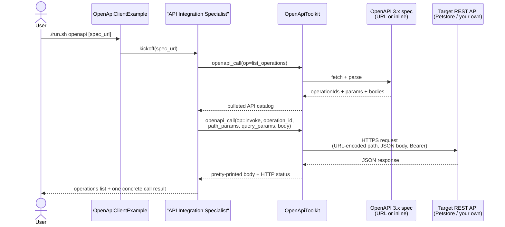

# OpenAPI Universal Client Example

> **New to SwarmAI?** Start from the [quickstart template](../quickstart-template/) for the
> minimum viable app, then swap `WikipediaTool` → `OpenApiToolkit` and feed it any OpenAPI 3.x
> spec URL. The API-Integration-Specialist prompt below is a good starting point.


Exercises **`OpenApiToolkit`** — the universal adapter that turns any OpenAPI 3.x spec into
callable tools. The agent loads a spec, enumerates operations, picks one, invokes it.

## How it works



## Prerequisites

**API keys / env vars:** none by default. If you point the example at an authenticated API, pass
its bearer token per-invocation via the tool's `bearer_token` parameter.

**Infrastructure:** none for the default target (the public Swagger Petstore sandbox at
`https://petstore3.swagger.io/api/v3`).

### Running against your own API locally

If you want to exercise the toolkit against your own service, run it on localhost and pass its
spec URL to the example:

```bash
# e.g. run a Swagger demo in Docker:
docker run --rm -p 8080:8080 swaggerapi/petstore3:latest

./run.sh openapi http://localhost:8080/api/v3/openapi.json
```

## Run

```bash
./run.sh openapi                                         # public Swagger Petstore v3
./run.sh openapi https://petstore3.swagger.io/api/v3/openapi.json
./run.sh openapi http://localhost:8080/openapi.json      # your own service
```

## What to expect

The agent first lists every operation declared in the OpenAPI spec (method + path + summary),
then invokes one of them (e.g. `findPetsByStatus?status=available`) and prints the
pretty-printed JSON response body alongside the HTTP status.

## Value add

One tool, **any** REST API. Dropping a spec URL into an agent unlocks hundreds of services
without per-API integration code — internal microservices, Stripe, GitHub, Slack, Jira,
bespoke B2B partners. No wrapper library to publish every time the API evolves.

## What this proves about the tool

- **Dynamic discovery**: the agent goes from "here is a spec URL" to "I can call these 20 endpoints"
  with zero per-API code.
- **Operation dispatch by `operationId`**: well-known names like `findPetsByStatus` route to the
  right `GET /pet/findByStatus`.
- **Path-parameter substitution** is URL-encoded: calling `getPetById` with `petId="Dog #7"` produces
  `/pet/Dog+%237` — no double-encoding bug.
- **Query parameter serialisation** works (`?status=available`).
- **POST body serialisation**: passing a map as `body` auto-serialises to JSON + sets
  `Content-Type: application/json`.
- **Required-parameter validation** happens locally BEFORE the network call (missing required path
  params surface a clear error, no wasted API call).
- **Response pretty-printing**: JSON bodies are re-serialised with 2-space indent so the LLM can
  actually read them.
- **HTTP 4xx/5xx** surfaces status + body cleanly — no stack traces leak into agent context.

## Known real-world bug-finders

- Specs with `servers: []` empty or missing: tool returns a clear "spec declares no servers" error.
- Operations without `operationId` get synthesized IDs so the agent can still reference them.
- Long response bodies are truncated to `getMaxResponseLength()` with a `… (truncated)` marker.
