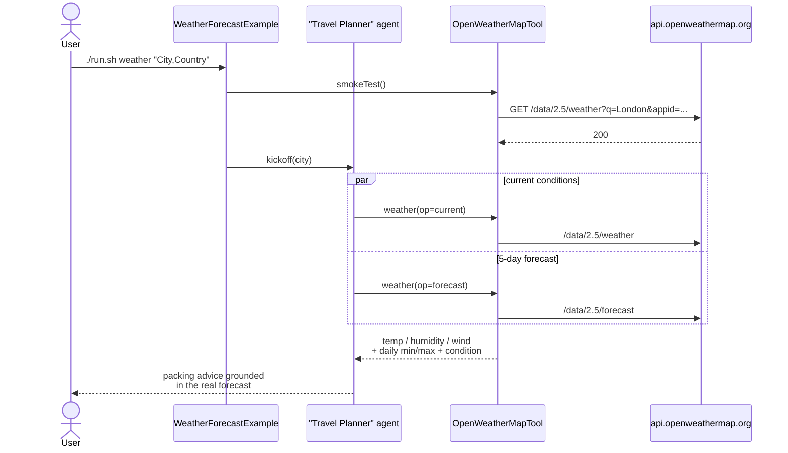

# OpenWeatherMap Forecast Example

> **New to SwarmAI?** Start from the [quickstart template](../quickstart-template/) for the
> minimum viable app, then swap `WikipediaTool` → `OpenWeatherMapTool` and use the travel-planner
> prompt below.


Exercises **`OpenWeatherMapTool`** — a travel-planner agent translates current conditions + the
5-day / 3-hour forecast into concrete packing advice for a given city.

## How it works



## Prerequisites

**API key (required):**

| Env var                | How to get it                                                    |
|------------------------|------------------------------------------------------------------|
| `OPENWEATHER_API_KEY`  | Free tier at https://openweathermap.org/api (60 req/min)         |

```bash
export OPENWEATHER_API_KEY=your-api-key-here
```

> New keys can take up to 2 hours to activate — the tool surfaces 401 responses with that hint.

**Infrastructure:** none — calls go to `api.openweathermap.org`.

## Run

```bash
./run.sh weather                       # Zurich,CH (default)
./run.sh weather "London,GB"
./run.sh weather "Tokyo"
./run.sh weather "New York,US"
```

## What to expect

Current conditions (temp / feels-like / humidity / wind / sunrise / sunset in local time) plus
a 5-day daily-aggregated forecast for the target city, followed by concrete packing advice
the travel-planner agent derives from those numbers.

## Value add

The canonical "structured environmental data → LLM-driven advice" demo. The same pattern
applies to any time-series feed (traffic, markets, IoT telemetry) — the tool returns numbers,
the agent returns actionable recommendations.

## What this proves about the tool

- `operation=current` returns name, country, temp/feels-like, humidity, wind, sunrise/sunset — all
  with units appropriate to `units=metric|imperial|standard`.
- `operation=forecast` aggregates 3-hour entries into daily min/max + representative condition.
- Invalid city names surface a clean `location not found` message.
- Lat/lon coords are accepted as an alternative to city name (sanity-checked against
  [-90,90] × [-180,180]).
- Sunrise/sunset are rendered in the target city's local time (not UTC).
