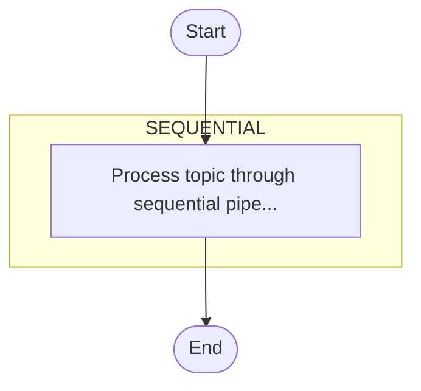
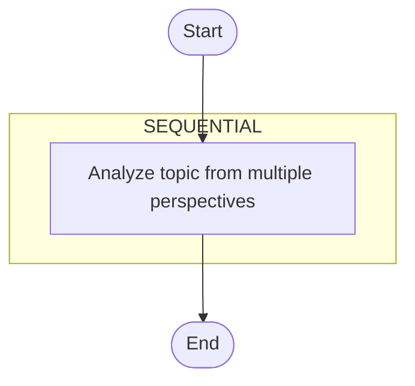
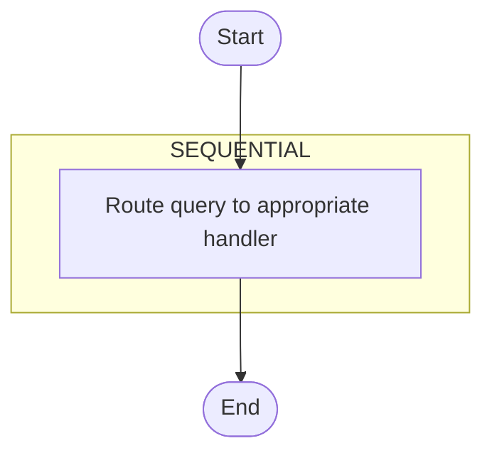
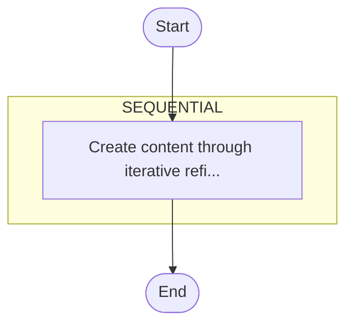

# SwarmAI Workflow Diagrams

Generated by WorkflowVisualizationExample. Each section shows a different
workflow topology built with SwarmGraph and rendered as a Mermaid diagram.

## 1. Sequential Pipeline

## 2. Parallel (Diamond) Pipeline

## 3. Conditional (Router) Pipeline

## 4. Loop (Iterative) Pipeline

---

Paste any diagram into https://mermaid.live to render it interactively.
