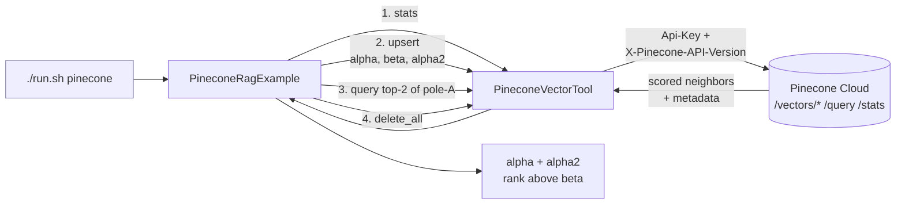

# Pinecone Vector RAG Example

> **New to SwarmAI?** Start from the [quickstart template](../quickstart-template/) for the
> minimum viable app. This example is *direct-tool-drive* — autowire `PineconeVectorTool` and
> call `.execute(Map.of(...))` for `upsert` / `query` / `delete`.


Exercises **`PineconeVectorTool`** end-to-end: upsert 3 synthetic vectors, query for nearest
neighbors, verify the ranking makes sense, clean up. No LLM needed — this example directly
drives the tool so any integration bugs surface immediately.

## How it works



## Prerequisites

**API keys / env vars (required):**

| Env var                     | How to get it                                                              |
|-----------------------------|----------------------------------------------------------------------------|
| `PINECONE_API_KEY`          | Console: https://app.pinecone.io → API Keys                                |
| `PINECONE_INDEX_HOST`       | Console → your index → **CONNECT** → "Host" field. Starts with `https://`. |
| `PINECONE_INDEX_DIM` (opt.) | Your index's dimension — default 8. Match this to your index!              |
| `PINECONE_TEST_NAMESPACE` (opt.) | Namespace to scope writes. Defaults to a random `swarmai-example-*`.  |

```bash
export PINECONE_API_KEY=pcsk-...
export PINECONE_INDEX_HOST=https://my-idx-abcdef.svc.us-east1-gcp.pinecone.io
export PINECONE_INDEX_DIM=8
```

Pinecone is a **managed service** — no Docker image. Sign up for the free starter tier at
https://app.pinecone.io (includes one index, no credit card for development).

> For a fully local alternative, see the Qdrant tool (Phase 2 roadmap).

## Run

```bash
./run.sh pinecone
```

The example performs, in order:

1. `stats` → prints index metadata.
2. `upsert` → writes `alpha`, `beta`, `alpha2` (two close to each other, one far).
3. `query` → fetches top-2 neighbors of `alpha`; should return `alpha` and/or `alpha2`, NOT `beta`.
4. `delete` with `delete_all=true` → cleanup.

## What to expect

The example directly drives the tool through a full round-trip — `stats` → `upsert` 3 vectors
(`alpha`, `beta`, `alpha2`) → `query` top-2 neighbours of `alpha` → `delete_all` cleanup. The
nearest-neighbour ranking should return `alpha` and/or `alpha2`, NOT `beta`.

## Value add

Low-level vector ops for agents that need to build their own episodic memory, similarity
caches, or semantic deduplication. Pinecone's managed-service + auth flow is validated end to
end, so production RAG pipelines can lean on this path without building their own client.

## What this proves about the tool

- Auth flows (`Api-Key` header + `X-Pinecone-API-Version` version pinning) work against a real host.
- Vectors + metadata round-trip correctly through the `/vectors/upsert` endpoint.
- Query results come back with scores in descending order, and metadata is preserved when
  `include_metadata=true`.
- Namespaces correctly scope writes and reads.
- `delete_all` works on serverless indexes where supported (warning surfaces cleanly otherwise).
- Eventual-consistency quirks are tolerated — the example waits 2s between upsert and query.
