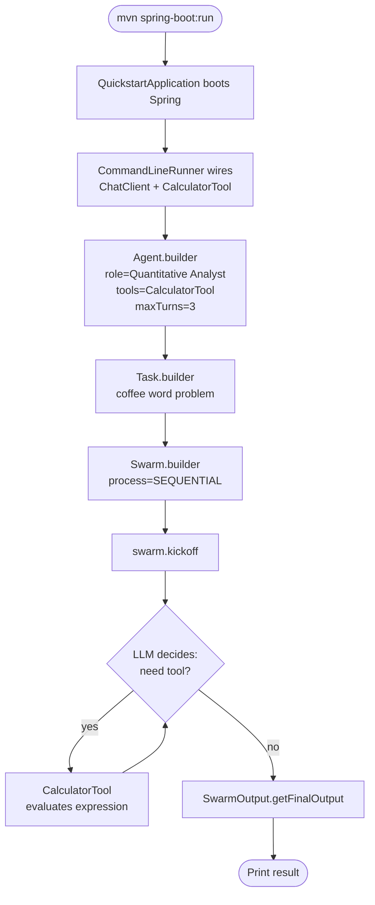

# SwarmAI Quickstart Template

The minimum viable SwarmAI application. One agent, one task, one swarm, one tool. The agent solves a math word problem by delegating arithmetic to the built-in `CalculatorTool` — proving the Agent -> Tool -> LLM loop works end-to-end with no API keys when run against a local Ollama model.

## Architecture



## What You'll Learn

- Building an `Agent` with `Agent.builder()` — role, goal, backstory, `chatClient`, `tools`, `maxTurns`
- Defining a `Task` with `Task.builder()` and binding it to an agent
- Running a `Swarm` with `ProcessType.SEQUENTIAL` and reading `SwarmOutput.getFinalOutput()`
- Registering a `BaseTool` (here `CalculatorTool`) so the LLM can invoke it via function calling
- Configuring the underlying chat model via `application.yml` profiles (Ollama default, OpenAI optional)
- The two-file swap pattern for changing tools without touching swarm wiring

## Prerequisites

- Java 21
- Maven 3.9+
- One of:
  - Local Ollama with a chat model (default `mistral`) running on `localhost:11434`, or
  - OpenAI account with `SPRING_AI_OPENAI_API_KEY` set (and the `openai` Spring profile active — defaults to `gpt-4o-mini`)
- SwarmAI 1.0.24 (pinned in `pom.xml`)

## Run

```bash
# Option A — local Ollama (free, no API keys)
ollama run mistral
mvn spring-boot:run

# Option B — OpenAI (swap the spring-ai starter in pom.xml first)
export SPRING_AI_OPENAI_API_KEY=sk-...
mvn spring-boot:run -Dspring-boot.run.profiles=openai
```

## How It Works

`QuickstartApplication` is a standard `@SpringBootApplication` that exposes a single `CommandLineRunner` bean. On startup, Spring injects a `ChatClient.Builder` (auto-configured by the Spring AI starter) and the `CalculatorTool` bean (auto-discovered from `swarmai-tools`). The runner constructs one `Agent` whose backstory forces it to use the calculator for any arithmetic, wraps a `Task` describing a discounted-purchase math problem, and executes it via a single-agent `Swarm` in `SEQUENTIAL` mode. The agent calls `CalculatorTool` to evaluate `4.75 * 13 * 0.82` (or equivalent), and returns the final dollar amount with the expression cited inline. The whole app is roughly 40 lines.

## Key Code

```java
Agent analyst = Agent.builder()
    .role("Quantitative Analyst")
    .goal("Answer word problems with precise arithmetic.")
    .backstory("You always use the calculator tool for any arithmetic — " +
               "never guess at numbers. Show the expression you evaluated.")
    .chatClient(chatClientBuilder.build())
    .tools(List.of(calculatorTool))
    .maxTurns(3)
    .build();

Task problem = Task.builder()
    .description("A store sells coffee at $4.75 per bag. A customer buys 13 " +
                 "bags and uses an 18% loyalty discount. What is the final " +
                 "price they pay? Use the calculator tool; show the calculation.")
    .expectedOutput("The final price in dollars, with the expression you used.")
    .agent(analyst)
    .build();

SwarmOutput result = Swarm.builder()
    .agent(analyst)
    .task(problem)
    .process(ProcessType.SEQUENTIAL)
    .build()
    .kickoff(Map.of());
```

## Customization

- Swap `CalculatorTool` for any other tool from `ai.intelliswarm.swarmai.tool.*` (e.g. `WikipediaTool`, `HttpRequestTool`, `JiraTool`, `S3Tool`, `PineconeVectorTool`, `OpenApiToolkit`) — change the `import` and the `CommandLineRunner` parameter; agent/task/swarm wiring is unchanged
- Tune `maxTurns` to allow more (or fewer) tool-calling rounds before the agent must answer
- Rewrite the `Task.description` for your own problem and set a stricter `expectedOutput` contract
- Switch chat models by editing `application.yml` or activating the `openai` profile and setting `OPENAI_MODEL`
- Add a second `Agent` + `Task` and keep `ProcessType.SEQUENTIAL` to chain them, or use `ProcessType.PARALLEL` for independent work

## Tool Catalog Reference

All tools below ship in the `swarmai-tools` module and are Spring beans the moment you add the dependency. Add them to `Agent.builder().tools(...)` and they become available to the LLM via function calling.

| Tool                         | Package                                        | Extra config                                       |
|------------------------------|------------------------------------------------|----------------------------------------------------|
| `CalculatorTool` *(default)* | `ai.intelliswarm.swarmai.tool.common`          | none                                               |
| `WebSearchTool`              | `ai.intelliswarm.swarmai.tool.common`          | one of `ALPHA_VANTAGE_API_KEY`, `GOOGLE_*`, etc.   |
| `HttpRequestTool`            | `ai.intelliswarm.swarmai.tool.common`          | none                                               |
| `FileReadTool`               | `ai.intelliswarm.swarmai.tool.common`          | none                                               |
| `WikipediaTool`              | `ai.intelliswarm.swarmai.tool.research`        | none                                               |
| `ArxivTool`                  | `ai.intelliswarm.swarmai.tool.research`        | none                                               |
| `WolframAlphaTool`           | `ai.intelliswarm.swarmai.tool.research`        | `WOLFRAM_APPID`                                    |
| `OpenWeatherMapTool`         | `ai.intelliswarm.swarmai.tool.data`            | `OPENWEATHER_API_KEY`                              |
| `JiraTool`                   | `ai.intelliswarm.swarmai.tool.productivity`    | `JIRA_BASE_URL`, `JIRA_EMAIL`, `JIRA_API_TOKEN`    |
| `KafkaProducerTool`          | `ai.intelliswarm.swarmai.tool.messaging`       | `KAFKA_BOOTSTRAP_SERVERS`                          |
| `S3Tool`                     | `ai.intelliswarm.swarmai.tool.cloud`           | AWS creds                                          |
| `ImageGenerationTool`        | `ai.intelliswarm.swarmai.tool.vision`          | `OPENAI_API_KEY`                                   |
| `PineconeVectorTool`         | `ai.intelliswarm.swarmai.tool.vector`          | `PINECONE_API_KEY`, `PINECONE_INDEX_HOST`          |
| `OpenApiToolkit`             | `ai.intelliswarm.swarmai.tool.integrations`    | none (point at any OpenAPI 3.x spec)               |
| `SpringDataRepositoryTool`   | `ai.intelliswarm.swarmai.tool.data.repository` | a running `JpaRepository` in your app              |

For each tool the corresponding top-level example (e.g. `../jira-ticket-management/`, `../stock-market-analysis/`, `../rag-retrieval-augmented-research/`) shows the full prompt + task wording you would copy into your `Task.builder().description(...)`.
