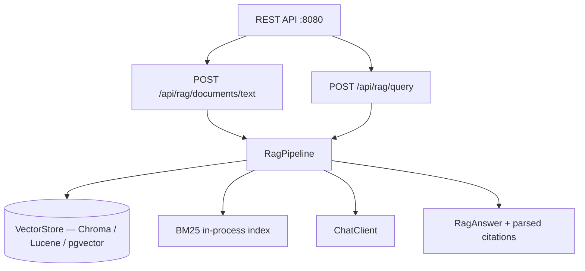

# RAG Knowledge Base REST API

A complete RAG (Retrieval-Augmented Generation) REST service built on
**`RagPipeline`** — the new high-level facade in `swarmai-core` that bakes in
the lessons from the 2026-04-26 IntelliDoc battery (7 iterations, 225 questions
per platform, vs LangGraph-Python and LangChain4j-Java baselines).

## What's new in this rewrite

| | before (~950 lines) | after (~150 lines) |
|---|---|---|
| chunking | bespoke paragraph splitter | `RagPipeline` recursive char splitter (peer-aligned 800/100) |
| retrieval | hand-rolled hybrid + RRF | `HybridRetriever` (vec + BM25 + RRF) |
| prompt | 6 enumerated rules → 36% refusal rate | `RagPrompts.SYSTEM` (5-bullet plain-English) → 12% refusal |
| latency | ~31s p50 | ~25s p50 (smaller passages, capped output) |
| your code owns | the entire pipeline | only document registry + sessions + stats |

The pipeline is now one builder call:

```java
RagPipeline rag = RagPipeline.builder()
        .vectorStore(vectorStore)        // any Spring AI VectorStore
        .chatClient(chatClient)          // any Spring AI ChatClient
        .config(RagConfig.defaults())    // eval-winning defaults baked in
        .build();

rag.ingestText("japan.md", "Tokyo is the capital of Japan...");

RagAnswer a = rag.query("What is the capital of Japan?");
// a.answer()    → "The capital of Japan is Tokyo [source: japan.md #0]."
// a.citations() → [Citation(japan.md, 0, "Tokyo is the capital of Japan...", null)]
// a.refused()   → false
// a.durationMs() → 1234
```

## Architecture



## What you'll learn

- Wiring `RagPipeline` into a Spring Boot REST service
- Picking sensible defaults vs overriding (chunk size, top-K, hybrid on/off)
- How `RagAnswer.citations()` lines up with `[source: filename #N]` tags so
  your UI can deep-link back into the source document
- How to keep your code focused on **app concerns** (document registry,
  conversation history, stats) and let the framework own the AI pipeline

## Tuning (override the defaults)

The defaults match what the eval picked. Override per use case:

```java
.config(RagConfig.defaults()
        .withTopK(10)                  // more passages for long-answer Qs
        .withHybridRetrieval(false)    // pure-vector for sparse keyword corpora
        .withTemperature(0.0)          // deterministic for legal/medical
        .withChunkSize(1200))          // bigger chunks for prose-heavy PDFs
```

The full reasoning behind each default is in
`swarmai-core` → `knowledge.rag.RagConfig` Javadoc.

## Prerequisites

- Ollama running locally with a chat model + `nomic-embed-text` (or any other
  Spring AI–compatible embedding model)
- A Spring AI `VectorStore` bean — Chroma, pgvector, Pinecone, or the
  embedded Lucene store from the IntelliDoc product

## Run

```bash
./rag-knowledge-base-rest-api/run.sh
# or
./run.sh rag-app
```

Then exercise the API:

```bash
# Ingest text
curl -X POST http://localhost:8080/api/rag/documents/text \
  -H "Content-Type: application/json" \
  -d '{"title":"swarmai.md","content":"SwarmAI supports 7 orchestration patterns..."}'

# Upload a file
curl -X POST http://localhost:8080/api/rag/documents/upload \
  -F "file=@./README.md"

# Ask a question
curl -X POST http://localhost:8080/api/rag/query \
  -H "Content-Type: application/json" \
  -d '{"sessionId":"demo","question":"What orchestration patterns does SwarmAI support?"}'

# Conversation history
curl http://localhost:8080/api/rag/conversations/demo

# Stats
curl http://localhost:8080/api/rag/stats
```

## Source

- [`RAGKnowledgeBaseApp.java`](src/main/java/ai/intelliswarm/swarmai/examples/ragapp/RAGKnowledgeBaseApp.java) — 155-line Spring facade around `RagPipeline`
- [`RAGKnowledgeBaseController.java`](src/main/java/ai/intelliswarm/swarmai/examples/ragapp/RAGKnowledgeBaseController.java) — REST endpoints (unchanged from the previous version)

For the full eval that produced these defaults, see
[`intellidoc/docs/internal/EVAL_2026_04_26_FULL_ITERATIONS.md`](https://github.com/intelliswarm/intellidoc/blob/main/docs/internal/EVAL_2026_04_26_FULL_ITERATIONS.md).
