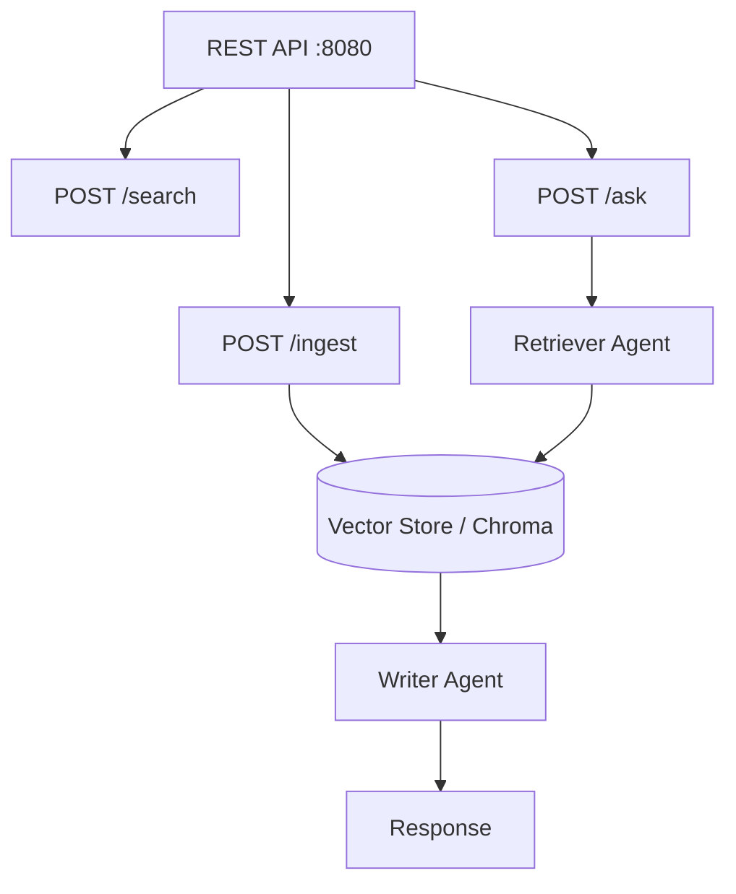

# RAG Knowledge Base REST API

Complete RAG (Retrieval-Augmented Generation) application with document ingestion, vector store integration, semantic search, and multi-agent Q&A. Runs as a persistent REST API on port 8080.

## Architecture



## What You'll Learn

- Building a production RAG application with Spring Boot
- Document ingestion and vector store integration (Chroma)
- Semantic search with embedding models
- Multi-agent Q&A pipeline grounded in retrieved context

## Prerequisites

- Ollama with `mistral:latest` and `nomic-embed-text` (for embeddings)
- Optional: Chroma vector store (`docker run -d -p 8000:8000 ghcr.io/chroma-core/chroma:latest`)

## Run

```bash
./rag-knowledge-base-rest-api/run.sh
# or
./run.sh rag-app

# Then use the API:
curl -X POST http://localhost:8080/api/rag/ingest -H "Content-Type: application/json" -d '{"content": "SwarmAI supports 7 orchestration patterns..."}'
curl -X POST http://localhost:8080/api/rag/ask -H "Content-Type: application/json" -d '{"question": "What orchestration patterns does SwarmAI support?"}'
```

## Source

- [`RAGKnowledgeBaseApp.java`](src/main/java/ai/intelliswarm/swarmai/examples/ragapp/RAGKnowledgeBaseApp.java)
- [`RAGKnowledgeBaseController.java`](src/main/java/ai/intelliswarm/swarmai/examples/ragapp/RAGKnowledgeBaseController.java)
