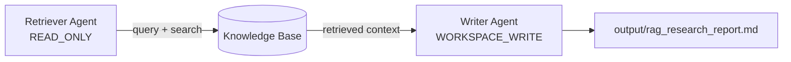

# RAG Research Workflow

Ground every agent answer in a document corpus instead of trusting the model's memory. A read-only retriever searches the `Knowledge` base for relevant passages; a workspace-write writer composes the report from that retrieved context and saves it to disk. Least-privilege roles, two-stage retrieve-then-generate — the canonical RAG pattern in 60 lines.

## Architecture



## What You'll Learn

- Using the `Knowledge` interface with `query()`, `search()`, and `addSource()` methods
- Binding knowledge to agents via `Agent.builder().knowledge()` and swarms via `Swarm.builder().knowledge()`
- Implementing the two-stage RAG pattern: retrieve then generate
- Task dependency chains with `Task.builder().dependsOn()` for ordered execution
- Combining `PermissionLevel.READ_ONLY` (retriever) and `WORKSPACE_WRITE` (writer) for least-privilege access
- Writing output to files with `Task.builder().outputFile()`

## Prerequisites

- Ollama with `mistral:latest` (or any configured model)
- No additional API keys required (knowledge base is built in-memory)

## Run

```bash
# Default query: "What are the key differences between AI agent frameworks?"
./run.sh rag-research

# Custom query
./run.sh rag-research "How does RAG compare to fine-tuning for domain knowledge?"
```

## How It Works

The workflow first populates an `InMemoryKnowledge` base with curated paragraphs about AI agent frameworks (architecture patterns, tool integration, orchestration models, memory, observability, and RAG details). A Retriever agent with `maxTurns(3)` queries this knowledge base using varied search terms to maximize recall, returning verbatim passages with source identifiers. A Writer agent then synthesizes those passages into a structured report with executive summary, detailed findings, comparative analysis, gaps, and a bibliography -- every claim citing its source. The `dependsOn` relationship ensures retrieval completes before generation. The final report is saved to `output/rag_research_report.md`.

## Key Code

```java
// Build the in-memory knowledge base
Knowledge knowledgeBase = new InMemoryKnowledge();
kb.addSource("architecture-patterns",
        "AI agent frameworks generally follow one of three...",
        Map.of("topic", "architecture", "category", "overview"));

// Retriever agent bound to the knowledge base
Agent retriever = Agent.builder()
        .role("Knowledge Retrieval Specialist")
        .chatClient(chatClient)
        .knowledge(knowledgeBase)
        .maxTurns(3)
        .permissionMode(PermissionLevel.READ_ONLY)
        .build();

// Report task depends on retrieval task output
Task reportTask = Task.builder()
        .description("Using the retrieved information, write a report...")
        .agent(writer)
        .dependsOn(retrievalTask)
        .outputFile("output/rag_research_report.md")
        .build();
```

## Customization

- Replace `InMemoryKnowledge` with a vector database (Pinecone, Weaviate, pgvector) for production use
- Add more sources via `kb.addSource(id, text, metadata)` to expand the corpus
- Increase `maxTurns` on the retriever to allow more search iterations
- Change `OutputFormat` or `outputFile` path to adjust report delivery

## YAML DSL

This workflow can also be defined declaratively in YAML. See [`workflows/rag-research.yaml`](src/main/resources/workflows/rag-research.yaml):

```bash
# Load and run via YAML instead of Java
Swarm swarm = swarmLoader.load("workflows/rag-research.yaml",
    Map.of("query", "How does the architecture work?"));
SwarmOutput output = swarm.kickoff(Map.of());
```

The YAML definition includes inline knowledge sources and evidence-grounded report writing.
