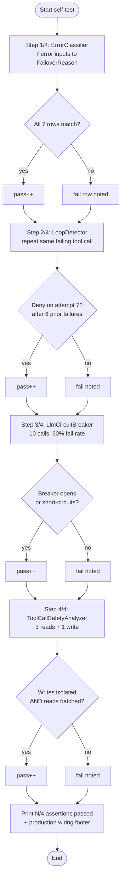

# Reliability Substrate

Offline self-test of every reliability primitive shipped in SwarmAI 1.0.24. Four assertions run end-to-end in seconds with no API keys and no network: error classification, loop detection, circuit breaking, and parallel-tool safety analysis. Each step prints what it's testing, the input, the expected outcome, and a pass/fail verdict — making the demo both a smoke test before deployment and a didactic walkthrough of the substrate.

## Architecture



## What You'll Learn

- `ErrorClassifier.classify(Throwable)` and the `FailoverReason` enum — how the framework maps raw exceptions to retry decisions (`RETRYABLE`, `SHOULD_ROTATE_CREDENTIAL`, `SHOULD_COMPRESS`, `SHOULD_FALLBACK`, `NOT_RECOVERABLE`)
- Using `LoopDetector` as a `ToolHook` to catch the model burning budget re-calling the same failing tool with identical args
- Wrapping LLM calls with `LlmCircuitBreaker` and tuning `ResilienceConfig` (`failureRateThreshold`, `slidingWindowSize`, `waitDurationOpenStateMs`) for cross-call protection
- `ToolCallSafetyAnalyzer` and `PendingToolCall` / `ParallelGroup` — deciding which tool calls in an LLM turn can fan out concurrently and which must serialise
- Extending the never-parallel set via `withAdditionalNeverParallel("write_file", "delete_file")`
- Where each primitive plugs into the framework: `Agent.callLlm`, `Agent.builder().toolHook(...)`, opt-in wrapper, parallel-tool dispatcher

## Prerequisites

- Java 21+
- SwarmAI 1.0.24 on the classpath (provided by the parent examples project)
- No API keys, no Ollama, no network — runs in seconds

## Run

```bash
./reliability-substrate/run.sh
```

The script sets `DEMO=1` by default to silence Spring Boot startup chatter so the assertions appear first.

## How It Works

The example runs four steps in sequence, each exercising one reliability primitive against a controlled input. **Step 1** feeds `ErrorClassifier.classify(...)` a 7-row table of representative exceptions (socket timeout, rate-limit string, invalid-API-key, context-window-exceeded, overloaded provider, malformed tool, connection reset) and asserts each maps to the expected `FailoverReason`. **Step 2** constructs a default `LoopDetector` and feeds it the same `(toolName, args)` pair repeatedly, simulating failures via `afterToolUse(...)`; after 6 prior failures the detector denies the 7th `beforeToolUse(...)` call. **Step 3** drives an `LlmCircuitBreaker` configured for a 50% failure threshold over a sliding window of 10 with a scripted pattern of 6 failures then 4 successes, verifying the breaker either opens or starts short-circuiting before all 10 calls land. **Step 4** feeds 3 `web_search` calls + 1 `write_file` to a `ToolCallSafetyAnalyzer` (with `write_file` registered as never-parallel) and asserts that writes are isolated into singleton groups while reads get batched. A final summary prints `N/4 assertions passed` and a footer describing how each primitive composes into production agent code.

## Key Code

```java
// 1. ErrorClassifier — exception to retry decision
FailoverReason reason = ErrorClassifier.classify(
        new RuntimeException("rate limit exceeded, please retry"));
// → FailoverReason.RETRYABLE

// 2. LoopDetector — denies repeat failing calls
LoopDetector loopDetector = new LoopDetector();
ToolHookContext before = ToolHookContext.before("search", args, "agent-1", null);
ToolHookResult result = loopDetector.beforeToolUse(before);
if (result.action() == ToolHookResult.Action.DENY) { /* stop the model */ }
ToolHookContext err = ToolHookContext.error("search", args, 50, ex, "agent-1", null);
loopDetector.afterToolUse(err);   // record the failure

// 3. LlmCircuitBreaker — open after a failure burst
LlmCircuitBreaker.ResilienceConfig cfg = new LlmCircuitBreaker.ResilienceConfig();
cfg.failureRateThreshold = 50f;
cfg.slidingWindowSize    = 10;
LlmCircuitBreaker breaker = new LlmCircuitBreaker(cfg);
String out = breaker.execute(() -> upstream.call());

// 4. ToolCallSafetyAnalyzer — fan-out planning
List<ParallelGroup> groups = new ToolCallSafetyAnalyzer()
        .withAdditionalNeverParallel("write_file", "delete_file")
        .analyse(pendingCalls);
```

## Customization

- Tune `LlmCircuitBreaker.ResilienceConfig` — raise `failureRateThreshold` to be more tolerant, shrink `slidingWindowSize` for faster reaction, lengthen `waitDurationOpenStateMs` to keep the breaker open longer
- Configure `LoopDetector`'s `warnAt` / `blockAt` thresholds to deny earlier (e.g., `blockAt=3` for tight test environments) or later (e.g., `blockAt=10` for noisy upstreams)
- Extend the never-parallel set on `ToolCallSafetyAnalyzer` with your own write/delete/mutating tool names via `withAdditionalNeverParallel(...)`
- Add new rows to the `ErrorClassifier` table to test exception strings specific to your provider — useful for verifying that vendor-specific error messages get mapped to the right `FailoverReason`
- Plug the primitives into a real agent: `Agent.builder().toolHook(new LoopDetector()).build()` for loop detection; wrap your `LlmService` with `LlmCircuitBreaker` for cross-call protection
